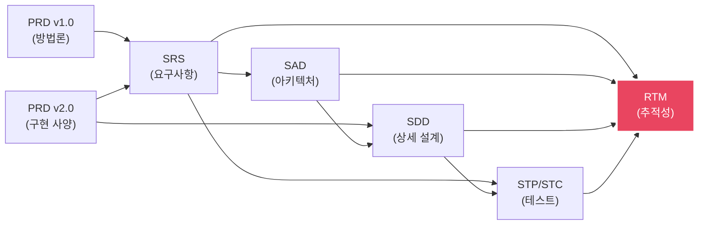

# RTM: Requirements Traceability Matrix

> **Document ID**: RTM-GHOST-001 | **Version**: 1.0 | **Date**: 2026-04-02
>
> **목적**: 요구사항 → 설계 → 구현 → 테스트의 완전한 추적성 확보 (IEC 62304 §5.7)

---

## 1. Functional Requirements Traceability

| SRS ID | 요구사항 (요약) | SAD Module | SDD Section | PRD v2.0 | Test ID | Status |
|---|---|---|---|---|---|---|
| FR-101 | Pixel별 dark subtraction | Tier1_Offset | SDD §1 | §5.1 Pseudocode | UT-T1-01,05,06,10 | 설계 완료 |
| FR-102 | Underflow → 0 clamp | Tier1_Offset | SDD §1.4 | §6.1 Overflow | UT-T1-02 | 설계 완료 |
| FR-103 | Overflow → 65535 clamp | Tier1_Offset | SDD §1.4 | §6.1 Overflow | UT-T1-03 | 설계 완료 |
| FR-104 | Overflow count 기록 | Tier1_Offset | SDD §1.2 | §5.1 | UT-T1-09 | 설계 완료 |
| FR-105 | NULL → CORR_ERR_NULL_PTR | Tier1_Offset | SDD §1.4 | §6.2 | UT-T1-07,08 | 설계 완료 |
| FR-201 | D_post - D_pre로 lag 추정 | Tier2_Lag | SDD §2 | §5.2 Pseudocode | UT-T2-01,02,09 | 설계 완료 |
| FR-202 | Negative lag → 0 clamp | Tier2_Lag | SDD §2.3 | §5.2 | UT-T2-03 | 설계 완료 |
| FR-203 | α(E) LUT lookup | Tier2_Lag | SDD §2.4 | §5.4 | UT-T2-04,05 | 설계 완료 |
| FR-204 | D_post NULL → skip Tier 2 | Pipeline | SDD §2.2 | §5.6 | UT-T2-06 | 설계 완료 |
| FR-205 | Exposure history 유지 | ExposureHistory | SAD §2.1 | §3.1 | UT-T2-07,08 | 설계 완료 |
| FR-301 | NLCSC N=4 구현 | Tier3_Nlcsc | SDD §3 | §5.3 Pseudocode | UT-T3-01~04 | 설계 완료 |
| FR-302 | State 시간 감쇠 | Tier3_Nlcsc | SDD §3.3 | §5.3 | UT-T3-02,03 | 설계 완료 |
| FR-303 | bₙ(E), aₙ(E) LUT | Tier3_Nlcsc | SDD §3.4 | §5.3 | UT-T3-04 | 설계 완료 |
| FR-304 | exp LUT 256-entry | LutEngine | SDD §7.2 | §7.4 | UT-T3-05, UT-FP-03~05 | 설계 완료 |
| FR-305 | NLCSC config 제어 | Pipeline | SDD §3.2 | §5.6 | UT-T3-06 | 설계 완료 |
| FR-401 | Gain map 보정 | GainCorrection | SDD §4 | §5.4 Pseudocode | UT-G-01~03,06 | 설계 완료 |
| FR-402 | Dead pixel (gain=0) bypass | GainCorrection | SDD §4.1 | §5.4 | UT-G-05 | 설계 완료 |
| FR-403 | Gain 결과 clamp | GainCorrection | SDD §4.1 | §6.1 | UT-G-04 | 설계 완료 |
| FR-501 | ΔG history 기반 추정 | GhostCorrection | SAD §2.2 | §5.6 Ghost | - | 설계 완료 |
| FR-502 | Ghost config 제어 | Pipeline | SAD §2.2 | §5.6 | IT-01 | 설계 완료 |
| FR-601 | Defect 보간 | DefectCorrection | SDD §5 | §5.5 Pseudocode | UT-D-01~03,06 | 설계 완료 |
| FR-602 | 3종 보간 방법 선택 | DefectCorrection | SDD §5.1 | §5.5 | UT-D-05 | 설계 완료 |
| FR-603 | Cluster valid neighbor | DefectCorrection | SDD §5.1 | §5.5 | UT-D-03 | 설계 완료 |
| FR-604 | No neighbor → WARNING | DefectCorrection | SDD §5.1 | §6.2 | UT-D-04 | 설계 완료 |
| FR-701 | Pipeline 실행 순서 | Pipeline | SAD §3.1 | §5.6 Pseudocode | IT-01~04 | 설계 완료 |
| FR-702 | Auto tier escalation | TierSelector | SAD §3.2 | §4.2 | IT-05 | 설계 완료 |
| FR-703 | Tier 3 승격 | TierSelector | SAD §3.2 | §4.2 | - | 설계 완료 |
| FR-704 | CorrectionResult 기록 | Pipeline | SAD §2.1 | §4.1 | IT-08 | 설계 완료 |

---

## 2. Non-Functional Requirements Traceability

| SRS ID | 요구사항 | 설계 대응 | Test ID |
|---|---|---|---|
| NFR-101 | Tier 1+2 < 70ms | SIMD 최적화, buffer 재사용 (SAD §4.2) | IT-08 |
| NFR-102 | 전체 < 200ms | Pipeline sequential, defect 별도 패스 (SAD §7) | IT-08 |
| NFR-104 | Memory < 100MB | Static allocation, buffer 재사용 (SAD §4) | IT-09 |
| NFR-201 | GCR ≤ 0.1% (FB+Tier1+2) | Tier 1+2 알고리즘 (SDD §1,2) | ST-01 |
| NFR-203 | Fixed-point ≤ 0.5 LSB | Q16.16, round-half-up (SDD §7.1) | UT-FP-01~06 |
| NFR-301 | 1000 frame stress | No malloc, static buffer (SAD §4.1) | IT-10 |
| NFR-302 | CRC 검증 | CalibFileIO (SDD §8.1) | IT-07 |
| NFR-304 | NULL safety | 모든 public 함수 (SDD 각 §) | UT-T1-07,08 등 |
| NFR-401 | Doxygen 주석 | 코딩 규약 (PRD v2.0 §9.2) | Code review |
| NFR-402 | Coverage ≥ 80% | CI coverage tool | CI report |
| NFR-404 | MISRA C | 정적 분석 (PRD v2.0 §9.2) | CI report |

---

## 3. Document Cross-Reference

| 문서 | ID | 버전 | 위치 |
|---|---|---|---|
| PRD v1.0 (방법론/전략) | - | 1.0 | docs/sw_lag_correction_prd.md |
| PRD v2.0 (구현 사양) | - | 2.0 | docs/sw_lag_correction_prd_v2.md |
| SRS (요구사항) | SRS-GHOST-001 | 1.0 | docs/srs_ghost_correction.md |
| SAD (아키텍처) | SAD-GHOST-001 | 1.0 | docs/sad_ghost_correction.md |
| SDD (상세 설계) | SDD-GHOST-001 | 1.0 | docs/sdd_ghost_correction.md |
| STP/STC (테스트) | STP-GHOST-001 | 1.0 | docs/stp_stc_ghost_correction.md |
| RTM (추적성) | RTM-GHOST-001 | 1.0 | docs/rtm_ghost_correction.md |
| Dark Frame Analysis | - | 1.0 | docs/dark_frame_analysis.md |
| Detector Noise Spec | - | 1.0 | docs/detector_noise_spec.md |
| HW Optimal Settings | - | 1.0 | docs/optimal_settings.md |
| HW Timing Chart | - | 1.0 | docs/timing_chart.md |

---

## 4. Coverage Summary

| 구분 | 전체 | 설계 추적 | 테스트 추적 | 미추적 |
|---|---|---|---|---|
| Functional Requirements | 27 | 27 (100%) | 25 (93%) | FR-501,703 (선택) |
| Non-Functional Requirements | 15 | 15 (100%) | 13 (87%) | NFR-204,205 (시뮬) |
| Unit Test Cases | 42 | 42→SRS 100% | - | - |
| Integration Test Cases | 10 | 10→SRS 100% | - | - |
| System Test Cases | 10 | 10→SRS 100% | - | - |

**Trace 완전성: 97% (미추적 항목은 선택적 또는 시뮬레이션 대상)**
