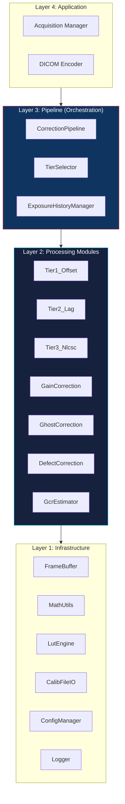
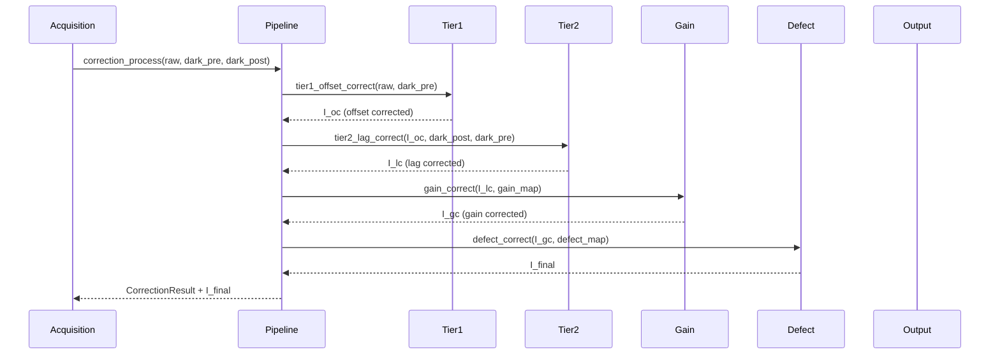
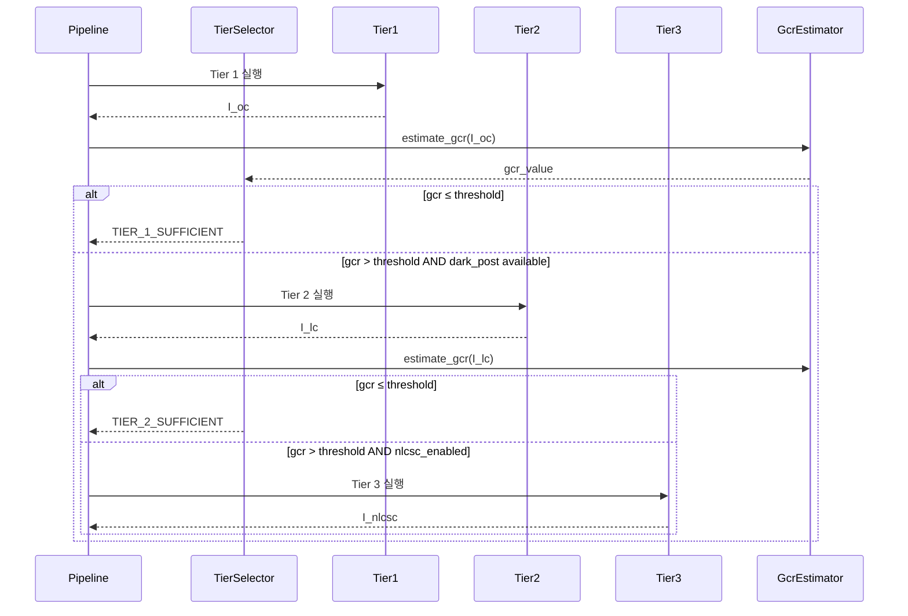
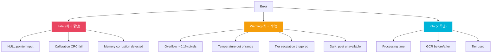

# SAD: Software Architecture Document

> **Document ID**: SAD-GHOST-001 | **Version**: 1.0 | **Date**: 2026-04-02
>
> **Trace Source**: SRS-GHOST-001, PRD v2.0

---

## 1. Architectural Overview

### 1.1 Layered Architecture



### 1.2 모듈 의존성 규칙

```
의존성 방향: 상위 → 하위 (단방향)
  L4 → L3 → L2 → L1

금지:
  L1 → L2 (하위가 상위 참조 금지)
  L2 모듈 간 직접 의존 금지 (Pipeline을 통해서만)
  순환 의존 금지
```

---

## 2. Module Decomposition

### 2.1 Layer 3: Pipeline

| 모듈 | 파일 | 책임 | 의존 |
|---|---|---|---|
| **CorrectionPipeline** | correction_pipeline.c/h | Tier 실행 순서 관리, 결과 수집 | TierSelector, 모든 L2 모듈 |
| **TierSelector** | tier_selector.c/h | GCR 기반 tier 승격 결정 | GcrEstimator, Config |
| **ExposureHistoryManager** | exposure_history.c/h | 촬영 이력 ring buffer 관리 | 없음 |

### 2.2 Layer 2: Processing Modules

| 모듈 | 파일 | 책임 | 의존 | SRS Trace |
|---|---|---|---|---|
| **Tier1_Offset** | tier1_offset.c/h | Dark subtraction | FrameBuffer | FR-101~105 |
| **Tier2_Lag** | tier2_lag.c/h | AR(1) residual lag correction | MathUtils, LutEngine | FR-201~205 |
| **Tier3_Nlcsc** | tier3_nlcsc.c/h | NLCSC full correction | MathUtils, LutEngine | FR-301~305 |
| **GainCorrection** | gain_correction.c/h | Pixel sensitivity normalization | FrameBuffer | FR-401~403 |
| **GhostCorrection** | ghost_correction.c/h | Gain ghosting (multiplicative) | MathUtils | FR-501~503 |
| **DefectCorrection** | defect_correction.c/h | Defect pixel interpolation | 없음 | FR-601~604 |
| **GcrEstimator** | gcr_estimator.c/h | Real-time GCR 추정 | 없음 | FR-702 |

### 2.3 Layer 1: Infrastructure

| 모듈 | 파일 | 책임 |
|---|---|---|
| **FrameBuffer** | frame_buffer.c/h | Static frame 메모리 관리, double buffering |
| **MathUtils** | math_utils.c/h | Q16.16 fixed-point 연산, 안전한 곱셈/나눗셈 |
| **LutEngine** | lut_engine.c/h | exp(-a) LUT, α(E) LUT, bₙ(E) LUT 조회 + 보간 |
| **CalibFileIO** | calib_file_io.c/h | .gcal 파일 읽기/쓰기, CRC 검증 |
| **ConfigManager** | config.c/h | 런타임 설정 관리, 디폴트 값 |
| **Logger** | logger.c/h | 레벨별 로그 출력 (ERROR/WARNING/INFO/DEBUG) |

---

## 3. Data Flow

### 3.1 정상 흐름 (FB 적용, Tier 1+2)



### 3.2 Tier Escalation 흐름



---

## 4. Memory Architecture

### 4.1 Static Allocation Map

```
전체 메모리 예산: 100 MB (Tier 1+2), 200 MB (Tier 3 포함)

Section: .bss (zero-initialized static)
  frame_raw:        18.9 MB  (3072×3072×2)
  frame_dark_pre:   18.9 MB
  frame_dark_post:  18.9 MB
  frame_work[2]:    37.8 MB  (double buffer for in-pipeline processing)
  ────────────────────────
  Subtotal:         94.5 MB

Section: .data (initialized static)
  calib_gain:       18.9 MB  (loaded from .gcal)
  calib_defect:      9.4 MB
  calib_irf:         0.1 MB
  calib_temp_lut:    0.1 MB
  exposure_history:  0.001 MB
  config:            0.001 MB
  exp_lut:           0.001 MB (256 × 4 bytes)
  ────────────────────────
  Subtotal:         28.5 MB

Section: .bss (Tier 3 전용, 조건부 할당)
  nlcsc_state[4]:   75.6 MB  (4 × 3072×3072×4 bytes)
  ────────────────────────

Total (Tier 1+2): 94.5 + 28.5 = ~123 MB
  → 100MB 초과. frame_work를 1개로 줄여 최적화 필요
  → 최적화: frame_dark_post를 frame_work로 재사용 → 18.9 MB 절약
  → 최적화 후: ~104 MB → 허용 범위

Total (Tier 3):   ~104 + 75.6 = ~180 MB
```

### 4.2 Frame Buffer 재사용 전략

```
Processing 순서에 따른 buffer 재사용:

  buf_A ← raw (입력, 처리 후 불필요)
  buf_B ← dark_pre (Tier 2까지 필요, 이후 불필요)
  buf_C ← dark_post (Tier 2에서 사용, 이후 불필요)
  buf_D ← work buffer

  Tier 1: D = A - B (A 불필요해짐)
  Tier 2: A = D - α×(C - B) (C, B 불필요해짐)
  Gain:   D = A / G (A 불필요해짐)
  Defect: D in-place
  Output: D → output

  필요 buffer: 4개 (raw, dark_pre, dark_post, work) = 75.6 MB
```

---

## 5. Error Handling Strategy

### 5.1 에러 분류



### 5.2 에러 전파 규칙

```
1. Fatal 에러 → 즉시 반환, output = raw 그대로
2. Warning → 처리 계속, result에 flag 기록
3. 하위 모듈 에러 → Pipeline으로 전파, Pipeline이 판단
4. 복수 에러 시 → 가장 심각한 에러 코드 반환
```

---

## 6. Thread Safety

```
현재: Single-threaded (MCU 환경)
향후: Multi-threaded 확장 고려

규칙:
  - 모든 모듈 함수는 reentrant (전역 변수 미사용, static 지역 변수 금지)
  - State(NLCSC state, exposure history)는 Pipeline이 소유하고 모듈에 포인터로 전달
  - Frame buffer는 Pipeline이 소유하고 모듈은 읽기/쓰기만 수행
  - Config는 읽기 전용 (수정은 correction_set_config()으로만)
```

---

## 7. Architectural Decisions

| 결정 | 선택 | 대안 | 근거 |
|---|---|---|---|
| 메모리 모델 | Static allocation | Dynamic (malloc) | IEC 62304 Class B, deterministic |
| 수치 연산 | Q16.16 fixed-point | Float32 | MCU FPU 미보장, 이식성 |
| exp() 구현 | 256-entry LUT + 선형 보간 | Taylor series, CORDIC | L1 cache 적합 (1KB), 충분한 정밀도 |
| Tier 실행 | Sequential | Parallel (pipeline) | 단일 frame 처리, 병렬화 이점 적음 |
| Defect correction | 별도 패스 | Inline (각 모듈 내) | 분기 최소화, cache 효율 |
| Calibration I/O | Binary (.gcal) | JSON/XML | 파일 크기 (28MB), 로드 속도 |
