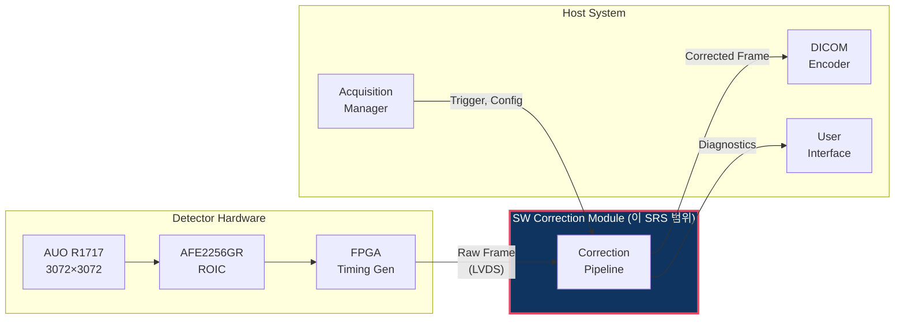

# SRS: Software Requirements Specification

> **Document ID**: SRS-GHOST-001 | **Version**: 1.0 | **Date**: 2026-04-02
>
> **Product**: Lag/Ghost SW Correction Module | **IEC 62304 Class**: B
>
> **Trace Source**: PRD v1.0, PRD v2.0

---

## 1. Purpose & Scope

이 문서는 a-Si FPD(AUO R1717 + AFE2256GR) 기반 Still DR 시스템의 Lag/Ghost SW 보정 모듈에 대한 소프트웨어 요구사항을 정의합니다.

### 1.1 시스템 컨텍스트



---

## 2. Functional Requirements

### FR-100: Offset Correction (Tier 1)

| ID | 요구사항 | 우선순위 | 검증 방법 |
|---|---|---|---|
| FR-101 | 시스템은 X-ray raw frame에서 pre-exposure dark frame을 pixel별로 차감하여 offset을 보정해야 한다 | **필수** | Unit test T1-01~06 |
| FR-102 | 차감 결과가 음수인 pixel은 0으로 clamp해야 한다 | 필수 | Unit test T1-02 |
| FR-103 | 차감 결과가 65535를 초과하는 pixel은 65535로 clamp해야 한다 | 필수 | Unit test T1-03 |
| FR-104 | Overflow/underflow 발생 pixel 수를 CorrectionResult에 기록해야 한다 | 필수 | Unit test |
| FR-105 | Dark frame이 NULL인 경우 CORR_ERR_NULL_PTR을 반환해야 한다 | 필수 | Unit test |

### FR-200: Lag Correction (Tier 2)

| ID | 요구사항 | 우선순위 | 검증 방법 |
|---|---|---|---|
| FR-201 | 시스템은 post-exposure dark frame과 pre-exposure dark frame의 차분으로 잔류 lag signal을 추정해야 한다 | 필수 | Unit test T2-01~05 |
| FR-202 | Lag signal이 음수인 pixel은 0으로 clamp하여 noise에 의한 역전을 방지해야 한다 | 필수 | Unit test T2-03 |
| FR-203 | Exposure-dependent α(E) coefficient를 교정 LUT에서 조회하여 적용해야 한다 | 필수 | Unit test |
| FR-204 | Post-exposure dark frame이 NULL인 경우 Tier 2를 건너뛰고 Tier 1 결과를 출력해야 한다 | 필수 | Unit test |
| FR-205 | 촬영 이력(ExposureRecord)을 최대 16개까지 유지하고, 시간 간격에 따른 감쇠를 적용해야 한다 | 권장 | Unit test |

### FR-300: NLCSC Correction (Tier 3)

| ID | 요구사항 | 우선순위 | 검증 방법 |
|---|---|---|---|
| FR-301 | 시스템은 N=4 multi-exponential 모델의 NLCSC 알고리즘을 구현해야 한다 | 선택 | Unit test |
| FR-302 | State variable Sₙ을 frame 간에 유지하고, 시간 간격에 따른 지수적 감쇠를 적용해야 한다 | 선택 | Unit test |
| FR-303 | Exposure-dependent bₙ(E)와 aₙ(E)를 교정 데이터에서 조회해야 한다 | 선택 | Unit test |
| FR-304 | exp(-a) 연산은 256-entry LUT + 선형 보간으로 구현해야 한다 | 선택 | Fixed-point test |
| FR-305 | NLCSC는 config에서 명시적으로 활성화된 경우에만 실행해야 한다 | 선택 | Integration test |

### FR-400: Gain Correction

| ID | 요구사항 | 우선순위 | 검증 방법 |
|---|---|---|---|
| FR-401 | 시스템은 factory calibration gain map을 사용하여 pixel별 감도 보정을 수행해야 한다 | 필수 | Unit test G-01~05 |
| FR-402 | Gain map의 값이 0인 pixel(dead pixel)은 보정을 건너뛰고 원본 값을 유지해야 한다 | 필수 | Unit test G-05 |
| FR-403 | Gain 보정 결과는 uint16 범위로 clamp해야 한다 | 필수 | Unit test G-04 |

### FR-500: Ghost (Gain Ghosting) Correction

| ID | 요구사항 | 우선순위 | 검증 방법 |
|---|---|---|---|
| FR-501 | 시스템은 exposure history 기반 ΔG 추정을 구현해야 한다 | 선택 | Unit test |
| FR-502 | Ghost correction은 config에서 명시적으로 활성화된 경우에만 실행해야 한다. 기본값은 비활성이다 | 필수 | Integration test |
| FR-503 | ΔG 추정에 사용되는 τ_ghost와 γ coefficient는 교정 데이터에서 로드해야 한다 | 선택 | Unit test |

### FR-600: Defect Correction

| ID | 요구사항 | 우선순위 | 검증 방법 |
|---|---|---|---|
| FR-601 | 시스템은 defect map에 표시된 pixel을 주변 정상 pixel로 보간해야 한다 | 필수 | Unit test |
| FR-602 | 보간 방법은 neighbor average, bilinear, median 중 config에서 선택 가능해야 한다 | 필수 | Unit test |
| FR-603 | Defect pixel이 cluster인 경우(3×3 내 복수 defect) 정상 neighbor만 사용해야 한다 | 필수 | Unit test |
| FR-604 | 정상 neighbor가 없는 경우 원본 값을 유지하고 경고를 기록해야 한다 | 필수 | Unit test |

### FR-700: Pipeline Orchestration

| ID | 요구사항 | 우선순위 | 검증 방법 |
|---|---|---|---|
| FR-701 | 보정 파이프라인은 Offset → Lag → Ghost → Gain → Defect 순서로 실행해야 한다 | 필수 | Integration test P-01~08 |
| FR-702 | Auto tier escalation이 활성화된 경우, Tier 1 후 GCR이 임계값을 초과하면 Tier 2로 승격해야 한다 | 권장 | Integration test |
| FR-703 | Tier 2 후에도 GCR 임계값을 초과하고 NLCSC가 활성화된 경우 Tier 3으로 승격해야 한다 | 선택 | Integration test |
| FR-704 | correction_process() 호출 시 CorrectionResult에 사용된 tier, GCR, 처리 시간을 기록해야 한다 | 필수 | Integration test |

---

## 3. Non-Functional Requirements

### NFR-100: Performance

| ID | 요구사항 | 목표값 | 검증 방법 |
|---|---|---|---|
| NFR-101 | Tier 1+2 처리 시간 | < 70ms | Timer 측정 |
| NFR-102 | Tier 1+2+Gain+Defect 전체 처리 시간 | < 200ms | Timer 측정 |
| NFR-103 | Tier 3 포함 전체 처리 시간 | < 500ms | Timer 측정 |
| NFR-104 | Memory 사용량 (Tier 1+2) | < 100 MB | Runtime 측정 |
| NFR-105 | Memory 사용량 (Tier 3 포함) | < 200 MB | Runtime 측정 |

### NFR-200: Accuracy

| ID | 요구사항 | 목표값 | 검증 방법 |
|---|---|---|---|
| NFR-201 | GCR (FB 적용 + Tier 1+2) | ≤ 0.1% | Step-wedge phantom |
| NFR-202 | GCR (FB 미적용 + Tier 2+3) | ≤ 0.3% | Step-wedge phantom |
| NFR-203 | Fixed-point 정밀도 손실 | ≤ 0.5 LSB RMS | Float vs fixed 비교 |
| NFR-204 | PSNR (보정 전후) | ≥ 45 dB | 시뮬레이션 |
| NFR-205 | SSIM (보정 전후) | ≥ 0.998 | 시뮬레이션 |
| NFR-206 | MTF preservation | ≥ 0.98 @Nyquist | Edge response |

### NFR-300: Reliability

| ID | 요구사항 | 검증 방법 |
|---|---|---|
| NFR-301 | 1000 frame 연속 처리 시 crash, memory leak, 결과 열화 없음 | Stress test |
| NFR-302 | 교정 데이터 CRC 불일치 시 CORR_ERR_CALIB_CRC 반환 | Unit test |
| NFR-303 | 온도 센서 미연결 시 25°C fallback으로 정상 동작 | Unit test |
| NFR-304 | 모든 public 함수는 NULL pointer 입력에 대해 에러를 반환해야 한다 | Unit test |

### NFR-400: Maintainability

| ID | 요구사항 | 검증 방법 |
|---|---|---|
| NFR-401 | 모든 public 함수에 Doxygen 주석 | Code review |
| NFR-402 | Statement coverage ≥ 80% | Coverage tool |
| NFR-403 | Branch coverage ≥ 70% | Coverage tool |
| NFR-404 | MISRA C:2012 Advisory 준수 (safety-critical subset) | Static analysis |
| NFR-405 | 정적 분석 도구 (cppcheck/Coverity) 경고 0건 | CI pipeline |

---

## 4. Interface Requirements

### IR-100: Input Interface

| ID | 인터페이스 | 데이터 | 소스 |
|---|---|---|---|
| IR-101 | Raw X-ray frame | Frame (3072×3072×uint16, timestamp, exposure level) | FPGA via DMA |
| IR-102 | Pre-exposure dark frame | Frame | FPGA (촬영 직전 취득) |
| IR-103 | Post-exposure dark frame | Frame (optional) | FPGA (촬영 직후 취득) |
| IR-104 | Configuration | CorrectionConfig struct | Host application |
| IR-105 | Calibration data | CalibrationData from .gcal file | Flash/EEPROM |
| IR-106 | Panel temperature | float (°C) | Temperature sensor |

### IR-200: Output Interface

| ID | 인터페이스 | 데이터 | 목적지 |
|---|---|---|---|
| IR-201 | Corrected frame | Frame (3072×3072×uint16) | DICOM encoder |
| IR-202 | Correction result | CorrectionResult struct | Host application |
| IR-203 | Log messages | Text string + severity | Logging system |
| IR-204 | Diagnostics | Overflow count, GCR, processing time | Monitoring system |

---

## 5. Constraints

| ID | 제약 | 근거 |
|---|---|---|
| CON-01 | C99 이상, POSIX 비의존 | MCU 이식성 |
| CON-02 | 동적 메모리 할당 금지 (malloc/free) | Deterministic memory, IEC 62304 |
| CON-03 | Floating-point 사용 최소화 (교정 시에만) | MCU에 FPU 없을 수 있음 |
| CON-04 | 외부 라이브러리 의존 금지 (math.h의 exp 제외, LUT로 대체) | 이식성 |
| CON-05 | Frame 처리 중 blocking I/O 금지 | 실시간성 |

---

## 6. Algorithm Reference Equations

이 섹션은 FR에서 참조하는 핵심 수식을 명시적으로 정의한다. SDD-GHOST-001 구현자가 수식을 모호성 없이 구현할 수 있도록 한다.

### 6.1 Tier 2 Lag 보정 수식 (FR-201~205)

**잔류 lag 추정** (Siewerdsen & Jaffray 1999):

```
L_est[x,y] = α(E) × max(0, D_post[x,y] - D_pre[x,y])

보정 출력:
I_lc[x,y] = clamp(I_oc[x,y] - L_est[x,y], 0, 65535)
```

**α(E) 온도 보정** (FR-203):

```
α_adj(E, T) = α_nominal(E) × (1 + β × (T - T_ref))

여기서:
  α_nominal(E): 교정 LUT에서 E 수준에 해당하는 값 (Q16.16)
  β ≈ 0.02 / °C (IrfParams.beta_temp)
  T_ref = 25.0°C (IrfParams.T_ref)
  T: 현재 패널 온도 (°C)
```

### 6.2 Tier 3 NLCSC 상태 방정식 (FR-301~305)

**상태 업데이트** (프레임 k에서):

```
S_n[k][x,y] = decay_n(Δt) × S_n[k-1][x,y] + bₙ(E[k-1]) × x̂[k-1][x,y]

여기서:
  decay_n(Δt) = exp(-Δt / τ_n)   // 256-entry LUT + 선형 보간 (FR-304)
  Δt = t[k] - t[k-1]             // 프레임 간 경과 시간 (초)
  bₙ(E) = Qₙ(E) / E              // 4차 다항식 / E (FR-303)
  τ_n: n번 지수 항의 시정수 (IrfParams.tau_nominal[n])
```

**보정 신호 추출**:

```
lag_sum[x,y] = Σ(n=0..3) S_n[k][x,y]

b₀ = 1 - Σ(n=1..3) bₙ(E)         // 에너지 보존 제약 (물리 모델 요구사항)

x̂[k][x,y] = clamp((y_k[x,y] - lag_sum[x,y]) / b₀, 0, 65535)
```

**수치 안정성 조건**:
- `b₀ > 0` 이 보장되어야 함 (교정 시 검증). `b₀ ≤ 0`이면 `CORR_ERR_INVALID_PARAM` 반환.
- `Σbₙ < 1.0` 이 교정 제약 (물리적 의미: 총 lag 비율 < 100%)

### 6.3 GCR 추정 수식 (FR-702)

```
GCR = σ_block / μ_global

계산:
  1. 이미지를 N_b × N_b 블록 분할 (권장: N_b = 16)
  2. 각 블록의 mean 계산 → M_i (i = 1...(H/N_b) × (W/N_b))
  3. μ_global = mean(M_i)
  4. σ_block = std(M_i)
  5. GCR = σ_block / μ_global

빠른 추정 (서브샘플링):
  4×4 서브샘플링 사용 → 1/16 픽셀로 추정
  정밀도 차이: < 0.01% (실험적 검증)
```

### 6.4 관련 문서 Cross-Reference

| 섹션 | 상세 설계 | 아키텍처 |
|------|-----------|---------|
| FR-100 (Tier 1) | SDD-GHOST-001 §1 | SAD-GHOST-001 §2.2 |
| FR-200 (Tier 2) | SDD-GHOST-001 §2 | SAD-GHOST-001 §2.2 |
| FR-300 (Tier 3) | SDD-GHOST-001 §3 + §3.4 (SIMD) | SAD-GHOST-001 §2.2 |
| FR-400 (Gain) | SDD-GHOST-001 §4 | SAD-GHOST-001 §2.2 |
| FR-600 (Defect) | SDD-GHOST-001 §5 | SAD-GHOST-001 §2.2 |
| 에러 코드 | SDD-GHOST-001 §9.1 | README.md §10.2 |
| 교정 데이터 | SDD-GHOST-001 §8 | README.md §7 |
