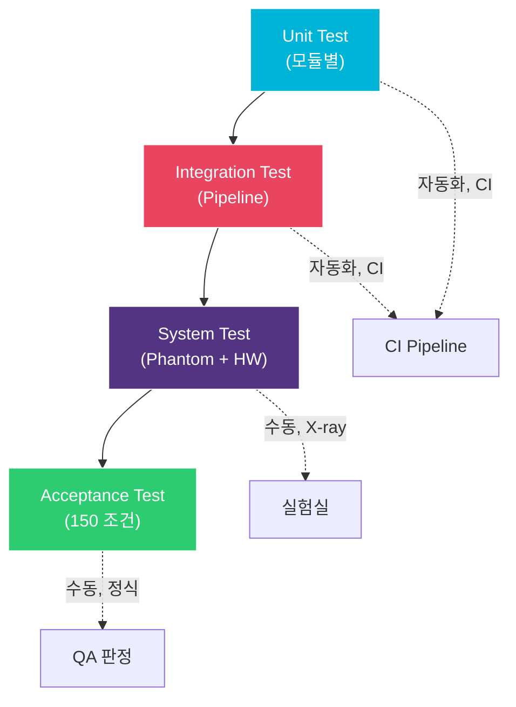

# STP/STC: Software Test Plan & Test Cases

> **Document ID**: STP-GHOST-001 | **Version**: 1.0 | **Date**: 2026-04-02
>
> **Trace Source**: SRS-GHOST-001, SDD-GHOST-001

---

## 1. Test Strategy

### 1.1 테스트 레벨



### 1.2 테스트 환경

| 환경 | Unit/Integration | System | Acceptance |
|---|---|---|---|
| HW | PC (x86_64) | Target MCU + FPGA + Panel | 동일 |
| 데이터 | Synthetic frames | Phantom X-ray images | 임상 시뮬레이션 |
| 교정 | 합성 교정 데이터 | 실제 교정 데이터 | 동일 |
| 자동화 | 100% 자동 | 데이터 취득 수동, 분석 자동 | 수동 |

---

## 2. Unit Test Cases

### 2.1 Tier 1: Offset Correction

| ID | 설명 | 입력 | 기대 출력 | 허용 오차 | SRS Trace |
|---|---|---|---|---|---|
| UT-T1-01 | 정상 차감 | raw=1000, dark=300 | 700 | 0 | FR-101 |
| UT-T1-02 | Underflow clamp | raw=100, dark=300 | 0 | 0 | FR-102 |
| UT-T1-03 | Max value | raw=65535, dark=0 | 65535 | 0 | FR-103 |
| UT-T1-04 | Zero both | raw=0, dark=0 | 0 | 0 | FR-101 |
| UT-T1-05 | Equal frames | raw=dark=500 (uniform) | 0 (all pixels) | 0 | FR-101 |
| UT-T1-06 | Ghost pattern | ROI_A: raw=1050, dark=1000; ROI_B: raw=1000, dark=1000 | ROI_A=50, ROI_B=0 | 0 | FR-101 |
| UT-T1-07 | NULL raw | raw=NULL | CORR_ERR_NULL_PTR | - | FR-105 |
| UT-T1-08 | NULL dark | dark=NULL | CORR_ERR_NULL_PTR | - | FR-105 |
| UT-T1-09 | Overflow count | 1000 pixels underflow | count=1000 | 0 | FR-104 |
| UT-T1-10 | Full frame (3072×3072) | Synthetic frame pair | 전체 pixel 정확 | 0 | FR-101 |

### 2.2 Tier 2: Lag Correction

| ID | 설명 | 입력 | 기대 출력 | 허용 오차 | SRS Trace |
|---|---|---|---|---|---|
| UT-T2-01 | 정상 lag correction | I_oc=500, D_post=310, D_pre=300, α=0.5 | 495 | ±1 LSB | FR-201 |
| UT-T2-02 | Zero lag | D_post=D_pre=300 | I_oc unchanged | 0 | FR-201 |
| UT-T2-03 | Negative lag (noise) | D_post=295, D_pre=300 | I_oc unchanged | 0 | FR-202 |
| UT-T2-04 | α=0 | any lag signal | I_oc unchanged | 0 | FR-203 |
| UT-T2-05 | α=1 (maximum) | I_oc=500, lag=50 | 450 | ±1 | FR-203 |
| UT-T2-06 | NULL dark_post | dark_post=NULL | Skip tier 2 | - | FR-204 |
| UT-T2-07 | Temperature compensation | T=35°C vs T=25°C | α 차이 확인 | ±5% | FR-205 |
| UT-T2-08 | History empty | hist_count=0 | α_default 사용 | - | FR-205 |
| UT-T2-09 | Large lag signal | lag=5000, α=0.3 | Corrected=I_oc-1500 | ±1 | FR-201 |
| UT-T2-10 | Underflow after correction | I_oc=100, lag_est=200 | 0 (clamp) | 0 | FR-102 |

### 2.3 Tier 3: NLCSC

| ID | 설명 | 입력 | 기대 출력 | 허용 오차 | SRS Trace |
|---|---|---|---|---|---|
| UT-T3-01 | Zero state (초기) | All state=0, I_oc=1000 | ~1000 (b₀ 나눗셈) | ±2 LSB | FR-301 |
| UT-T3-02 | State decay | state=1000, dt=τ₁ | state×exp(-1) ≈ 368 | ±5 | FR-302 |
| UT-T3-03 | Large dt (long idle) | dt=3600s (1h) | state ≈ 0 | ±1 | FR-302 |
| UT-T3-04 | Exposure-dependent bn | E=0.5×sat vs E=0.1×sat | bn 차이 확인 | 교정값 대비 ±10% | FR-303 |
| UT-T3-05 | exp LUT accuracy | a=0.01~16 range | Float exp 대비 | ±0.1% | FR-304 |
| UT-T3-06 | NLCSC disabled | nlcsc_enabled=0 | Tier 3 미실행 | - | FR-305 |

### 2.4 Gain Correction

| ID | 설명 | 입력 | 기대 출력 | 허용 오차 | SRS Trace |
|---|---|---|---|---|---|
| UT-G-01 | Unity gain | pixel=1000, gain=mean=32768 | 1000 | 0 | FR-401 |
| UT-G-02 | Low gain pixel | pixel=1000, gain=16384, mean=32768 | 2000 | ±1 | FR-401 |
| UT-G-03 | High gain pixel | pixel=1000, gain=65535, mean=32768 | 500 | ±1 | FR-401 |
| UT-G-04 | Overflow clamp | pixel=60000, gain=16384, mean=32768 | 65535 | 0 | FR-403 |
| UT-G-05 | Dead pixel (gain=0) | pixel=1000, gain=0 | 1000 unchanged | 0 | FR-402 |
| UT-G-06 | Full frame uniformity | Uniform input + non-uniform gain | Output uniform ±1 LSB | ±1 | FR-401 |

### 2.5 Defect Correction

| ID | 설명 | 입력 | 기대 출력 | SRS Trace |
|---|---|---|---|---|
| UT-D-01 | Single defect, avg | center=0, 8 neighbors=1000 | 1000 | FR-601 |
| UT-D-02 | Corner defect | (0,0) defect, 3 valid neighbors=900,1000,1100 | 1000 (avg) | FR-601 |
| UT-D-03 | Cluster (2 adjacent) | 2 defect in 3×3, 6 valid neighbors | avg of 6 | FR-603 |
| UT-D-04 | Isolated (all neighbors defect) | 0 valid neighbors | unchanged + WARNING | FR-604 |
| UT-D-05 | Median method | 5 neighbors: 100,200,1000,1000,1000 | 1000 (median) | FR-602 |
| UT-D-06 | Row defect | Entire row defect | Avg of row above and below | FR-601 |

### 2.6 Fixed-Point Precision

| ID | 설명 | 연산 | Float 결과 | Fixed 결과 | 허용 오차 |
|---|---|---|---|---|---|
| UT-FP-01 | Q16.16 multiply | 0.3 × 1000 | 300.0 | 300 | ±1 |
| UT-FP-02 | Q16.16 multiply near overflow | 0.9999 × 65535 | 65528.5 | 65528~65529 | ±1 |
| UT-FP-03 | exp(-0.01) | 0.990050 | 64882~64883 (Q0.16) | ±1 |  |
| UT-FP-04 | exp(-1.0) | 0.367879 | 24109 (Q0.16) | ±2 |  |
| UT-FP-05 | exp(-10) | 0.0000454 | 3 or 0 (Q0.16) | ±3 |  |
| UT-FP-06 | Division by small number | 65535 / 100 | 655.35 → 655 | ±1 |  |

---

## 3. Integration Test Cases

| ID | 시나리오 | 입력 | 판정 기준 | SRS Trace |
|---|---|---|---|---|
| IT-01 | Uniform dark (no exposure) | raw=dark=uniform | output ≈ 0, σ < 5 LSB | FR-701 |
| IT-02 | Uniform flat field | raw=flat, dark=uniform | output uniform ±1%, no row/col artifacts | FR-701 |
| IT-03 | Tier 1 only | config.max_tier=1 | Tier 2/3 미실행, result.tier_used=1 | FR-701 |
| IT-04 | Tier 1+2 | dark_post 제공 | result.tier_used=2 | FR-701 |
| IT-05 | Tier escalation | GCR > threshold after Tier 1 | Auto escalate to Tier 2 | FR-702 |
| IT-06 | Config update | correction_set_config() 호출 | 즉시 반영 | - |
| IT-07 | Calibration CRC fail | Corrupted .gcal | CORR_ERR_CALIB_CRC | NFR-302 |
| IT-08 | Processing time | Full pipeline | < 200ms | NFR-102 |
| IT-09 | Memory usage | Tier 1+2 | < 100 MB (측정) | NFR-104 |
| IT-10 | 1000 frame stress | 연속 1000 frame | No crash, no memory leak | NFR-301 |

---

## 4. System Test Cases

| ID | 시나리오 | X-ray 조건 | HW 설정 | 판정 기준 |
|---|---|---|---|---|
| ST-01 | Step-wedge phantom, FB 적용 | 70kVp, 10mAs | FB +4V, 3cy | GCR ≤ 0.1% |
| ST-02 | Step-wedge phantom, FB 미적용 | 동일 | Scrub only | GCR ≤ 0.3% (Tier 2+3) |
| ST-03 | Lead marker ghost | 125kVp, 100mAs → dark | FB +4V, 5cy | Ghost 시인 불가 |
| ST-04 | Full saturation → dark | Max exposure | FB +4V, 10cy | 1st dark residual ≤ 0.1% |
| ST-05 | 연속 10 촬영 | 70kVp, 5mAs, 7s 간격 | FB each | GCR ≤ 0.1% all |
| ST-06 | 온도 25°C | 25°C ± 1°C | FB +4V, 3cy | Baseline |
| ST-07 | 온도 35°C | 35°C ± 1°C | FB +4V, 3cy | GCR ≤ 0.15% |
| ST-08 | 온도 40°C | 40°C ± 1°C | FB +4V, 3cy | GCR ≤ 0.2% |
| ST-09 | SNR preservation | RQA5 spectrum | FB +4V | SNR 감소 ≤ 7% |
| ST-10 | MTF preservation | Edge phantom | FB +4V | MTF ≥ 0.98 @Nyquist |

---

## 5. Acceptance Test Matrix (150 조건)

```
5 Exposure × 6 Time Interval × 5 Temperature = 150 conditions

Exposure levels: 0.1, 0.5, 1.0, 5.0, 20.0 mR
Time intervals:  5, 15, 30, 60, 300, 900 seconds
Temperatures:    20, 25, 30, 35, 40 °C

각 조건에서:
  1. FB conditioning 수행
  2. X-ray 촬영
  3. SW correction 적용
  4. GCR 측정
  5. PASS: GCR ≤ 0.1% (FB), GCR ≤ 0.3% (non-FB)

기록: 조건, GCR before, GCR after, tier used, processing time
```

---

## 6. Regression Test Suite

```
변경 시 자동 실행:
  1. 전체 Unit Test (UT-T1 ~ UT-FP, ~50 cases)
  2. 전체 Integration Test (IT-01 ~ IT-10)
  3. Golden reference 비교
     - 5개 synthetic frame에 대한 보정 결과를 golden으로 저장
     - Bit-exact 비교 (fixed-point 변경 감지)

CI trigger:
  - 소스 코드 변경 시 자동
  - 교정 데이터 변경 시 자동
  - 주 1회 정기 실행
```
