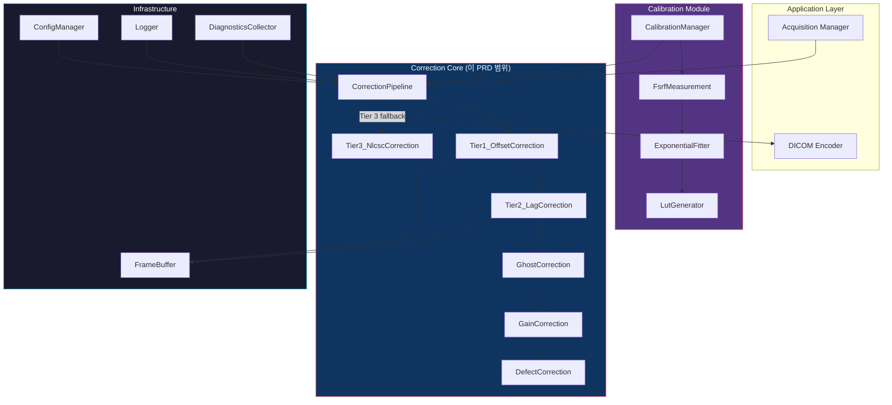

# PRD v2.0: Lag/Ghost SW Correction Algorithm — Implementation Specification

> **Product**: Ghost Image SW Correction Module for a-Si FPD Still DR System
>
> **Target**: AUO R1717 (3072×3072) + AFE2256GR | HW FB 적용 후 잔여 lag/ghost SW 보정
>
> **Version**: 2.0 | **Date**: 2026-04-02 | **Supersedes**: PRD v1.0
>
> **IEC 62304 Class**: Class B (non-life-sustaining, but diagnostic image quality)

---

## 1. Scope & Goals

### 1.1 이 문서가 추가하는 것 (v1.0 대비)

| v1.0 (방법론 설계) | v2.0 (구현 사양 추가) |
|---|---|
| 알고리즘 수식 | **Pseudocode + 구현 가능 수준 상세** |
| 아키텍처 개요 | **모듈 구조, 파일 레이아웃, 의존성** |
| 데이터 흐름 | **API 시그니처, 데이터 구조 정의** |
| 성능 목표 | **Edge case, Error handling, Overflow 방지** |
| 테스트 계획 | **구체적 테스트 케이스 (입력→기대출력)** |
| - | **교정 파일 포맷, Configuration 관리** |
| - | **코딩 규약, 코드 품질 기준** |

### 1.2 성능 목표 (변경 없음)

| 지표 | 목표 |
|---|---|
| GCR (1st frame, FB 적용 후) | ≤ 0.1% |
| Processing latency | < 200ms (Tier 1+2: < 70ms) |
| Memory footprint | < 100 MB (Tier 1+2) |
| 16-bit 정밀도 손실 | ≤ 0.5 LSB RMS |

---

## 2. Software Architecture

### 2.1 모듈 구조



### 2.2 파일 레이아웃

```
sw_correction/
├── include/
│   ├── correction_pipeline.h    # Pipeline orchestration
│   ├── tier1_offset.h           # Dark subtraction
│   ├── tier2_lag.h              # AR(1) lag correction
│   ├── tier3_nlcsc.h            # NLCSC full correction
│   ├── gain_correction.h        # Static + dynamic gain
│   ├── ghost_correction.h       # Gain ghosting correction
│   ├── defect_correction.h      # Defect pixel interpolation
│   ├── frame_buffer.h           # Frame memory management
│   ├── calibration_data.h       # Calibration file I/O
│   ├── config.h                 # Runtime configuration
│   ├── types.h                  # Common type definitions
│   └── error_codes.h            # Error/status codes
├── src/
│   ├── correction_pipeline.c
│   ├── tier1_offset.c
│   ├── tier2_lag.c
│   ├── tier3_nlcsc.c
│   ├── gain_correction.c
│   ├── ghost_correction.c
│   ├── defect_correction.c
│   ├── frame_buffer.c
│   ├── calibration_data.c
│   ├── config.c
│   ├── math_utils.c             # Fixed-point math, LUT interpolation
│   └── simd_kernels.c           # NEON SIMD optimized kernels (optional)
├── calibration/
│   ├── fsrf_measurement.c       # FSRF/RSRF acquisition automation
│   ├── exponential_fitter.c     # Levenberg-Marquardt fitting
│   ├── lut_generator.c          # LUT generation from fitted params
│   └── calib_file_io.c          # .gcal file read/write
├── test/
│   ├── test_tier1.c
│   ├── test_tier2.c
│   ├── test_tier3.c
│   ├── test_gain.c
│   ├── test_ghost.c
│   ├── test_defect.c
│   ├── test_pipeline.c
│   ├── test_edge_cases.c
│   ├── test_fixed_point.c
│   └── test_data/               # Golden reference data
└── docs/
    └── sw_lag_correction_prd.md  # 이 문서
```

---

## 3. Data Types & Structures

### 3.1 기본 타입

```c
// types.h

#define IMG_WIDTH   3072
#define IMG_HEIGHT  3072
#define IMG_PIXELS  (IMG_WIDTH * IMG_HEIGHT)  // 9,437,184
#define N_EXP_TERMS 4    // Multi-exponential 항 수
#define N_CALIB_LEVELS 9 // 교정 exposure 수준 수

typedef uint16_t pixel_t;       // Raw/corrected pixel (0~65535)
typedef int32_t  pixel_wide_t;  // Intermediate computation (overflow 방지)
typedef uint16_t q16_t;         // Q0.16 unsigned fixed-point (0~0.9999)
typedef int32_t  q1616_t;       // Q16.16 signed fixed-point
typedef uint8_t  defect_t;      // Defect map (0=normal, 1=defect)

// Frame buffer (18.9 MB each)
typedef struct {
    pixel_t data[IMG_HEIGHT][IMG_WIDTH];
    uint64_t timestamp_us;      // Acquisition timestamp (microseconds)
    float    temperature_c;     // Panel temperature at acquisition
    uint32_t exposure_level;    // 0~65535 (proportional to dose)
    uint32_t frame_id;          // Sequential frame counter
} Frame;

// Exposure history entry
typedef struct {
    uint64_t timestamp_us;
    uint32_t exposure_level;    // Median pixel value of bright frame
    uint8_t  fb_applied;        // 1=FB was applied before this shot
    uint8_t  fb_cycles;         // Number of FB cycles applied
} ExposureRecord;

#define MAX_EXPOSURE_HISTORY 16
```

### 3.2 교정 데이터 구조

```c
// calibration_data.h

// IRF 파라미터 (Tier 2/3)
typedef struct {
    // LTI parameters (Tier 2)
    q1616_t  b[N_EXP_TERMS];       // Lag coefficients b1~b4, Q16.16
    q1616_t  a[N_EXP_TERMS];       // Lag rates (= 1/τ, in frame⁻¹), Q16.16
    q1616_t  b0;                    // Unaffected fraction, Q16.16

    // NLCSC parameters (Tier 3): polynomial coefficients for Qn(E)
    q1616_t  Qn_poly[N_EXP_TERMS][5]; // 4th-order polynomial, per trap level
    q1616_t  a2n_coeff[N_EXP_TERMS][3]; // Exponential fit for a2,n(E)
} IrfParams;

// Temperature LUT
typedef struct {
    float    temp_points[5];    // 20, 25, 30, 35, 40 °C
    q1616_t  a_scale[5][N_EXP_TERMS]; // aₙ multiplier at each temp
    q1616_t  b_scale[5][N_EXP_TERMS]; // bₙ multiplier at each temp
} TempLut;

// Gain map
typedef struct {
    pixel_t  gain[IMG_HEIGHT][IMG_WIDTH];  // 16-bit normalized gain
    pixel_t  gain_mean;                     // Global mean for normalization
} GainMap;

// Defect map
typedef struct {
    defect_t map[IMG_HEIGHT][IMG_WIDTH];    // 0=normal, 1~255=defect type
    uint32_t defect_count;
    uint32_t cluster_count;
    uint32_t line_defect_count;
} DefectMap;

// Ghost correction parameters
typedef struct {
    q1616_t  gamma;             // Ghost coefficient
    q1616_t  tau_ghost_s;       // Ghost time constant (seconds), Q16.16
    uint8_t  enabled;           // 0=disabled (default for indirect FPD)
} GhostParams;

// Master calibration structure
typedef struct {
    uint32_t   magic;           // 0x47434C42 ('GCLB')
    uint32_t   version;         // File format version
    uint32_t   panel_serial;    // Panel S/N
    char       date[16];        // Calibration date YYYY-MM-DD
    float      ref_temperature; // Reference temperature (25°C)
    IrfParams  irf;
    TempLut    temp_lut;
    GainMap    gain;
    DefectMap  defect;
    GhostParams ghost;
    uint32_t   crc32;           // CRC of entire structure
} CalibrationData;
```

### 3.3 Configuration

```c
// config.h

typedef struct {
    // Tier selection
    uint8_t  max_tier;              // 1, 2, or 3 (default: 2)
    uint8_t  auto_tier_escalation;  // 1=auto, 0=fixed tier (default: 1)
    q1616_t  gcr_threshold;         // GCR threshold for tier escalation (default: 0.001 = 0.1%)

    // Tier 1 parameters
    uint8_t  dark_sub_enabled;      // (default: 1)

    // Tier 2 parameters
    q1616_t  alpha_default;         // AR(1) coefficient (default: calibrated)
    uint8_t  use_nonlinear_alpha;   // 1=exposure-dependent α (default: 1)
    uint8_t  residual_frames;       // Number of D_post frames to use (default: 1)

    // Tier 3 parameters
    uint8_t  nlcsc_enabled;         // (default: 0, enable only when needed)

    // Gain correction
    uint8_t  gain_enabled;          // (default: 1)
    uint8_t  ghost_correction_enabled; // (default: 0, indirect FPD)

    // Defect correction
    uint8_t  defect_enabled;        // (default: 1)
    uint8_t  defect_interp_method;  // 0=neighbor_avg, 1=bilinear, 2=median

    // System
    uint16_t charge_range_pc;       // AFE2256 charge range in 0.1pC (default: 48 = 4.8pC)
    float    current_temperature;   // Current panel temperature
} CorrectionConfig;

// Default configuration
static const CorrectionConfig DEFAULT_CONFIG = {
    .max_tier = 2,
    .auto_tier_escalation = 1,
    .gcr_threshold = 0x0000028F,  // Q16.16 for 0.001 (0.1%)
    .dark_sub_enabled = 1,
    .alpha_default = 0x00000000,  // Set during calibration
    .use_nonlinear_alpha = 1,
    .residual_frames = 1,
    .nlcsc_enabled = 0,
    .gain_enabled = 1,
    .ghost_correction_enabled = 0,
    .defect_enabled = 1,
    .defect_interp_method = 0,
    .charge_range_pc = 48,
    .current_temperature = 25.0f,
};
```

---

## 4. API Specification

### 4.1 Pipeline API

```c
// correction_pipeline.h

typedef enum {
    CORR_OK                 = 0,
    CORR_ERR_NULL_PTR       = -1,
    CORR_ERR_CALIB_INVALID  = -2,
    CORR_ERR_CALIB_CRC      = -3,
    CORR_ERR_OVERFLOW       = -4,
    CORR_ERR_TIMEOUT        = -5,
    CORR_ERR_TIER_FAILED    = -6,
    CORR_ERR_MEMORY         = -7,
    CORR_ERR_TEMPERATURE    = -8,
} CorrectionError;

typedef struct {
    float    gcr_before;        // GCR before correction
    float    gcr_after;         // GCR after correction
    uint8_t  tier_used;         // Actual tier applied (1, 2, or 3)
    float    processing_ms;     // Total processing time
    float    sigma_residual;    // σ_R of corrected image
    uint32_t overflow_count;    // Number of pixels that hit overflow
    uint32_t underflow_count;   // Number of pixels clamped to 0
} CorrectionResult;

// Initialize pipeline (call once at startup)
CorrectionError correction_init(
    const CalibrationData* calib,
    const CorrectionConfig* config
);

// Process single frame
CorrectionError correction_process(
    const Frame* raw_frame,       // X-ray image
    const Frame* dark_pre,        // Pre-exposure dark
    const Frame* dark_post,       // Post-exposure dark (NULL if unavailable)
    Frame* output,                // Corrected output
    CorrectionResult* result      // Diagnostics output
);

// Update exposure history (call after each shot)
CorrectionError correction_update_history(
    const ExposureRecord* record
);

// Update runtime config
CorrectionError correction_set_config(
    const CorrectionConfig* config
);

// Cleanup
void correction_deinit(void);
```

### 4.2 Individual Tier APIs

```c
// tier1_offset.h
CorrectionError tier1_offset_correct(
    const Frame* raw,
    const Frame* dark,
    Frame* output              // output = raw - dark (clamped to 0)
);

// tier2_lag.h
CorrectionError tier2_lag_correct(
    const Frame* offset_corrected,
    const Frame* dark_post,
    const Frame* dark_pre,
    const IrfParams* irf,
    const ExposureRecord* history,
    uint8_t history_count,
    float temperature,
    Frame* output
);

// tier3_nlcsc.h
CorrectionError tier3_nlcsc_correct(
    const Frame* offset_corrected,
    const IrfParams* irf,
    const ExposureRecord* history,
    uint8_t history_count,
    float temperature,
    Frame* output,
    pixel_wide_t state_maps[N_EXP_TERMS][IMG_HEIGHT][IMG_WIDTH]  // Persistent state
);

// gain_correction.h
CorrectionError gain_correct(
    const Frame* input,
    const GainMap* gain,
    Frame* output
);

// ghost_correction.h
CorrectionError ghost_correct(
    const Frame* input,
    const GhostParams* params,
    const ExposureRecord* history,
    uint8_t history_count,
    Frame* output
);

// defect_correction.h
CorrectionError defect_correct(
    Frame* inout,               // In-place correction
    const DefectMap* defect,
    uint8_t interp_method
);
```

---

## 5. Algorithm Pseudocode

### 5.1 Tier 1: Offset Correction

```
FUNCTION tier1_offset_correct(raw, dark, output):
    FOR y = 0 TO IMG_HEIGHT-1:
        FOR x = 0 TO IMG_WIDTH-1:
            diff = (int32_t)raw.data[y][x] - (int32_t)dark.data[y][x]

            // Clamp: underflow 방지
            IF diff < 0:
                output.data[y][x] = 0
                underflow_count += 1
            ELSE IF diff > 65535:
                output.data[y][x] = 65535
                overflow_count += 1
            ELSE:
                output.data[y][x] = (uint16_t)diff

    RETURN CORR_OK
```

### 5.2 Tier 2: AR(1) Residual Lag Correction

```
FUNCTION tier2_lag_correct(I_oc, D_post, D_pre, irf, history, temp, output):

    // Step 1: Compute residual lag map
    //   R(x,y) = D_post(x,y) - D_pre(x,y)  → 순수 lag signal
    FOR each pixel (x,y):
        lag_signal = (int32_t)D_post.data[y][x] - (int32_t)D_pre.data[y][x]

        // Clamp negative lag (noise로 인한 역전)
        IF lag_signal < 0:
            lag_signal = 0

    // Step 2: Estimate α(E) — exposure-dependent residual fraction
    //   α는 "X-ray frame과 1st dark frame 사이의 lag 비율"
    //   교정 데이터에서 LUT lookup
    E = history[last].exposure_level
    alpha = lookup_alpha(E, irf, temp)

    // Step 3: Compute lag estimate in X-ray frame
    //   L_est(x,y) = α(E) × R(x,y)
    //
    //   원리: D_post1에서 관찰되는 lag signal R은
    //         X-ray frame에도 동일한 trap에서 유래하므로
    //         α 비율만큼 X-ray frame에 포함되어 있음
    FOR each pixel (x,y):
        lag_est = fixed_mul(alpha, lag_signal[y][x])  // Q16.16 × int32 → int32

    // Step 4: Subtract lag estimate from offset-corrected image
    FOR each pixel (x,y):
        corrected = (int32_t)I_oc.data[y][x] - lag_est[y][x]
        output.data[y][x] = CLAMP(corrected, 0, 65535)

    RETURN CORR_OK
```

### 5.3 Tier 3: NLCSC Correction

```
FUNCTION tier3_nlcsc_correct(I_oc, irf, history, history_count, temp, output, state):

    // State variables Sn carry across frames (persistent)
    // On first call or after long idle, state should be zeroed

    FOR each pixel (x,y):
        y_k = (int32_t)I_oc.data[y][x]

        // Step 1: Update state variables with time decay
        FOR n = 0 TO N_EXP_TERMS-1:
            // Compute time-adjusted decay
            dt = current_time - last_frame_time  // in seconds
            tau_n = get_tau(n, irf, temp)
            decay = exp_lut(-dt / tau_n)  // LUT-based exp

            // State update: Sn = Sn_prev × decay + x_hat_prev × bn(E_prev)
            E_prev = history[last].exposure_level
            bn_E = lookup_bn(n, E_prev, irf, temp)

            state[n][y][x] = fixed_mul(state[n][y][x], decay)
                           + fixed_mul(x_hat_prev[y][x], bn_E)

        // Step 2: Compute corrected signal
        lag_sum = 0
        FOR n = 0 TO N_EXP_TERMS-1:
            lag_sum += state[n][y][x]

        x_hat = (y_k - lag_sum) / irf.b0  // Fixed-point division

        // Step 3: Clamp and store
        output.data[y][x] = CLAMP(x_hat, 0, 65535)

        // Step 4: Update stored charge estimate (for NLCSC nonlinear adaptation)
        q_stored = 0
        FOR n = 0 TO N_EXP_TERMS-1:
            an_E = lookup_an(n, E_current, irf, temp)
            IF an_E > 0:
                q_stored += state[n][y][x] / (1 - exp_lut(-an_E))

    RETURN CORR_OK
```

### 5.4 Gain Correction

```
FUNCTION gain_correct(input, gain_map, output):

    // gain_map.gain[y][x] = G(x,y) normalized to gain_mean
    // Corrected = input × gain_mean / G(x,y)

    FOR each pixel (x,y):
        g = gain_map.gain[y][x]

        IF g == 0:
            // Dead pixel → defect correction에서 처리
            output.data[y][x] = input.data[y][x]
            CONTINUE

        // Fixed-point division: input × gain_mean / g
        // Use 32-bit intermediate to avoid overflow
        numerator = (uint32_t)input.data[y][x] * (uint32_t)gain_map.gain_mean
        result = numerator / (uint32_t)g

        output.data[y][x] = CLAMP(result, 0, 65535)

    RETURN CORR_OK
```

### 5.5 Defect Correction

```
FUNCTION defect_correct(inout, defect_map, method):

    FOR each pixel (x,y):
        IF defect_map.map[y][x] == 0:
            CONTINUE  // Normal pixel

        // Collect valid neighbors
        neighbors = []
        FOR dy = -1 TO 1:
            FOR dx = -1 TO 1:
                IF (dx == 0 AND dy == 0): CONTINUE
                nx = x + dx
                ny = y + dy
                IF in_bounds(nx, ny) AND defect_map.map[ny][nx] == 0:
                    neighbors.append(inout.data[ny][nx])

        IF neighbors.count == 0:
            // Isolated in defect cluster → leave unchanged or flag
            CONTINUE

        SWITCH method:
            CASE 0:  // Neighbor average
                inout.data[y][x] = mean(neighbors)
            CASE 1:  // Bilinear interpolation
                inout.data[y][x] = bilinear_interp(inout, x, y, defect_map)
            CASE 2:  // Median
                inout.data[y][x] = median(neighbors)

    RETURN CORR_OK
```

### 5.6 Pipeline Orchestration

```
FUNCTION correction_process(raw, dark_pre, dark_post, output, result):

    timer_start()

    // === Tier 1: Offset Correction (필수) ===
    err = tier1_offset_correct(raw, dark_pre, &buf_oc)
    IF err != CORR_OK: RETURN err

    result.tier_used = 1

    // === Tier 2: Lag Correction (조건부) ===
    IF config.max_tier >= 2 AND dark_post != NULL:

        err = tier2_lag_correct(&buf_oc, dark_post, dark_pre,
                                &calib.irf, history, history_count,
                                config.current_temperature, &buf_lc)
        IF err != CORR_OK: RETURN err

        result.tier_used = 2
        copy_frame(&buf_oc, &buf_lc)  // buf_oc ← lag-corrected

    // === Ghost Correction (조건부, 기본 비활성) ===
    IF config.ghost_correction_enabled:
        err = ghost_correct(&buf_oc, &calib.ghost, history, history_count, &buf_gc)
        IF err != CORR_OK: RETURN err
        copy_frame(&buf_oc, &buf_gc)

    // === Gain Correction ===
    IF config.gain_enabled:
        err = gain_correct(&buf_oc, &calib.gain, &buf_gain)
        IF err != CORR_OK: RETURN err
        copy_frame(&buf_oc, &buf_gain)

    // === Defect Correction ===
    IF config.defect_enabled:
        err = defect_correct(&buf_oc, &calib.defect, config.defect_interp_method)
        IF err != CORR_OK: RETURN err

    // === Auto Tier Escalation ===
    IF config.auto_tier_escalation AND config.max_tier >= 3:
        gcr = estimate_gcr(&buf_oc, dark_pre, raw)
        IF gcr > config.gcr_threshold:
            err = tier3_nlcsc_correct(&buf_oc, &calib.irf, history,
                                      history_count, config.current_temperature,
                                      output, nlcsc_state)
            IF err == CORR_OK:
                result.tier_used = 3
            // Re-apply gain + defect after Tier 3
            ...

    copy_frame(output, &buf_oc)

    result.processing_ms = timer_elapsed_ms()
    result.gcr_after = estimate_gcr(output, dark_pre, raw)

    RETURN CORR_OK
```

---

## 6. Edge Cases & Error Handling

### 6.1 Overflow/Underflow

```
모든 pixel 연산은 int32_t 중간 변수 사용:

  pixel_wide_t diff = (pixel_wide_t)a - (pixel_wide_t)b;

  // Clamp to uint16 range
  if (diff < 0) { result = 0; underflow_count++; }
  else if (diff > 65535) { result = 65535; overflow_count++; }
  else { result = (pixel_t)diff; }

Overflow/underflow 발생 시:
  - 경고 로그 기록 (pixel 좌표, 원본 값, 계산 결과)
  - 전체 frame의 overflow count가 임계치 (0.1% = ~9,400 pixels) 초과 시
    → result에 CORR_ERR_OVERFLOW flag 설정
    → 보정은 계속 진행 (abort 하지 않음)
```

### 6.2 Null/Missing Data

```
dark_post == NULL:
  → Tier 2 skip, Tier 1만 적용
  → result.tier_used = 1

dark_pre == NULL:
  → CORR_ERR_NULL_PTR 반환 (치명적)

calib == NULL 또는 CRC 불일치:
  → CORR_ERR_CALIB_INVALID
  → 보정 불가, raw 그대로 출력

exposure_history count == 0:
  → α_default 사용 (config에서 설정)
```

### 6.3 Saturation Pixels

```
raw.data[y][x] == 65535 (ADC saturation):
  → 보정 결과도 65535로 유지 (실제 값을 알 수 없음)
  → saturation flag map 생성 (후처리에서 활용)

raw.data[y][x] == 0 (dead pixel 또는 극저선량):
  → 0 유지, defect correction에서 처리
```

### 6.4 Temperature Out of Range

```
temperature < 15°C 또는 > 45°C:
  → CORR_ERR_TEMPERATURE 경고 (보정은 계속)
  → LUT 외삽 (extrapolation) 대신 가장 가까운 LUT 값 사용

temperature NaN 또는 센서 미연결:
  → 25°C (기준 온도)로 fallback
  → 경고 로그
```

### 6.5 Fixed-Point Precision

```
Q16.16 곱셈:
  int64_t tmp = (int64_t)a * (int64_t)b;
  int32_t result = (int32_t)(tmp >> 16);

  // Rounding: add 0.5 before shift
  int32_t result = (int32_t)((tmp + 0x8000) >> 16);

Q16.16 나눗셈:
  int64_t tmp = ((int64_t)a << 16) / (int64_t)b;

  // Division by zero 방지
  if (b == 0) { result = 0; error_flag = 1; }

exp(-a) LUT:
  256 entries, a 범위 0~16
  Index = (a * 256) / 16 = a * 16
  Linear interpolation between entries
  a > 16: return 0 (exp(-16) ≈ 1.1e-7, 무시 가능)
  a < 0:  return 65535 (exp(0) = 1.0)
```

---

## 7. Calibration File Format (.gcal)

```
File: panel_XXXXXXXX.gcal

Header (64 bytes):
  [0:3]    Magic: "GCLB" (0x47434C42)
  [4:7]    Version: 0x00020000 (v2.0)
  [8:11]   Panel S/N
  [12:27]  Date: "YYYY-MM-DD\0\0\0\0\0\0"
  [28:31]  Ref temperature × 100 (int32, e.g., 2500 = 25.00°C)
  [32:35]  Data offset: byte offset to data section
  [36:39]  Data size: total data bytes
  [40:43]  CRC32 of data section
  [44:63]  Reserved (zero-filled)

Data Section:
  [IRF Parameters]     : 4 × (b + a + b0) + NLCSC poly/exp coefficients
  [Temperature LUT]    : 5 × 4 × 2 entries
  [Gain Map]           : IMG_HEIGHT × IMG_WIDTH × 2 bytes (18.9 MB)
  [Defect Map]         : IMG_HEIGHT × IMG_WIDTH × 1 byte (9.4 MB)
  [Ghost Parameters]   : gamma + tau + enabled

Total file size: ~28.5 MB
```

---

## 8. Test Cases

### 8.1 Unit Test: Tier 1

| Test ID | 입력 | 기대 출력 | 허용 오차 |
|---|---|---|---|
| T1-01 | raw=1000, dark=300 | 700 | 0 |
| T1-02 | raw=100, dark=300 | **0** (clamp) | 0 |
| T1-03 | raw=65535, dark=0 | 65535 | 0 |
| T1-04 | raw=0, dark=0 | 0 | 0 |
| T1-05 | raw=dark (uniform) | 0 (all pixels) | 0 |
| T1-06 | Synthetic ghost pattern (ROI_A=1000+50, ROI_B=1000), dark=1000 | ROI_A=50, ROI_B=0, GCR=0 | 0 |

### 8.2 Unit Test: Tier 2

| Test ID | 입력 | 기대 출력 | 허용 오차 |
|---|---|---|---|
| T2-01 | I_oc=500, D_post=310, D_pre=300, α=0.5 | 500 - 0.5×10 = **495** | ±1 LSB |
| T2-02 | I_oc=500, D_post=300, D_pre=300 (no lag) | **500** (unchanged) | 0 |
| T2-03 | I_oc=500, D_post=295, D_pre=300 (negative lag) | **500** (lag clamped to 0) | 0 |
| T2-04 | α=0, any lag signal | **I_oc unchanged** | 0 |
| T2-05 | Full saturation exposure | 보정 후 GCR < 0.1% | 측정 |

### 8.3 Unit Test: Gain Correction

| Test ID | 입력 | 기대 출력 | 허용 오차 |
|---|---|---|---|
| G-01 | pixel=1000, gain=32768 (1.0×), mean=32768 | **1000** | 0 |
| G-02 | pixel=1000, gain=16384 (0.5×), mean=32768 | **2000** | ±1 |
| G-03 | pixel=1000, gain=65535 (2.0×), mean=32768 | **500** | ±1 |
| G-04 | pixel=60000, gain=16384 | **65535** (clamp) | 0 |
| G-05 | gain=0 (dead pixel) | **input unchanged** | 0 |

### 8.4 Integration Test: Pipeline

| Test ID | 시나리오 | 판정 기준 |
|---|---|---|
| P-01 | Uniform dark (no exposure) | output = 0 ± noise, no artifacts |
| P-02 | Uniform flat field | output uniform ± 1%, no row/col artifacts |
| P-03 | Step-wedge phantom, FB applied | GCR ≤ 0.1% |
| P-04 | Full saturation → dark, FB applied | 1st dark residual ≤ 0.1% |
| P-05 | FB not applied, high dose | GCR ≤ 0.3% (Tier 2+3) |
| P-06 | Defect pixel region | Defect pixels interpolated, no visible artifacts |
| P-07 | Processing time | < 200ms (all tiers) |
| P-08 | Memory usage | < 100 MB (Tier 1+2) |

### 8.5 Fixed-Point Precision Test

| Test ID | 연산 | Float 결과 | Fixed 결과 | 허용 오차 |
|---|---|---|---|---|
| FP-01 | 0.3 × 1000 | 300.0 | 300 | ±1 |
| FP-02 | exp(-0.01) | 0.99005 | 0.99005±0.0001 | ±1 LSB @Q0.16 |
| FP-03 | exp(-10) | 4.54e-5 | 0 (acceptable) | - |
| FP-04 | 50000 × 1.5 / 1.0 | 75000 → clamp 65535 | 65535 | 0 |

---

## 9. Code Quality Standards

### 9.1 IEC 62304 Class B 준수

| 항목 | 요구사항 | 구현 |
|---|---|---|
| SW Development Plan | 있음 | 이 PRD + 개발 일정 |
| SW Architecture | 있음 | Section 2 |
| Detailed Design | 있음 | Section 3~6 |
| Unit Testing | 있음 | Section 8.1~8.5 |
| Integration Testing | 있음 | Section 8.4 |
| Traceability | 요구→설계→테스트 추적 가능 | 각 섹션 cross-reference |
| Risk Analysis | 있음 | PRD v1.0 Section 11 |
| Anomaly Resolution | 있음 | Error codes + logging |

### 9.2 코딩 규약

```
명명 규칙:
  함수:    snake_case (tier1_offset_correct)
  타입:    PascalCase (CorrectionResult)
  상수:    UPPER_SNAKE_CASE (IMG_WIDTH)
  변수:    snake_case (pixel_count)

문서화:
  모든 public 함수에 Doxygen 주석
  파라미터 범위, 반환값, 에러 조건 명시

정적 분석:
  MISRA C:2012 Advisory 준수 (safety-critical subset)
  -Wall -Wextra -Werror 컴파일
  cppcheck / Coverity 정적 분석 통과

코드 커버리지:
  Statement coverage ≥ 80%
  Branch coverage ≥ 70%
  Safety-critical 경로 (overflow, null check) 100%
```

### 9.3 성능 최적화 규칙

```
1. 내부 루프에서 분기 최소화
   → defect map은 별도 패스로 분리

2. 메모리 접근 패턴: row-major 순회
   → cache line 활용 극대화

3. SIMD 최적화 (선택적):
   → ARM NEON: 8 × uint16 동시 처리
   → 4배 속도 향상 기대

4. LUT 크기: L1 cache에 들어가는 크기 유지
   → exp LUT: 256 × 4 bytes = 1 KB (L1 cache 내)
   → α LUT: 256 × 4 bytes = 1 KB

5. Frame buffer: double buffering
   → 현재 처리 중 + 다음 취득 동시 진행
```

---

## 10. Diagnostics & Logging

### 10.1 CorrectionResult 활용

```
매 촬영 후 CorrectionResult를 기록:
  - tier_used: 어떤 tier가 실제 적용되었는가
  - gcr_before / gcr_after: 보정 전후 GCR
  - processing_ms: 처리 시간
  - overflow_count / underflow_count: 비정상 pixel 수
  - sigma_residual: 잔류 noise

이 데이터를 시계열로 저장하여:
  - 교정 drift 감지 (GCR이 점진적으로 증가)
  - 성능 열화 조기 경고
  - 교정 주기 결정
```

### 10.2 Log Level

```
ERROR:   보정 실패 (NULL ptr, CRC, timeout)
WARNING: overflow > threshold, temperature out of range, tier escalation
INFO:    매 촬영 result summary
DEBUG:   pixel-level 상세 (개발 중에만)
```

---

## 11. Migration from v1.0

### v1.0 → v2.0 변경 추적

| 섹션 | v1.0 | v2.0 | 변경 사유 |
|---|---|---|---|
| 1 | 목표만 기술 | + Scope 구분 (v1 vs v2) | 문서 역할 명확화 |
| 2 | - | **모듈 구조 + 파일 레이아웃** | 구현 착수 가능하도록 |
| 3 | - | **데이터 구조 정의 (C struct)** | API 계약 확립 |
| 4 | - | **API 시그니처 + Error codes** | 모듈 간 인터페이스 확정 |
| 5 | 수식만 | **+ Pseudocode (구현 수준)** | 코드 변환 직접 가능 |
| 6 | - | **Edge case + Error handling** | 견고성 확보 |
| 7 | - | **교정 파일 포맷 (.gcal)** | 데이터 호환성 |
| 8 | 테스트 개요 | **+ 구체적 테스트 케이스** | 자동화 테스트 가능 |
| 9 | - | **코딩 규약 + IEC 62304** | 코드 품질 기준 |
| 10 | - | **Diagnostics + Logging** | 운용 가시성 |

v1.0의 Section 2~12 (Literature Survey, 수학 모델, 교정, 시나리오, Roadmap, Risk, References)는 **그대로 유효**하며 이 문서에서 참조합니다.
