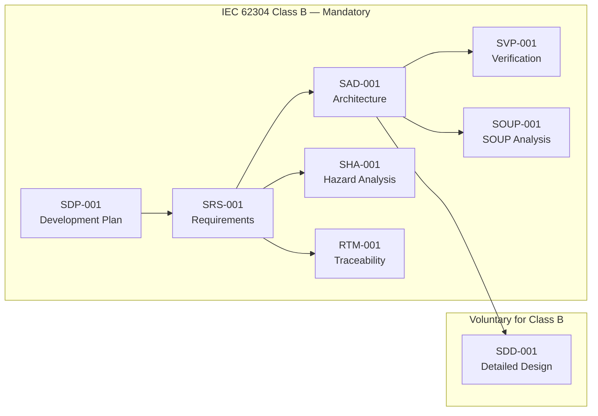

# GSVG Document Package — Master Index

**Project:** X-ray Grid Suppression & Virtual Grid Software  
**Safety Classification:** IEC 62304 Class B  
**Version:** 1.0 | **Date:** 2026-04-03  
**Applicable Standards:** IEC 62304:2015, ISO 14971:2019, IEC 62366-1:2015

---

## Document Registry

| Doc ID | Title | IEC 62304 Clause | File |
|--------|-------|------------------|------|
| GSVG-SDP-001 | Software Development Plan | 5.1 | `GSVG-SDP-001_Development_Plan.md` |
| GSVG-SRS-001 | Software Requirements Specification | 5.2 | `GSVG-SRS-001_Requirements.md` |
| GSVG-SAD-001 | Software Architecture Design | 5.3 | `GSVG-SAD-001_Architecture.md` |
| GSVG-SDD-001 | Software Detailed Design | 5.4 (voluntary) | `GSVG-SDD-001_Detailed_Design.md` |
| GSVG-SVP-001 | Software Verification Plan | 5.5–5.7 | `GSVG-SVP-001_Verification_Plan.md` |
| GSVG-SOUP-001 | SOUP Analysis | 5.3.3 | `GSVG-SOUP-001_SOUP_Analysis.md` |
| GSVG-SHA-001 | Software Hazard Analysis | Clause 7 | `GSVG-SHA-001_Hazard_Analysis.md` |
| GSVG-RTM-001 | Requirements Traceability Matrix | 5.7 | `GSVG-RTM-001_Traceability.md` |

## Class B Mandatory vs Voluntary

## Revision History

| Version | Date | Author | Description |
|---------|------|--------|-------------|
| 1.0 | 2026-04-03 | — | Initial release |
