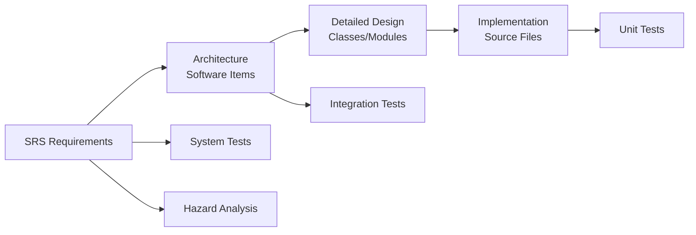
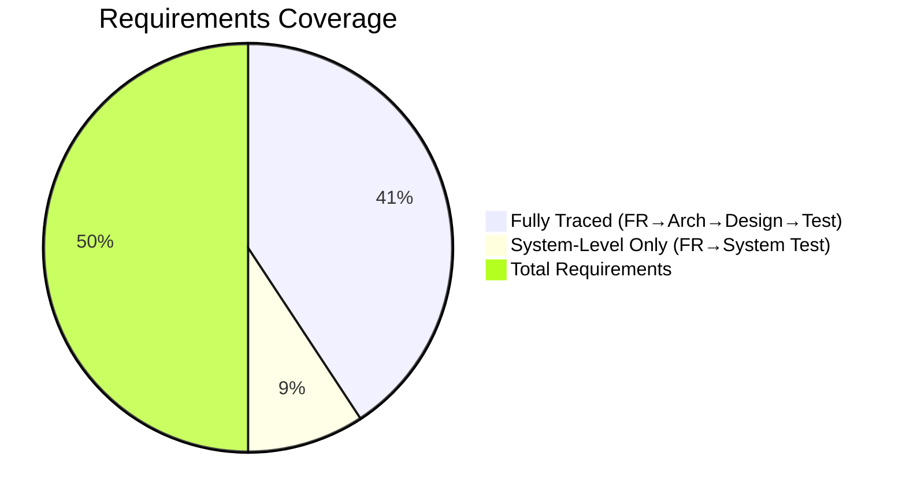

# GSVG-RTM-001: Requirements Traceability Matrix

**Document ID:** GSVG-RTM-001  
**Version:** 1.0 | **Date:** 2026-04-03  
**IEC 62304 Clause:** 5.7  
**Safety Classification:** Class B

---

## 1. Traceability Overview

---

## 2. Grid Suppression Requirements Traceability

| Requirement | Architecture (SAD) | Design (SDD) | Unit Test | Integration Test | System Test |
|-------------|-------------------|-------------|-----------|-----------------|-------------|
| GS-FR-001 Grid freq calculation | SI-002: GridlineDetector | GridlineDetector.cpp | UT-GS-003 | IT-001 | ST-001 |
| GS-FR-002 2D DWT decomposition | SI-002: DwtDecomposer | DwtDecomposer.cpp | UT-GS-001, UT-GS-002 | IT-001 | ST-001 |
| GS-FR-003 Energy auto-detection | SI-002: GridlineDetector | GridlineDetector.cpp | UT-GS-003, UT-GS-004, UT-GS-007 | IT-001 | ST-001 |
| GS-FR-004 Band-stop filter | SI-002: BandStopFilter | BandStopFilter.cpp | UT-GS-005, UT-GS-006 | IT-001 | ST-001 |
| GS-FR-005 Artifact-free output | SI-002 (system level) | — | — | IT-001 | ST-001, ST-002 |
| GS-FR-006 MTF < 5% loss | SI-002 (system level) | — | UT-GS-006 | IT-001 | ST-002 |
| GS-FR-007 60–200 LP/inch range | SI-002: GridlineDetector | GridlineDetector.cpp | UT-GS-003 | IT-001 | ST-001, ST-002 |
| GS-FR-008 Moiré removal | SI-002: BandStopFilter | BandStopFilter.cpp | UT-GS-005 | IT-001 | ST-001 |

---

## 3. Virtual Grid Requirements Traceability

| Requirement | Architecture (SAD) | Design (SDD) | Unit Test | Integration Test | System Test |
|-------------|-------------------|-------------|-----------|-----------------|-------------|
| VG-FR-001 Thickness estimation | SI-003: ThicknessEstimator | ThicknessEstimator.cpp | UT-VG-001 | IT-002 | ST-003 |
| VG-FR-002 SPR calculation | SI-003: SprCalculator | SprCalculator.cpp | UT-VG-002 | IT-002 | ST-003 |
| VG-FR-003 Scatter kernel LUT | SI-003: ScatterEstimator | ScatterEstimator.cpp | UT-VG-003 | IT-002 | ST-003 |
| VG-FR-004 Scatter subtraction | SI-003: ScatterEstimator | ScatterEstimator.cpp | UT-VG-003 | IT-002 | ST-003 |
| VG-FR-005 Laplacian Pyramid | SI-003: LaplacianPyramid | LaplacianPyramid.cpp | UT-VG-005, UT-VG-006 | IT-002 | ST-003 |
| VG-FR-006 De-noising | SI-003: Denoiser | Denoiser.cpp | UT-VG-007 | IT-002 | ST-003 |
| VG-FR-007 CNR ≥ 90% of grid | SI-003 (system level) | — | — | IT-002 | ST-003, ST-004 |
| VG-FR-008 Selectable grid ratio | SI-001: ProcessingConfig | ProcessingConfig.cpp | — | IT-003 | ST-003 |
| VG-FR-009 10–30cm range | SI-003: ThicknessEstimator | ThicknessEstimator.cpp | UT-VG-001 | IT-002 | ST-003~005 |
| VG-FR-010 No artificial artifact | SI-003 (system level) | — | — | — | ST-003~005 |

---

## 4. Performance Requirements Traceability

| Requirement | Architecture | Test |
|-------------|-------------|------|
| PERF-001 ≤ 1.0s | All SI (pipeline) | ST-006 |
| PERF-002 ≤ 512MB | All SI (memory) | IT-005, ST-006 |
| PERF-003 No memory leak | All SI | IT-005 (Valgrind) |
| PERF-004 16-bit preserved | SI-004: DicomIO | UT-CM-007, IT-004 |

---

## 5. Interface Requirements Traceability

| Requirement | Architecture | Test |
|-------------|-------------|------|
| IF-001 DICOM / Raw input | SI-004: DicomIO, Validator | UT-CM-005, IT-004 |
| IF-002 Processed output + log | SI-001: PipelineManager | IT-004 |
| IF-003 Error pass-through | SI-001: ErrorHandler | UT-SF-001, ST-007 |
| IF-004 JSON config | SI-001: ProcessingConfig | UT-CM-005 |
| IF-005 C shared library | API: gsvg_api.h | IT-001~003 |

---

## 6. Safety Requirements Traceability

| Safety Req | Hazard (SHA) | Architecture | Design | Unit Test | System Test |
|------------|-------------|-------------|--------|-----------|-------------|
| SAFE-001 No image corruption | HAZ-001 | SI-004: ImageBuffer | deepCopy() | UT-SF-001 | ST-007 |
| SAFE-002 Processed marking | HAZ-002 | SI-004: DicomIO | markProcessed() | UT-SF-005 | IT-004 |
| SAFE-003 Error → original | HAZ-001 | SI-001: ErrorHandler | error path | UT-SF-001 | ST-007 |
| SAFE-004 SPR clamping | HAZ-003 | SI-003: ScatterEstimator | MAX_SPR const | UT-SF-002, UT-VG-004 | ST-005 |
| SAFE-005 Pixel range | HAZ-004 | SI-001: PipelineManager | output clamp | UT-SF-003, UT-SF-004 | ST-008 |

---

## 7. Coverage Summary

| Category | Total | Unit Tested | Integration Tested | System Tested | Full Trace |
|----------|-------|-------------|-------------------|---------------|------------|
| GS Functional | 8 | 7 | 8 | 8 | 7 |
| VG Functional | 10 | 7 | 9 | 10 | 7 |
| Performance | 4 | 1 | 2 | 4 | 1 |
| Interface | 5 | 2 | 4 | 2 | 2 |
| Safety | 5 | 5 | 2 | 3 | 5 |
| **Total** | **32** | **22** | **25** | **27** | **22** |

모든 SRS 요구사항은 최소 하나의 system test로 검증됨 (IEC 62304 Class B 필수).

---

## Revision History

| Version | Date | Author | Description |
|---------|------|--------|-------------|
| 1.0 | 2026-04-03 | — | Initial release |
