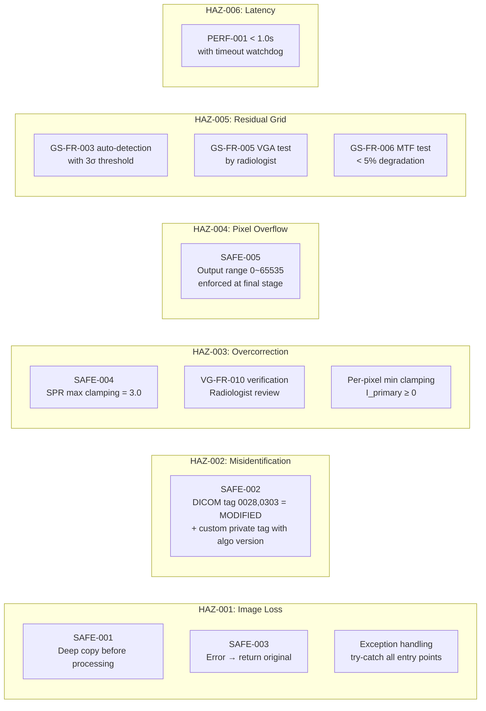

# GSVG-SHA-001: Software Hazard Analysis

**Document ID:** GSVG-SHA-001  
**Version:** 1.0 | **Date:** 2026-04-03  
**IEC 62304 Clause:** 7 (ISO 14971 integration)  
**Safety Classification:** Class B

---

## 1. Scope

GSVG 소프트웨어 모듈의 hazardous situations 식별, 위험 평가, risk control measures 정의.  
ISO 14971:2019 프로세스에 따라 수행.

---

## 2. Hazard Identification

| HAZ ID | Hazardous Situation | Software Cause | Affected Function |
|--------|--------------------|----|---|
| HAZ-001 | 원본 영상 손실/훼손 — 진단 불가 | Algorithm crash, memory corruption, buffer overwrite | All |
| HAZ-002 | 처리된 영상을 원본으로 오인 — 오진 가능 | Processing marker 미삽입 | SI-001, SI-004 |
| HAZ-003 | Scatter 과보정 → 인체 구조물 소실 — 오진 | SPR 과대추정, clamping 미적용 | SI-003 |
| HAZ-004 | Pixel overflow/underflow → 영상 왜곡 — 오진 | 16-bit arithmetic overflow | SI-002, SI-003 |
| HAZ-005 | Grid artifact 잔류 → 병변 가려짐 | Grid frequency 오검출, filter 부적용 | SI-002 |
| HAZ-006 | 처리 지연 → 긴급 진단 지체 | Performance 미달, infinite loop | All |

---

## 3. Risk Assessment (Pre-mitigation)

| HAZ ID | Severity | Probability | Risk Level |
|--------|----------|-------------|------------|
| HAZ-001 | Medium (재촬영/진단 지연) | Low (defensive coding) | **Medium** |
| HAZ-002 | Low (영상 비교 시 혼동) | Medium (tag 누락 가능) | **Low** |
| HAZ-003 | Medium (미세 구조 소실) | Low (SPR 모델 validated) | **Medium** |
| HAZ-004 | Medium (영상 왜곡) | Low (standard arithmetic) | **Medium** |
| HAZ-005 | Low (재촬영으로 해결) | Low (알고리즘 검증됨) | **Low** |
| HAZ-006 | Low (대기 시간 증가) | Low (성능 테스트) | **Low** |

---

## 4. Risk Control Measures

---

## 5. Risk Assessment (Post-mitigation)

| HAZ ID | Residual Severity | Residual Probability | Residual Risk | Acceptable? |
|--------|-------------------|---------------------|---------------|-------------|
| HAZ-001 | Low (원본 항상 반환) | Very Low | **Acceptable** | ✓ |
| HAZ-002 | Negligible | Very Low | **Acceptable** | ✓ |
| HAZ-003 | Low (clamping 적용) | Very Low | **Acceptable** | ✓ |
| HAZ-004 | Negligible (clamping) | Very Low | **Acceptable** | ✓ |
| HAZ-005 | Low (재촬영 가능) | Very Low | **Acceptable** | ✓ |
| HAZ-006 | Negligible | Very Low | **Acceptable** | ✓ |

---

## 6. Traceability: Hazard → Safety Req → Test

| Hazard | Safety Requirement | Implementation | Verification Test |
|--------|-------------------|----------------|-------------------|
| HAZ-001 | SAFE-001, SAFE-003 | ImageBuffer::deepCopy(), ErrorHandler | UT-SF-001 |
| HAZ-002 | SAFE-002 | DicomIO::markProcessed() | UT-SF-005, IT-004 |
| HAZ-003 | SAFE-004 | ScatterEstimator::MAX_SPR clamping | UT-SF-002, UT-VG-004 |
| HAZ-004 | SAFE-005 | Output clamping in PipelineManager | UT-SF-003, UT-SF-004 |
| HAZ-005 | GS-FR-003/005/006 | GridlineDetector + BandStopFilter | UT-GS-003~006, ST-001/002 |
| HAZ-006 | PERF-001 | Performance optimization + timeout | ST-006 |

---

## Revision History

| Version | Date | Author | Description |
|---------|------|--------|-------------|
| 1.0 | 2026-04-03 | — | Initial release |
