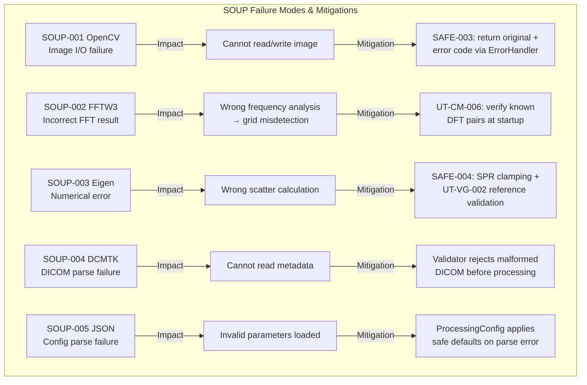

# GSVG-SOUP-001: SOUP Analysis

**Document ID:** GSVG-SOUP-001  
**Version:** 1.0 | **Date:** 2026-04-03  
**IEC 62304 Clause:** 5.3.3  
**Safety Classification:** Class B

---

## 1. SOUP Component Registry

| ID | Component | Version | License | Deployed | Source |
|----|-----------|---------|---------|----------|--------|
| SOUP-001 | OpenCV | 4.9.0 | Apache 2.0 | Yes | github.com/opencv/opencv |
| SOUP-002 | FFTW3 | 3.3.10 | GPL v2+ | Yes | fftw.org |
| SOUP-003 | Eigen | 3.4.0 | MPL 2.0 | Yes | eigen.tuxfamily.org |
| SOUP-004 | DCMTK | 3.6.8 | BSD-like | Yes | dicom.offis.de/dcmtk |
| SOUP-005 | nlohmann/json | 3.11.3 | MIT | Yes | github.com/nlohmann/json |
| SOUP-006 | Google Test | 1.14.0 | BSD-3 | No (test only) | github.com/google/googletest |

---

## 2. Functional & Performance Requirements per SOUP

### SOUP-001: OpenCV

| Required API | Purpose | Performance |
|-------------|---------|-------------|
| `cv::imread` / `cv::imwrite` | Image file I/O (non-DICOM formats) | < 100ms for 3072×3072 |
| `cv::resize` | Image resampling for pyramid operations | < 50ms per operation |
| `cv::GaussianBlur` | Gaussian convolution for LP decomposition | < 30ms per 3072×3072 |
| `cv::Mat` ↔ `ImageBuffer` | Data interchange (zero-copy where possible) | Negligible overhead |

### SOUP-002: FFTW3

| Required API | Purpose | Performance |
|-------------|---------|-------------|
| `fftw_plan_dft_r2c_2d` | Real-to-complex 2D forward FFT | < 200ms for 3072×3072 |
| `fftw_plan_dft_c2r_2d` | Complex-to-real 2D inverse FFT | < 200ms for 3072×3072 |
| `fftw_execute` | Execute pre-planned transform | — |
| `fftw_make_planner_thread_safe` | Thread safety for concurrent use | — |

### SOUP-003: Eigen

| Required API | Purpose | Performance |
|-------------|---------|-------------|
| `MatrixXf` / `VectorXf` | Scatter kernel coefficient storage & interpolation | < 1ms per operation |
| Element-wise operations | Pixel-level math for scatter subtraction | < 50ms for 3072×3072 |

### SOUP-004: DCMTK

| Required API | Purpose | Performance |
|-------------|---------|-------------|
| `DcmFileFormat::loadFile` | DICOM Part 10 file reading | < 200ms per file |
| `DcmFileFormat::saveFile` | DICOM file writing | < 200ms per file |
| `DcmDataset::findAndGet*` | Tag reading (kVp, exposure, grid info) | < 1ms |
| `DcmDataset::putAndInsert*` | Tag writing (SAFE-002 processed marker) | < 1ms |

### SOUP-005: nlohmann/json

| Required API | Purpose | Performance |
|-------------|---------|-------------|
| `json::parse` | Config file parsing | < 10ms |
| `json::at` / `json::value` | Parameter extraction with defaults | < 1ms |

---

## 3. Risk Assessment

---

## 4. Known Anomaly Review

| SOUP | Known Issues Reviewed | Relevant to GSVG | Action |
|------|-----------------------|-------------------|--------|
| OpenCV 4.9 | CVE list reviewed (2024-2026) | No image codec vulnerabilities affect 16-bit raw processing | Monitor quarterly |
| FFTW3 3.3.10 | Stable release, no known accuracy bugs | N/A | Validated by 20+ years of use |
| Eigen 3.4 | Known: alignment issues on some ARM platforms | GX10 (ARM) requires `EIGEN_DONT_ALIGN` flag | Applied in CMake |
| DCMTK 3.6.8 | DICOM conformance statements available | Part 10 compliance confirmed | Integration test IT-004 |
| nlohmann/json 3.11 | No security-relevant CVEs | N/A | Input validation wraps all access |

---

## 5. SOUP Version Control Policy

- SOUP 버전은 `CMakeLists.txt`에 pin (exact version)
- SOUP 업데이트 시: regression test suite 전체 실행 필수
- 보안 취약점 발견 시: 30일 내 업데이트 또는 mitigation 문서화
- SOUP changelog 분기별 검토

---

## Revision History

| Version | Date | Author | Description |
|---------|------|--------|-------------|
| 1.0 | 2026-04-03 | — | Initial release |
