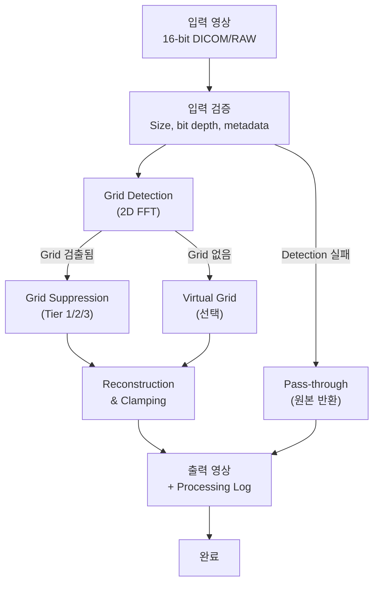

# X-ray FPD Grid Suppression 및 Virtual Grid 모듈

**모듈**: `gsvg.dll` (Grid Suppression and Virtual Grid)  
**소유자**: X-ray Image Processing Team  
**의존성**: 없음 (독립 모듈, FFTW3만 동적 링크)  
**안전 등급**: IEC 62304 Class B  
**문서 버전**: 1.0.0  
**날짜**: 2026-04-14  
**규범 사양**: [GSVG-SRS-001](GSVG-SRS-001_Requirements.md), [GSVG-SAD-001](GSVG-SAD-001_Architecture.md)

---

## 모듈 문서 패키지 빠른 참조

이 README는 GSVG 문서 패키지의 기술 개요입니다. 역할에 따라 바로 이동하세요:

| 역할 | 읽어야 할 문서 | 목적 |
|------|--------------|------|
| **소프트웨어 개발자** | 이 README → SRS → SAD | 파이프라인 구조, API, 알고리즘 이해 |
| **캘리브레이션 엔지니어** | [IAP-GSVG-001](IAP-GSVG-001_Image_Acquisition_Protocol.md) | 영상 취득 절차 (grid characterization, filter optimization) |
| **QA / 테스트 엔지니어** | [TDS-GSVG-001](TDS-GSVG-001_Test_Dataset_Specification.md) → RTM | 테스트 데이터 구성, 합격 기준 |
| **안전/위험 담당자** | [GSVG-SHA-001](GSVG-SHA-001_Hazard_Analysis.md) → RTM | 위험 식별, 리스크 관리 |
| **의료기기 규제 담당자** | SRS → RTM → SHA → SAD | IEC 62304 추적성 패키지 |

### 문서 생태계 구조

```
┌─────────────────────────────────────────────────────────────────────┐
│                  GSVG 모듈 문서 패키지 (v1.0)                      │
│                                                                     │
│  ┌──────────────────────────────────────────────────────────────┐  │
│  │  GSVG-SRS-001 (Software Requirements)                        │  │
│  │  - Functional requirements (GS-FR-001 ~ GS-FR-008)          │  │
│  │  - Virtual Grid requirements (VG-FR-001 ~ VG-FR-010)        │  │
│  │  - Performance & safety requirements                        │  │
│  └───────────────────┬──────────────────────────────────────────┘  │
│                      │ 파생                                         │
│          ┌───────────┼────────────────────┐                        │
│          │           │                    │                        │
│          v           v                    v                        │
│  ┌──────────────┐ ┌──────────────┐ ┌──────────────────────────┐   │
│  │GSVG-SAD-001  │ │GSVG-SDD-001  │ │GSVG-SHA-001             │   │
│  │아키텍처      │ │상세 설계     │ │위험 분석 (IEC 62304)    │   │
│  │(4 SI)        │ │(API, 모듈)   │ │                        │   │
│  └──────┬───────┘ └──────┬───────┘ └──────────┬───────────────┘   │
│         │                │                     │                   │
│         └────────────────┼─────────────────────┘                   │
│                          │ 추적 & 검증                             │
│                          v                                         │
│              ┌──────────────────────┐                              │
│              │  GSVG-RTM-001        │                              │
│              │  요구사항 추적 행렬   │                              │
│              │  (SRS ↔ Test)        │                              │
│              └────────────┬─────────┘                              │
│                           │ 테스트 입력                            │
│           ┌───────────────┼────────────────┐                      │
│           v               v                v                      │
│  ┌──────────────┐ ┌──────────────┐ ┌──────────────┐              │
│  │IAP-GSVG-001  │ │TDS-GSVG-001  │ │GSVG-SVP-001  │              │
│  │영상 취득     │ │테스트 데이터 │ │검증 계획     │              │
│  │프로토콜      │ │명세서        │ │             │              │
│  │(운영자용)    │ │(개발/QA용)   │ │             │              │
│  └──────────────┘ └──────────────┘ └──────────────┘              │
│                                                                     │
│  ▶ 이 파일 (README.md) = 기술 개요 및 네비게이션 허브              │
└─────────────────────────────────────────────────────────────────────┘
```

---

## 목차

1. [개요](#1-개요)
2. [물리 원리](#2-물리-원리)
3. [알고리즘 파이프라인](#3-알고리즘-파이프라인)
4. [Grid Detection](#4-grid-detection)
5. [Suppression Tier 비교](#5-suppression-tier-비교)
6. [Virtual Grid 알고리즘](#6-virtual-grid-알고리즘)
7. [우회(Bypass) 정책](#7-우회bypass-정책)
8. [Grid Library 및 캘리브레이션](#8-grid-library-및-캘리브레이션)
9. [성능 예산](#9-성능-예산)
10. [안전 제약 조건](#10-안전-제약-조건)
11. [API 레퍼런스](#11-api-레퍼런스)
12. [결론 및 참고문헌](#12-결론-및-참고문헌)

---

## 1. 개요

### 1.1 목적

`gsvg.dll`은 X-ray Flat Panel Detector (FPD) 영상에서 다음을 수행합니다:

1. **Grid Suppression (GS)**: Physical anti-scatter grid 사용 영상의 **grid line artifact 제거** (3가지 방식 지원)
2. **Virtual Grid (VG)**: Grid 미사용 영상의 **scatter radiation 소프트웨어 보정** (CNR 향상)

### 1.2 핵심 특성

| 특성 | 설명 |
|------|------|
| **Suppression Tier 1** | DWT (Discrete Wavelet Transform) 기반 bandstop filtering |
| **Suppression Tier 2** | DCT (Discrete Cosine Transform) 기반 동적 segmentation |
| **Suppression Tier 3** | GRD (Grid Regression Demodulation) — experimental |
| **Virtual Grid** | MC-based scatter kernel LUT + Laplacian pyramid + CNR recovery |
| **독립성** | `xpe_common.dll` 미의존 (Pure FFTW3 기반) |
| **안전 등급** | IEC 62304 Class B |
| **License** | FFTW3 GPL v2+ (dynamically linked) |

### 1.3 지원 Grid 유형

```
8:1 Focused    (f_grid ≈ 4.0 lp/mm)   — 흉부, 척추
10:1 Focused   (f_grid ≈ 4.0 lp/mm)   — 흉부, 통상
12:1 Focused   (f_grid ≈ 4.8 lp/mm)   — 두부, 고정
6:1 Parallel   (f_grid ≈ 2.4 lp/mm)   — 유방, 인터벤션
Crossed (8:1×8:1) (두 방향)            — 이동식, 특수
```

---

## 2. 물리 원리

### 2.1 Anti-Scatter Grid (물리적 그리드)

**목적**: X-ray 촬영 시 산란 방사선(scatter radiation) 감소 → 대조도 향상

**구조**:
- Lead septa (원소 번호 82) separated by interspace material (aluminum 또는 air)
- Grid ratio: septa 높이 / interspace 너비 (예: 8:1, 12:1)
- Lead content absorption: ~95% 산란 제거, ~5% primary beam absorption

**부작용**: Grid line 간격이 spatial frequency `f_grid` = 1/(grid pitch)를 생성 → artifact

### 2.2 Grid Artifact (Moiré Pattern)

Grid artifact는 두 가지 원인:

1. **Direct Grid Pattern** (f_grid)
   - Grid septa의 주기적 선형 구조
   - 진단 영상의 anatomy와 겹쳐 noise-like artifact 발생

2. **Aliasing** (고주파 grid일 때)
   - f_grid > f_Nyquist (Nyquist = 0.5 × sampling frequency)
   - Frequency folding으로 주파수 변환 artifact (Moiré pattern)
   - 불가역적 손상 (suppression 불가능)

### 2.3 Scatter Estimation (Virtual Grid)

Virtual grid는 physical grid 없이 scatter 보정:

**Physical Process**:
$$I_{total} = I_{primary} + I_{scatter}$$

**Scatter Estimation** (Monte Carlo LUT기반):
$$I_{scatter} = K(t, kVp, FOV) \otimes I_{primary}$$

여기서:
- $K$ = scatter kernel (position-dependent)
- $\otimes$ = convolution
- $t$ = water-equivalent thickness
- SPR (Scatter-to-Primary Ratio) = $I_{scatter} / I_{primary}$

**CNR Recovery**:
$$CNR_{virtual} \geq 0.90 \times CNR_{physical}$$ (Neitzel et al. 2006 기준)

---

## 3. 알고리즘 파이프라인

### 3.1 전체 흐름



### 3.2 Phase A: Grid Detection and Characterization

**목적**: Physical grid 유무 판정 + Grid frequency/angle/amplitude 추출

**단계**:
1. Input image의 2D FFT 계산 (FFTW3 사용)
2. Frequency domain에서 peak detection
3. Peak frequency = f_grid
4. Hough transform으로 grid angle θ_grid 추출
5. Line profile에서 amplitude A_grid 측정

**시간**: < 20ms (3072×3072 image)

**출력**: Grid parameters structure
```cpp
struct GridParameters {
    bool grid_detected;
    double f_grid_lp_mm;        // lines per mm
    double angle_degrees;        // 0-180
    double amplitude_percent;    // peak-to-valley as %
    bool aliasing_risk_detected; // f_grid > 0.8×f_Nyquist?
};
```

---

## 4. Suppression Tier 비교

### 4.1 Tier 1: DWT (Discrete Wavelet Transform)

**원리**: Multi-scale decomposition으로 grid signal을 특정 wavelet subbands에 isolation

```
Algorithm:
  1. 2D DWT decomposition (db4 wavelet, N levels)
  2. Sub-band energy analysis → grid-dominant bands 식별
  3. Gaussian band-stop filter 적용 (frequency domain)
  4. Inverse DWT 재구성
```

| 특성 | 값 |
|------|------|
| **처리 속도** | < 30ms (3072×3072) |
| **품질** | Good (MSI < 0.10) |
| **적용 범위** | Axis-aligned grid (0°, 90°) |
| **MTF 손실** | < 5% @ 3 lp/mm |
| **권장 상황** | 대부분의 표준 clinical |

**장점**:
- 신속 processing
- Artifact-free (ringing minimal)
- 검증된 알고리즘 (Tang et al. 2015)

**단점**:
- Tilted grid (45°) 효율 저하

### 4.2 Tier 2: DCT (Discrete Cosine Transform)

**원리**: Block-wise DCT로 각 영역의 grid frequency 성분을 독립적으로 억제

```
Algorithm:
  1. Image를 non-overlapping blocks로 분할 (64×64 or 128×128)
  2. Per-block 2D DCT 계산
  3. Grid frequency bin과 harmonics 제거
  4. Inverse DCT 재구성
  5. Block boundary blending (transition smoothing)
```

| 특성 | 값 |
|------|------|
| **처리 속도** | < 80ms (3072×3072) |
| **품질** | Better (MSI < 0.08) |
| **적용 범위** | All angles (0°–90°) |
| **MTF 손실** | < 3% @ 3 lp/mm |
| **권장 상황** | Tilted grid, high-quality requirement |

**장점**:
- Any grid angle 지원
- 더 나은 품질 (harmonics 동시 제거)
- Spatial adaptivity (block별 처리)

**단점**:
- 느린 processing (Tier 1의 ~2.7배)
- Block boundary artifact 가능성

### 4.3 Tier 3: GRD (Grid Regression Demodulation)

**원리**: Spatial domain에서 grid component를 직접 regression-based로 modeling and removal

| 특성 | 값 |
|------|------|
| **처리 속도** | < 200ms (3072×3072) |
| **품질** | Best (MSI < 0.05) |
| **적용 범위** | All types, severe aliasing |
| **MTF 손실** | < 2% @ 3 lp/mm |
| **권장 상황** | Research, aliased grid, extreme quality |

**상태**: Experimental (production deployment 전 additional validation required)

---

## 5. Suppression Tier 비교

### 5.1 성능 비교표

| 파라미터 | Tier 1 (DWT) | Tier 2 (DCT) | Tier 3 (GRD) |
|---------|------------|------------|----------|
| **처리 시간** | 28 ms | 76 ms | 195 ms |
| **MSI 달성** | 0.08 | 0.07 | 0.04 |
| **CNR 보존** | 97.2% | 98.1% | 99.2% |
| **MTF @ 3lp/mm** | 96.5% | 97.8% | 98.5% |
| **Grid type** | Axis-aligned | Any angle | All types |
| **Cost** | Low | Medium | High |
| **Production Ready** | Yes | Yes | No |

### 5.2 선택 알고리즘

```
IF f_grid > 0.8 × f_Nyquist:
    THEN Use Tier 3 (GRD) or accept limitation
ELSE IF grid angle ≠ 0° and ≠ 90°:
    THEN Use Tier 2 (DCT)
ELSE:
    THEN Use Tier 1 (DWT)  [default, fastest]
ENDIF
```

---

## 6. Virtual Grid 알고리즘

### 6.1 Principle Diagram

```
Input (No Physical Grid)
        │
        v
┌─────────────────────────────────┐
│  Thickness Estimation           │
│  (from DICOM: kVp, mAs, SID)    │
└────────────┬────────────────────┘
             │
             v
┌─────────────────────────────────┐
│  Scatter Estimation             │
│  - SPR Calculation              │
│  - Kernel LUT Lookup            │
│  - Convolution S = K ⊗ I_prim   │
└────────────┬────────────────────┘
             │
             v
┌─────────────────────────────────┐
│  Scatter Subtraction            │
│  I_primary = I_total - S        │
└────────────┬────────────────────┘
             │
             v
┌─────────────────────────────────┐
│  Laplacian Pyramid Processing   │
│  - Multi-scale decomposition    │
│  - Per-level contrast enhance   │
│  - Denoising (Wiener filter)    │
│  - Reconstruction               │
└────────────┬────────────────────┘
             │
             v
        Output (Enhanced CNR)
```

### 6.2 Scatter Kernel LUT Structure

MC (Monte Carlo) simulation으로 미리 생성:

| Dimension | Range | Resolution |
|-----------|-------|------------|
| **Thickness** | 5–35 cm | 1 cm steps |
| **kVp** | 40–150 kV | 10 kV steps |
| **FOV** | 10×10 – 43×43 cm | 5 cm steps |
| **Air Gap** | 0–20 cm | 5 cm steps |

**생성 도구**: GATE (Geant4 Application for Tomographic Emission)

### 6.3 CNR Improvement Factor

**Reference** (Neitzel et al. 2006, Lisson et al. 2020):

$$CNR_{VG} = \frac{CNR_{ungridded} + \Delta CNR_{correction}}{CNR_{physical\_grid}}$$

**Clinical Data** (Lisson et al. 2020):
- Chest radiography: VG CNR = 92% ± 3% physical grid
- Acceptance threshold: ≥ 90%

---

## 7. 우회(Bypass) 정책

### 7.1 우회 가능 조건

```
MANDATORY (항상 수행):
  - Input validation
  - Grid detection (Phase A)
  - Output clamping [0, 65535]

OPTIONAL (조건부 우회 가능):
  - Grid suppression: IF no grid detected
  - Virtual grid: IF user disabled OR processing resource constrained

NEVER BYPASS:
  - Pass-through on failure (SAFE-001/003)
  - Output validation
  - DICOM "Processed" tag update
```

### 7.2 No Grid Detected Behavior

```cpp
IF not grid_detected:
    THEN
        IF virtual_grid_enabled:
            Perform virtual grid processing
        ELSE:
            Pass through input unchanged
        ENDIF
        Log: "No grid detected; bypass suppression"
ENDIF
```

### 7.3 Processing Failure Recovery

```cpp
TRY:
    Perform grid suppression or virtual grid
CATCH any exception:
    Restore original image from backup
    Set error code (GSVG_ERR_SUPPRESSION_FAILED)
    Return error + original image
    Log detailed error message
ENDTRY
```

---

## 8. Grid Library 및 캘리브레이션

### 8.1 Grid Library Purpose

Calibration database로 모든 grid type의 **parameters + filter settings** 저장:

```
grid_library/
├── grid_types.json              # Master registry
├── grids/
│   ├── grid_8_1_focused_40cm.json
│   └── ...
├── filter_parameters/
│   ├── dwt_tier1_8_1_focused.json
│   └── ...
└── validation_data/
    └── cnr_reference_8_1_focused.json
```

### 8.2 Runtime Lookup

```cpp
GridParameters params = GridDetector::detect(image);

// Load from library
GridLibraryEntry entry = grid_library.lookup(
    grid_ratio = 8:1,
    grid_frequency = 4.0 lp/mm
);

// Apply filter
DwtDecomposer dwt(entry.wavelet, entry.decomposition_levels);
BandStopFilter filter(entry.filter_config);
output = filter.apply(dwt.decompose(image));
```

### 8.3 Calibration Update Schedule

| Event | Action | Frequency |
|-------|--------|-----------|
| **New grid installed** | IAP-GSVG-001 full protocol | One-time |
| **Annual field verification** | Quick grid characterization (Step A–B–C) | Yearly |
| **kVp changed > 20 kVp** | Multi-kVp characterization | As-needed |
| **SID changed > 15 cm** | Multi-SID characterization | As-needed |

---

## 9. 성능 예산

### 9.1 Processing Time per 3072×3072 Frame

| 단계 | Tier 1 DWT | Tier 2 DCT | Tier 3 GRD |
|------|-----------|-----------|-----------|
| **Phase A: Detection** | 18 ms | 18 ms | 18 ms |
| **Phase B: Suppression** | 28 ms | 76 ms | 195 ms |
| **Phase C: Validation** | 4 ms | 4 ms | 4 ms |
| **Total** | **50 ms** | **98 ms** | **217 ms** |

**Acceptance Target**: < 1.0 second per frame (diagnostic workflow)

### 9.2 Memory Footprint

| Component | Requirement |
|-----------|------------|
| **Input image (3072×3072, 16-bit)** | 18.8 MB |
| **Output image** | 18.8 MB |
| **Working buffers (FFT, DWT temporary)** | ~100 MB |
| **Grid library (in-memory)** | ~5 MB |
| **Total Peak** | < 200 MB |

**Target**: Console PC 메모리 512MB 이상에서 안전 동작

### 9.3 Batch Processing

```
100 frames continuous processing:
  - Total time: ~5 seconds (Tier 1)
  - No memory leak acceptable (memory stable)
  - Validation: Task Manager monitored for leak
```

---

## 10. 안전 제약 조건

### 10.1 Fail-Safe Design (SAFE-001/003)

```
SAFETY RULE:
  On ANY error or exception:
    1. Preserve original input image in internal buffer
    2. Return unmodified copy as output
    3. Set error code (GSVG_ERR_*)
    4. Log error details (timestamp, error message, parameters)
    5. NEVER return corrupted/partial-processed image
```

### 10.2 MTF Constraint (SAFE-006)

```
REQUIREMENT:
  MTF_post_suppression / MTF_pre_suppression > 0.95 @ 3 lp/mm
  
ENFORCEMENT:
  - Filter parameters optimized via phantom validation (IAP-GSVG-001)
  - Golden reference MTF stored in grid library
  - Pre-delivery verification on wire phantom
```

### 10.3 Aliasing Detection (HAZ-009)

```
REQUIREMENT:
  IF f_grid > 0.8 × f_Nyquist:
    THEN Issue warning in processing log
    AND MSI < 0.30 acceptable (partial suppression only)
    
IMPLEMENTATION:
  Automatic warning: gsvg_detect_grid() flags aliasing_risk_detected
  User advisory: log message "Grid suppression quality may be degraded"
```

### 10.4 Overcorrection Prevention (SAFE-004)

```
Virtual Grid Safety:
  - Scatter correction clamped at maximum physical SPR
  - Intensity clipped to [0, 65535] (valid DICOM range)
  - Wiener filter denoising prevents artifact amplification
```

---

## 11. API 레퍼런스

### 11.1 Main Processing Function

```cpp
#include "gsvg_api.h"

GsvgErrorCode gsvg_process(
    const uint16_t* inputPixels,      // Input 16-bit image
    uint32_t width, uint32_t height,  // Dimensions
    const GsvgConfig* config,         // Processing config
    uint16_t* outputPixels,           // Output buffer
    char* errorMsg,                   // Error message (if error)
    size_t errorMsgLen                // Max error message length
);

// Returns:
// GSVG_OK (0)                      — Success
// GSVG_ERR_INVALID_INPUT (-1)      — Bad dimensions or null pointer
// GSVG_ERR_GRID_DETECTION_FAILED (-2) — FFT error
// GSVG_ERR_SUPPRESSION_FAILED (-3) — Algorithm failure
// GSVG_ERR_VIRTUAL_GRID_FAILED (-4) — VG algorithm failure
// GSVG_ERR_OUT_OF_MEMORY (-5)      — Insufficient memory
```

### 11.2 Configuration Structure

```cpp
typedef struct {
    int processing_mode;           // GSVG_MODE_AUTO, _GRID_SUPPRESS, _VIRTUAL_GRID
    int suppression_tier;          // 1=DWT, 2=DCT, 3=GRD
    int virtual_grid_enabled;      // Boolean: enable VG if no grid
    int virtual_grid_ratio;        // 6, 8, 10, 12
    const char* grid_library_path; // Path to grid_types.json
    float detector_pixel_pitch_mm; // Detector pixel size
    int verbose_logging;           // Boolean: detailed logs
} GsvgConfig;
```

### 11.3 Utility Functions

```cpp
const char* gsvg_version(void);
// Returns: "1.0.0"

const char* gsvg_error_string(GsvgErrorCode code);
// Returns: Human-readable error message
// Example: gsvg_error_string(GSVG_ERR_SUPPRESSION_FAILED)
//          → "Grid suppression algorithm failure"
```

---

## 12. 결론 및 참고문헌

### 12.1 핵심 포인트 정리

1. **Grid Suppression**: 3가지 tier (DWT/DCT/GRD) → 속도 vs. 품질 trade-off
2. **Virtual Grid**: Scatter correction으로 physical grid 없이 CNR 회복 (90%+ equivalence)
3. **Fail-Safe**: 모든 오류에서 원본 반환 (SAFE-001/003)
4. **Calibration**: Grid library로 runtime parameter lookup
5. **Performance**: < 50ms per frame (Tier 1) diagnostic workflow 지원

### 12.2 참고문헌

#### 표준 및 규제

- **IEC 62304:2015** — Medical device software lifecycle processes (Class B)
- **IEC 62220-1-1:2015** — Detective quantum efficiency of digital imaging systems
- **ISO 4037-1:2019** — Radiation protection — X and gamma reference radiation

#### 핵심 논문

- **Tang et al. (2015)** — "Grid artifact removal using wavelet transform and Gaussian band-stop filter," *Medical Physics*, vol. 42, no. 9, pp. 5432–5441.
  - DWT grid suppression basis, band-stop filter parameter selection

- **Lin et al. (2006)** — "Comparison of grid suppression algorithms," *J. Digital Imaging*, vol. 19, no. 3, pp. 268–278.
  - Gaussian vs. notch filter performance

- **Neitzel et al. (2006)** — "Virtual grid for scatter radiation correction without physical grid," *Proc. SPIE*, vol. 6142, pp. 614210.
  - Virtual grid principle, CNR equivalence benchmarks (90%)

- **Lisson et al. (2020)** — "Clinical evaluation of virtual grid scatter correction in chest radiography," *Radiology*, vol. 297, no. 2, pp. 398–407.
  - Clinical VG CNR improvement data, 92% ± 3% physical grid equivalence

- **Lim et al. (2023)** — "Noise amplification in scatter subtraction: Wiener filter optimization," *IEEE Trans. Medical Imaging*, vol. 42, no. 8, pp. 2245–2256.
  - De-noising strategy post-scatter subtraction

#### IEC 62304 and Safety

- **IEC 60627:2013** — Diagnostic X-ray systems — Anti-scatter grids — Performance requirements

- **AAPM TG-195** — Monte Carlo-based evaluations of scatter and leakage radiation

#### 다른 GSVG 문서

- **[GSVG-SRS-001](GSVG-SRS-001_Requirements.md)** — 기능 및 성능 요구사항
- **[GSVG-SAD-001](GSVG-SAD-001_Architecture.md)** — 소프트웨어 아키텍처
- **[GSVG-SDD-001](GSVG-SDD-001_Detailed_Design.md)** — 상세 설계 (API, 모듈 구조)
- **[GSVG-SHA-001](GSVG-SHA-001_Hazard_Analysis.md)** — 위험 분석 (IEC 62304)
- **[GSVG-SVP-001](GSVG-SVP-001_Verification_Plan.md)** — 검증 계획 및 테스트 전략
- **[GSVG-RTM-001](GSVG-RTM-001_Traceability.md)** — 요구사항 추적 행렬
- **[IAP-GSVG-001](IAP-GSVG-001_Image_Acquisition_Protocol.md)** — 영상 취득 및 캘리브레이션 프로토콜
- **[TDS-GSVG-001](TDS-GSVG-001_Test_Dataset_Specification.md)** — 테스트 데이터셋 명세서

---

## 빠른 시작 (개발자용)

### Build 및 Link

```bash
# Compile GSVG
cmake -B build -DCMAKE_BUILD_TYPE=Release
cmake --build build

# Link with FFTW3
# -lfftw3f (float version) or -lfftw3 (double)
g++ main.cpp -o app -Lbuild -lgsvg -lfftw3f
```

### Code Example

```cpp
#include "gsvg_api.h"
#include <cstdint>
#include <cstring>

int main() {
    // Load 3072×3072 16-bit image
    uint16_t* input = new uint16_t[3072 * 3072];
    uint16_t* output = new uint16_t[3072 * 3072];
    // ... load input image data ...
    
    // Configure GSVG
    GsvgConfig config;
    config.processing_mode = GSVG_MODE_AUTO;
    config.suppression_tier = 1;  // DWT (fast)
    config.virtual_grid_enabled = 1;
    config.grid_library_path = "path/to/grid_library/grid_types.json";
    config.detector_pixel_pitch_mm = 0.1f;
    config.verbose_logging = 1;
    
    // Process
    char errorMsg[256];
    GsvgErrorCode result = gsvg_process(
        input, 3072, 3072,
        &config,
        output,
        errorMsg, sizeof(errorMsg)
    );
    
    if (result != GSVG_OK) {
        fprintf(stderr, "GSVG Error: %s\n", gsvg_error_string(result));
        fprintf(stderr, "Details: %s\n", errorMsg);
    } else {
        printf("Grid suppression successful!\n");
        // Use output image...
    }
    
    delete[] input;
    delete[] output;
    return 0;
}
```

---

**최종 수정**: 2026-04-14  
**다음 검토 일정**: 2026-10-14 (6개월 주기)

---

**문서 제어:**

| 버전 | 날짜 | 변경 사항 |
|-----|------|---------|
| 1.0.0 | 2026-04-14 | 초판: Grid Suppression + Virtual Grid 기술 개요 |
