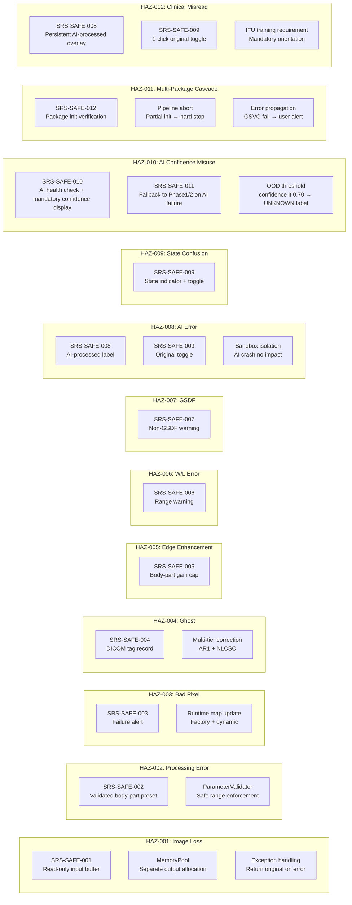

# Software Hazard Analysis

> **Document ID**: XPE-SHA-001 | **Version**: 2.0 | **Date**: 2026-04-15
>
> **IEC 62304 Clause**: 7 (ISO 14971 integration)
>
> **Safety Classification**: Class B
>
> **Parent System Document**: XPE-SVVP-001 §5 (System V&V Plan — Validation Gate)
>
> **Trace Source**: XPE-SRS-001, XPE-SRM-001, XPE-SAD-001, XPE-PRD-SYSTEM-001

---

## 1. Scope

XPE 소프트웨어 시스템의 hazardous situations를 독립적으로 식별, 평가하고 risk control measures를 정의한다.
ISO 14971:2019 프로세스에 따라 수행한다.

> **Note**: 본 문서는 XPE-SRM-001(Software Risk Management File)에서 참조하는 Hazard 정의의
> 정식 출처(source of truth)이다. SRM은 risk control 관리 프로세스를,
> SHA는 hazard 식별 및 평가를 담당한다.

v2.0 변경: HAZ-010 (AI 신뢰도 오용), HAZ-011 (다중 패키지 연쇄 실패), HAZ-012 (임상 사용 시나리오) 추가. ISO 14971 정식 서명 블록 추가.

---

## 2. Risk Acceptability Matrix

ISO 14971 Annex C 기반:

| | Negligible | Minor | Serious | Critical | Catastrophic |
|---|:-:|:-:|:-:|:-:|:-:|
| **Frequent** | Low | Medium | **High** | **Unacceptable** | **Unacceptable** |
| **Probable** | Low | Medium | **High** | **High** | **Unacceptable** |
| **Occasional** | Low | Low | Medium | **High** | **High** |
| **Remote** | Low | Low | Low | Medium | **High** |
| **Improbable** | Low | Low | Low | Low | Medium |

---

## 3. Hazard Identification

### HAZ-001: 원본 영상 손실/훼손

| Field | Description |
|-------|-------------|
| **Hazardous Situation** | 원본 영상 손실 → 재촬영(추가 피폭) |
| **Software Cause** | Processing이 원본 buffer를 overwrite → 재처리 불가 → 재촬영 필요 |
| **Affected Function** | SWI-1 Pre-Processing (all units), SWI-5 MemoryPool |
| **Sequence of Events** | Pipeline 시작 → MemoryPool이 input buffer에 write 허용 → Offset correction이 raw overwrite → 오류 발생 시 원본 복구 불가 → 재촬영 |
| **Harm** | 환자 추가 X-ray 피폭 (Minor) |

### HAZ-002: 부적절한 processing으로 진단 정보 손실

| Field | Description |
|-------|-------------|
| **Hazardous Situation** | 부적절한 processing parameter → 진단 정보 손실 |
| **Software Cause** | Default preset 오류 또는 수동 조정 실수 → 과도한/부족한 처리 |
| **Affected Function** | SWI-2 Core Processing (SWU-2.2~2.4), SWI-5 ParameterValidator |
| **Sequence of Events** | 체형 부적합 preset 적용 → 과도한 noise reduction → 미세 석회화 비가시 → 오진 |
| **Harm** | 진단 지연 또는 오진 (Serious) |

### HAZ-003: 미보정 bad pixel → 병변 오인

| Field | Description |
|-------|-------------|
| **Hazardous Situation** | Bad pixel 미보정 → 허위 병변 오인 |
| **Software Cause** | Bad pixel map 미갱신 또는 defect correction 실패 |
| **Affected Function** | SWI-1 SWU-1.3 DefectPixelCorrector |
| **Sequence of Events** | 새로운 defect 발생 → factory map에 미등록 → 밝은/어두운 점 잔존 → 의사가 micro-calcification으로 오인 |
| **Harm** | 불필요한 추가 검사 또는 오진 (Serious) |

### HAZ-004: Ghost artifact → 병변 오인

| Field | Description |
|-------|-------------|
| **Hazardous Situation** | Ghost/lag artifact → 허위 구조물 오인 |
| **Software Cause** | Lag correction 미적용 또는 부정확한 IRF 파라미터 |
| **Affected Function** | SWI-1 SWU-1.4 GhostCorrector |
| **Sequence of Events** | 이전 고선량 촬영 → lag signal 잔류 → 다음 영상에 이전 이미지 잔상 → 허위 구조물 오인 |
| **Harm** | 오진 (Serious) |

### HAZ-005: 과도한 edge enhancement → 허위 구조물

| Field | Description |
|-------|-------------|
| **Hazardous Situation** | Edge enhancement 과다 → overshoot halo → 허위 구조물 |
| **Software Cause** | Enhancement gain 제한 미적용 또는 body-part별 safe range 설정 오류 |
| **Affected Function** | SWI-2 SWU-2.4 EdgeEnhancer, SWI-5 SWU-5.5 ParameterValidator |
| **Sequence of Events** | 높은 gain 적용 → edge overshoot halo 발생 → 미세 골절/결절로 오인 |
| **Harm** | 오진 (Serious) |

### HAZ-006: 부적절한 W/L → 병변 비가시

| Field | Description |
|-------|-------------|
| **Hazardous Situation** | 부적절한 Window/Level → 진단 영역 밖 window → 병변 비가시 |
| **Software Cause** | W/L preset 오류 또는 사용자가 극단적 W/L로 조정 |
| **Affected Function** | SWI-3 SWU-3.2 VoiLUT, SWI-5 SWU-5.3 ErrorHandler |
| **Sequence of Events** | 좁은 window 설정 → 폐 실질의 미묘한 density 차이 비가시 → 결절 미발견 |
| **Harm** | 진단 지연 (Serious) |

### HAZ-007: GSDF 미준수 display → contrast 왜곡

| Field | Description |
|-------|-------------|
| **Hazardous Situation** | GSDF 미보정 모니터 → perceptual linearity 미확보 → 미묘한 contrast 비가시 |
| **Software Cause** | 비보정 모니터에서 GSDF correction 미적용 |
| **Affected Function** | SWI-3 SWU-3.3 PresentationLUT |
| **Sequence of Events** | 비보정 모니터 사용 → GSDF 미적용 → JND spacing 불균일 → 미묘한 density 차이 놓침 |
| **Harm** | 진단 성능 저하 (Minor) |

### HAZ-008: AI가 병변 제거 또는 허위 생성

| Field | Description |
|-------|-------------|
| **Hazardous Situation** | DL bone suppression이 실제 병변을 함께 제거하거나 artifact 생성 |
| **Software Cause** | AI 모델의 오분류 또는 학습 데이터 편향 |
| **Affected Function** | SWI-2 SWU-2.11 BoneSuppressionEngine, SWU-2.12 DLDenoiser |
| **Sequence of Events** | Bone suppression 적용 → 폐 결절이 bone과 중첩 → 모델이 결절을 bone으로 오분류하여 제거 → 결절 비가시 |
| **Harm** | 진단 지연 또는 오진 (Serious) |

### HAZ-009: Processing 상태 혼동

| Field | Description |
|-------|-------------|
| **Hazardous Situation** | 원본 vs 처리 영상 구분 불가 → AI 결과를 원본으로 오인 |
| **Software Cause** | Processing state indicator 미표시 또는 toggle 기능 부재 |
| **Affected Function** | SWI-3 SWU-3.3 PresentationLUT, SWI-5 SWU-5.7 PipelineOrchestrator |
| **Sequence of Events** | AI bone suppression 적용 → 사용자가 원본으로 오인 → bone suppression으로 변형된 영상 기반 진단 |
| **Harm** | 진단 오류 가능 (Minor) |

### HAZ-010: AI 신뢰도 점수 오용 *(v2.0 신규)*

| Field | Description |
|-------|-------------|
| **Hazardous Situation** | AI worker 장애/타임아웃 → confidence score 미반환 → 사용자가 AI 결과를 신뢰 가능 결과로 오인 |
| **Software Cause** | AI worker 예외 처리 불완전 → silent failure 또는 기본값 반환 → OOD(out-of-distribution) 미감지 상태로 결과 출력 |
| **Affected Function** | SWI-2 SWU-2.11 BoneSuppressionEngine, SWU-2.12 DLDenoiser; SWI-5 AI Router / BodyPartClassifier |
| **Sequence of Events** | AI worker 연결 실패 또는 OOD 입력 → router가 에러 없이 이전 결과 또는 기본 결과 반환 → confidence 점수 미표시 또는 허위 표시 → 의사가 신뢰도 불명인 AI 결과를 정상으로 수용 → 오진 |
| **Harm** | 오진 (Serious) |

### HAZ-011: 다중 패키지 연쇄 실패 (XPE+GSVG) *(v2.0 신규)*

| Field | Description |
|-------|-------------|
| **Hazardous Situation** | XPE와 GSVG DLL 동시 초기화 부분 실패 → 처리 적용 여부 불명확한 영상 출력 |
| **Software Cause** | 두 독립 패키지(xpe_common.dll + gsvg.dll) 간 에러 격리 미흡 → 한쪽 초기화 실패 시 PipelineOrchestrator가 partial 상태에서 처리 진행 |
| **Affected Function** | SWI-5 SWU-5.7 PipelineOrchestrator; GSVG external API (SI-001~004) |
| **Sequence of Events** | GSVG 로드/초기화 실패 → orchestrator가 GSVG 오류를 non-critical로 처리 → XPE 단독 처리 후 출력 → 사용자가 grid suppression 미적용 여부 인지 못함 → 적절하지 않은 영상 기반 진단 |
| **Harm** | 진단 오류 (Serious) |

### HAZ-012: 임상 사용 시나리오 — AI 도출 영상 기반 방사선사 판독 *(v2.0 신규)*

| Field | Description |
|-------|-------------|
| **Hazardous Situation** | 방사선사가 AI bone suppression 적용 영상을 원본으로 오인하여 결절 기반 진단 수행 |
| **Software Cause** | AI 처리 상태 미표시 + 원본-처리 영상 전환 기능 미인식; IFU(사용설명서) 훈련 미흡 |
| **Affected Function** | SWI-3 SWU-3.3 PresentationLUT; SWI-5 SWU-5.7 PipelineOrchestrator; IFU/Labeling |
| **Sequence of Events** | AI bone suppression 자동 적용 → 방사선사가 원본-AI 전환 기능 미사용 → AI 영상만으로 결절 판독 → bone suppression 처리 중 제거된 결절 미발견 → 진단 오류 → 치료 지연 |
| **Harm** | 오진으로 인한 치료 지연 (Serious) |

---

## 4. Risk Assessment (Pre-mitigation)

| HAZ ID | Severity | Probability | Pre-control Risk |
|--------|:--------:|:-----------:|:----------------:|
| HAZ-001 | Minor | Occasional | **Medium** |
| HAZ-002 | Serious | Occasional | **Medium** |
| HAZ-003 | Serious | Remote | **Low** |
| HAZ-004 | Serious | Occasional | **Medium** |
| HAZ-005 | Serious | Occasional | **Medium** |
| HAZ-006 | Serious | Probable | **High** |
| HAZ-007 | Minor | Occasional | **Low** |
| HAZ-008 | Serious | Occasional | **Medium** |
| HAZ-009 | Minor | Probable | **Medium** |
| HAZ-010 | Serious | Occasional | **Medium** |
| HAZ-011 | Serious | Remote | **Low** |
| HAZ-012 | Serious | Occasional | **Medium** |

---

## 5. Risk Control Measures

### Risk Control Detail

| HAZ ID | Risk Control | Type | Implementation Unit | SRS Req |
|--------|-------------|------|-------------------|---------|
| HAZ-001 | Non-destructive processing (read-only input) | Inherent safety | SWU-5.1 MemoryPool | SRS-SAFE-001 |
| HAZ-002 | Validated body-part preset auto-selection | Inherent safety | SWU-5.5 ParameterValidator | SRS-SAFE-002 |
| HAZ-003 | Defect correction failure visual alert | Protective measure | SWU-1.3 + SWU-5.3 ErrorHandler | SRS-SAFE-003 |
| HAZ-004 | Ghost correction status in DICOM tag | Information for safety | SWU-1.4 + SWU-4.2 DicomWriter | SRS-SAFE-004 |
| HAZ-005 | Enhancement gain safe-range limiting | Inherent safety | SWU-2.4 + SWU-5.5 ParameterValidator | SRS-SAFE-005 |
| HAZ-006 | W/L out-of-range warning | Protective measure | SWU-3.2 + SWU-5.3 ErrorHandler | SRS-SAFE-006 |
| HAZ-007 | Non-GSDF display warning | Information for safety | SWU-3.3 PresentationLUT | SRS-SAFE-007 |
| HAZ-008 | AI-processed label + original toggle | Information for safety | SWU-2.11 + SWU-3.3 | SRS-SAFE-008, 009 |
| HAZ-009 | Processing state indicator + 1-click toggle | Protective measure | SWU-3.3 + SWU-5.7 | SRS-SAFE-009 |
| HAZ-010 | AI worker health check; mandatory confidence score display; OOD threshold (confidence < 0.70 → UNKNOWN); fallback to Phase 1/2 on AI failure | Protective measure + Information for safety | SWU-2.11, SWU-2.12, AI Router | SRS-SAFE-010, SRS-SAFE-011 |
| HAZ-011 | Multi-package initialization verification; pipeline hard-stop on partial initialization; GSVG failure → mandatory user alert | Inherent safety + Protective measure | SWU-5.7 PipelineOrchestrator + GSVG API wrapper | SRS-SAFE-012 |
| HAZ-012 | Persistent AI-processed overlay indicator; 1-click original toggle (same as HAZ-008/009); IFU mandatory orientation training requirement | Information for safety + IFU/Labeling | SWU-3.3 + SWU-5.7 + Labeling | SRS-SAFE-008, SRS-SAFE-009; IFU-TRAIN-001 |

---

## 6. Risk Assessment (Post-mitigation)

| HAZ ID | Residual Severity | Residual Probability | Residual Risk | Acceptable? |
|--------|:-----------------:|:-------------------:|:-------------:|:-----------:|
| HAZ-001 | Minor | Improbable | **Low** | Yes |
| HAZ-002 | Serious | Remote | **Low** | Yes |
| HAZ-003 | Minor (alert visible) | Remote | **Low** | Yes |
| HAZ-004 | Minor (DICOM recorded) | Remote | **Low** | Yes |
| HAZ-005 | Minor (gain capped) | Remote | **Low** | Yes |
| HAZ-006 | Minor (warning shown) | Occasional | **Low** | Yes |
| HAZ-007 | Negligible | Occasional | **Low** | Yes |
| HAZ-008 | Minor (label + toggle) | Occasional | **Low** | Yes |
| HAZ-009 | Negligible | Remote | **Low** | Yes |
| HAZ-010 | Minor (fallback + UNKNOWN label) | Remote | **Low** | Yes |
| HAZ-011 | Negligible (hard-stop prevents output) | Improbable | **Low** | Yes |
| HAZ-012 | Minor (persistent indicator + toggle) | Remote | **Low** | Yes |

---

## 7. Traceability: Hazard → Safety Req → Architecture → Unit → Test

| HAZ ID | Safety Req | Architecture (SAD) | Software Unit (SDD) | Verification Test |
|--------|-----------|-------------------|--------------------|--------------------|
| HAZ-001 | SRS-SAFE-001 | SWI-1, SWI-5 segregation | SWU-5.1 MemoryPool | ST-SAFE-001 |
| HAZ-002 | SRS-SAFE-002 | SWI-5 ParameterValidator | SWU-5.5 ParameterValidator | ST-SAFE-002 |
| HAZ-003 | SRS-SAFE-003 | SWI-1, SWI-5 ErrorHandler | SWU-1.3, SWU-5.3 | ST-SAFE-003 |
| HAZ-004 | SRS-SAFE-004 | SWI-1, SWI-4 metadata | SWU-1.4, SWU-4.2 | ST-004 |
| HAZ-005 | SRS-SAFE-005 | SWI-2, SWI-5 validator | SWU-2.4, SWU-5.5 | ST-013 |
| HAZ-006 | SRS-SAFE-006 | SWI-3, SWI-5 ErrorHandler | SWU-3.2, SWU-5.3 | ST-SAFE-006 |
| HAZ-007 | SRS-SAFE-007 | SWI-3, SWI-5 ErrorHandler | SWU-3.3, SWU-5.3 | ST-SAFE-007 |
| HAZ-008 | SRS-SAFE-008 | SWI-2, SWI-3 overlay | SWU-2.11, SWU-3.3 | ST-SAFE-008 |
| HAZ-009 | SRS-SAFE-009 | SWI-3, SWI-5 orchestrator | SWU-3.3, SWU-5.7 | ST-SAFE-009 |
| HAZ-010 | SRS-SAFE-010, SRS-SAFE-011 | SWI-2 AI Router, SWI-5 health check | SWU-2.11, SWU-2.12, AI Router | ST-SAFE-010, ST-SAFE-011 |
| HAZ-011 | SRS-SAFE-012 | SWI-5 orchestrator, GSVG API | SWU-5.7, GSVG wrapper | ST-SAFE-012, MP-IT-004 |
| HAZ-012 | SRS-SAFE-008, SRS-SAFE-009; IFU-TRAIN-001 | SWI-3, SWI-5 + Labeling | SWU-3.3, SWU-5.7 | ST-SAFE-008, ST-SAFE-009; UV-002 |

> **Note**: MP-IT-004 = Multi-Package Integration Test (XPE-SVVP-001 §4). UV-002 = Usability Validation scenario (XPE-SVVP-001 §6).

---

## 8. Overall Residual Risk Evaluation

모든 식별된 12개 hazard에 대해 risk control 적용 후 residual risk가 **Low** 또는 **Acceptable** 수준이다.

**Benefit-risk 평가**:
- XPE의 의도된 사용 목적(X-ray 영상 processing 및 진단 지원)에 의한 benefit이 잔여 위험을 상회한다.
- 모든 **High** risk (HAZ-006 pre-control)는 control 후 **Low**로 경감되었다.
- AI 관련 위험(HAZ-008, 009, 010, 012)은 sandbox 격리 + mandatory confidence display + label + toggle로 관리 가능 수준이다.
- 다중 패키지 위험(HAZ-011)은 초기화 검증 + hard-stop 정책으로 partial processing 출력을 원천 차단한다.
- 임상 사용 시나리오 위험(HAZ-012)은 소프트웨어 제어(persistent overlay + toggle) 및 IFU 훈련 요구사항(IFU-TRAIN-001)으로 완화한다.

**잔여 위험 수용 근거**:

ISO 14971 §8 기준: 모든 residual risk가 Low이며, 개별 hazard의 benefit이 residual risk를 상회한다고 판단함. 추가 risk control 적용 시 새로운 hazard를 유발할 가능성이 있어 현 수준이 ALARP(As Low As Reasonably Practicable) 기준에 부합한다.

---

## 9. ISO 14971 Approval Sign-off

> **[ACTION REQUIRED]** 아래 서명란은 Phase 1a 게이트 전 완료 필수 (XPE-PRD-SYSTEM-001 §3.1, OPEN-005).
>
> 서명 전까지 본 문서는 **Working Draft** 상태이며 규제 제출용으로 사용 불가.

| Role | Name | Signature | Date |
|------|------|-----------|------|
| Software Quality Lead | | __________________ | __________ |
| Regulatory Affairs | | __________________ | __________ |
| Clinical/Medical Reviewer | | __________________ | __________ |
| Project Manager | | __________________ | __________ |

**Approval Scope**: 본 서명은 XPE-SHA-001 v2.0의 내용 — HAZ-001~012 식별, risk assessment, risk control 정의, 잔여 위험 수용 판단 — 이 ISO 14971:2019 요구사항에 따라 적절히 수행되었음을 확인한다.

**연계 문서**: XPE-SRM-001 (Risk Management File), XPE-SVVP-001 §5 (Validation Gate), XPE-PRD-SYSTEM-001 §3 (Safety Classification).

---

## Revision History

| Rev | Date | Author | Description |
|-----|------|--------|-------------|
| 1.0 | 2026-04-14 | XPE Team | Initial release — 9 hazards identified and mitigated |
| 2.0 | 2026-04-15 | XPE Team | Added HAZ-010 (AI confidence misuse), HAZ-011 (multi-package cascade failure), HAZ-012 (clinical scenario misread). Updated §4~§7 for 12 hazards. Added §8 residual risk text update. Added §9 ISO 14971 formal approval sign-off block. Added parent document reference (XPE-SVVP-001). |

---

*Document End — XPE-SHA-001 v2.0*
