# Calibration Algorithm Concept Diagrams

**모듈**: `xpe_preprocess.dll` (Layer 1, Phase 1a)  
**버전**: 1.0  
**날짜**: 2026-04-19  
**목적**: 캘리브레이션 알고리즘의 개념도, 처리 메커니즘, 흐름도 시각화

---

## 목차

1. [전체 캘리브레이션 파이프라인](#1-전체-캘리브레이션-파이프라인)
2. [데이터 흐름 및 타입 변환](#2-데이터-흐름-및-타입-변환)
3. [CalibrationManager 초기화 시퀀스](#3-calibrationmanager-초기화-시퀀스)
4. [오프셋(암전류) 보정](#4-오프셋암전류-보정)
5. [게인(평탄화) 보정](#5-게인평탄화-보정)
6. [비선형성 보정](#6-비선형성-보정)
7. [결함 픽셀 보정](#7-결함-픽셀-보정)
8. [고스트/잔상 보정 (3-Tier)](#8-고스트잔상-보정-3-tier)
9. [온도 보상](#9-온도-보상)
10. [바이패스 결정 로직](#10-바이패스-결정-로직)
11. [캘리브레이션 데이터 생명주기](#11-캘리브레이션-데이터-생명주기)
12. [소프트웨어 유닛 분해도](#12-소프트웨어-유닛-분해도)

---

## 1. 전체 캘리브레이션 파이프라인

> **개념**: Raw 검출기 출력(uint16)을 9단계를 거쳐 보정된 임상 영상(float32)으로 변환

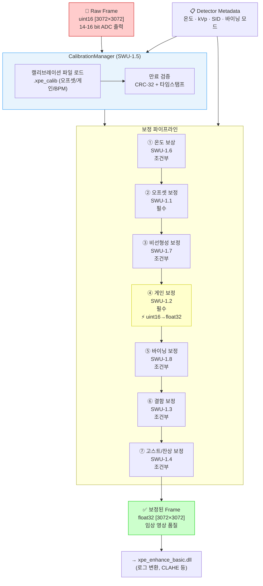

**핵심 포인트**:
- `④ 게인 보정` 단계에서 **uint16 → float32** 형식 경계가 발생 (이후 모든 연산은 float32)
- 필수 단계: 오프셋 보정, 게인 보정
- 조건부 단계: 나머지 (패널 프로파일 + 획득 파라미터에 따라 활성화)

---

## 2. 데이터 흐름 및 타입 변환

> **개념**: 각 보정 단계에서의 데이터 타입, 값 범위, 형식 경계 시각화

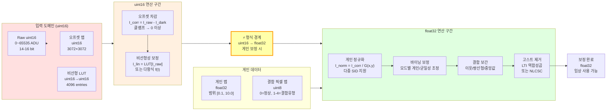

---

## 3. CalibrationManager 초기화 시퀀스

> **개념**: C# GUI → C ABI → CalibrationManager 초기화 및 보정 파일 로드 흐름

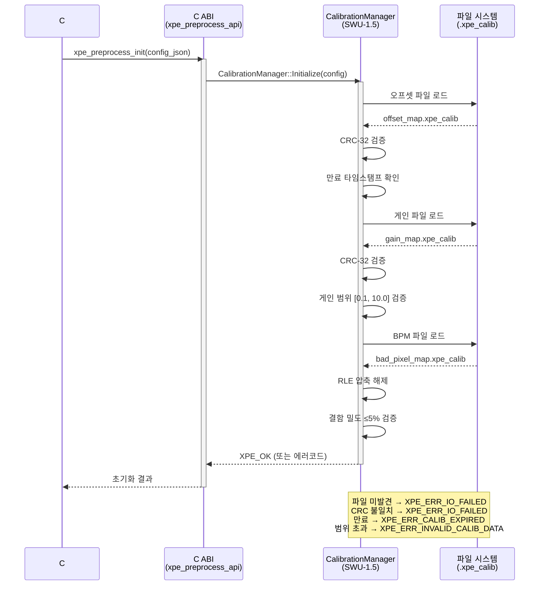

---

## 4. 오프셋(암전류) 보정

> **개념**: 검출기의 열적 암전류 노이즈를 제거하는 기본 보정 알고리즘

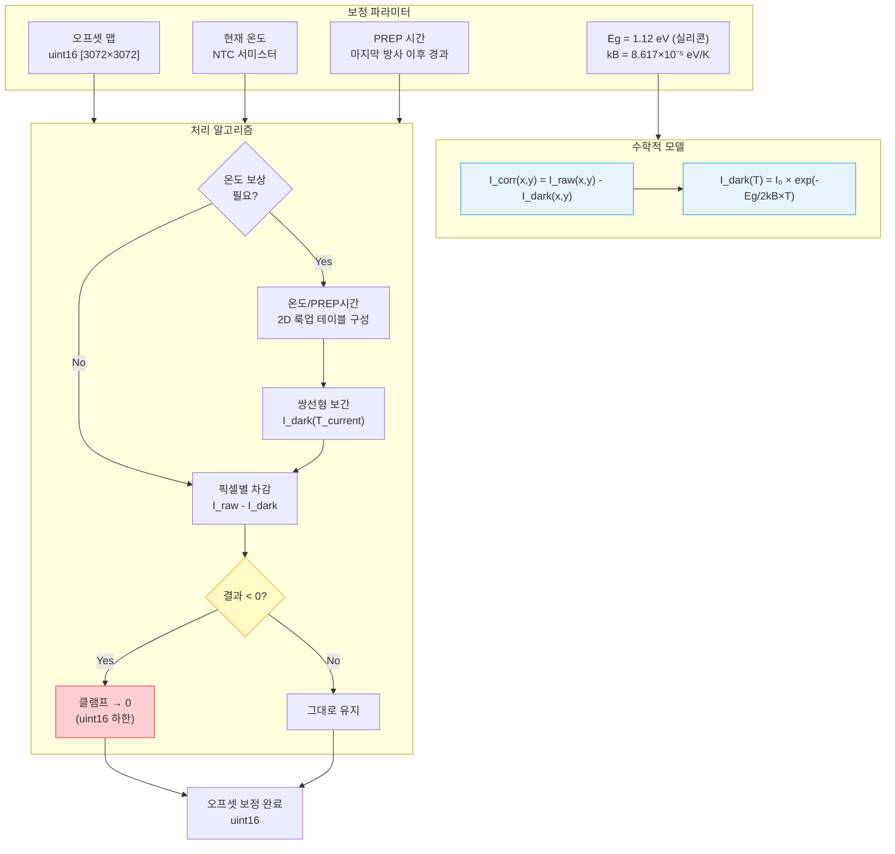

**물리적 배경**: 암전류는 반도체 밴드갭(Eg)에 의한 열 여기 전자로 발생. 온도 의존적 지수 모델 적용.  
**구현 파일**: `modules/preprocess/src/xpe_offset.cpp`

---

## 5. 게인(평탄화) 보정

> **개념**: 픽셀별 감도 불균일성(FPN) 및 SID 의존 강도 강하를 정규화

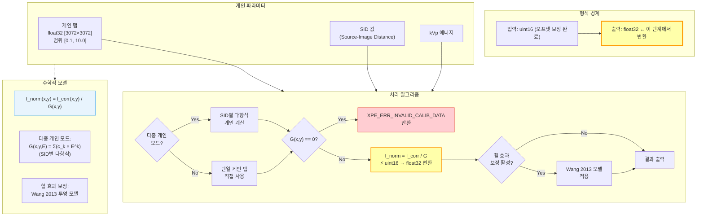

**구현 파일**: `modules/preprocess/src/xpe_gain.cpp`

---

## 6. 비선형성 보정

> **개념**: 검출기 응답의 비선형성을 LUT 또는 다항식으로 선형화

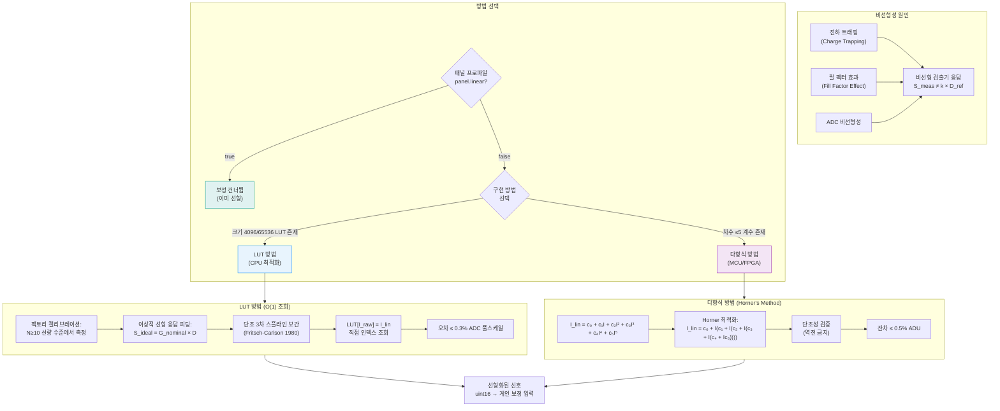

**구현 파일**: `modules/preprocess/src/nonlinearity_correct.cpp`  
**SRS 참조**: `SRS-CALIB-FUNC-006-EXT`

---

## 7. 결함 픽셀 보정

> **개념**: 불량 픽셀 검출(RMM 알고리즘) 및 주변 픽셀 보간으로 결함 은폐

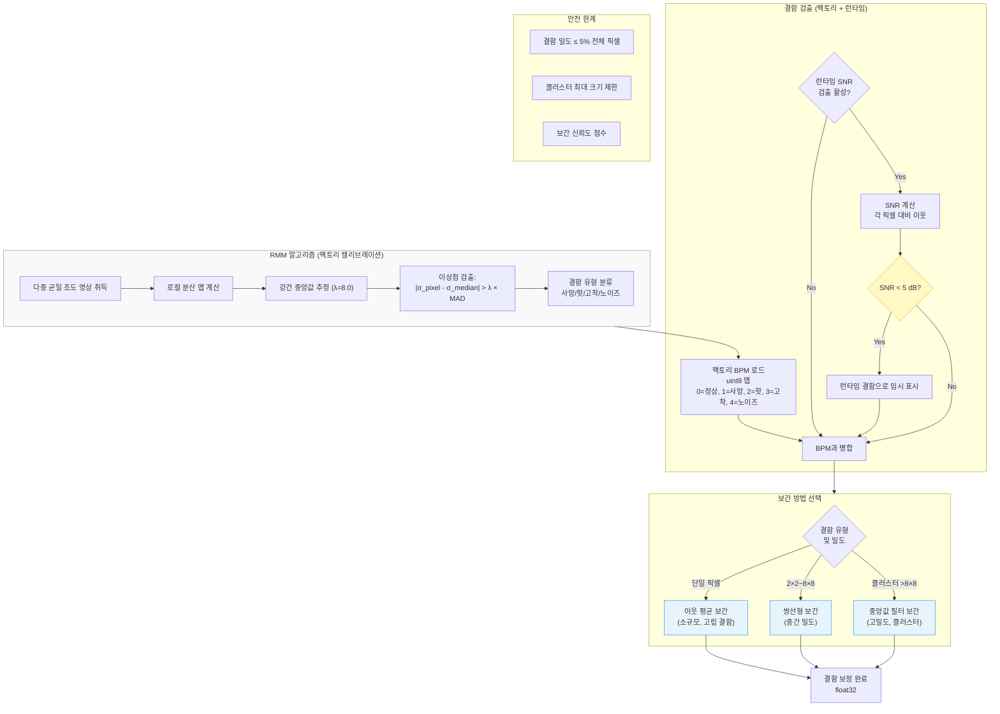

**구현 파일**: `modules/preprocess/src/xpe_defect.cpp`  
**관련 문서**: [`../panel-defect/SRS-DEFECT-001_Software_Requirements_Specification.md`](../panel-defect/SRS-DEFECT-001_Software_Requirements_Specification.md)

---

## 8. 고스트/잔상 보정 (3-Tier)

> **개념**: 잔류 전하 축적에 의한 잔상을 3단계 복잡도로 제거 (Tier 1 → Tier 3 순으로 정교)

### 8.1 Tier 선택 로직

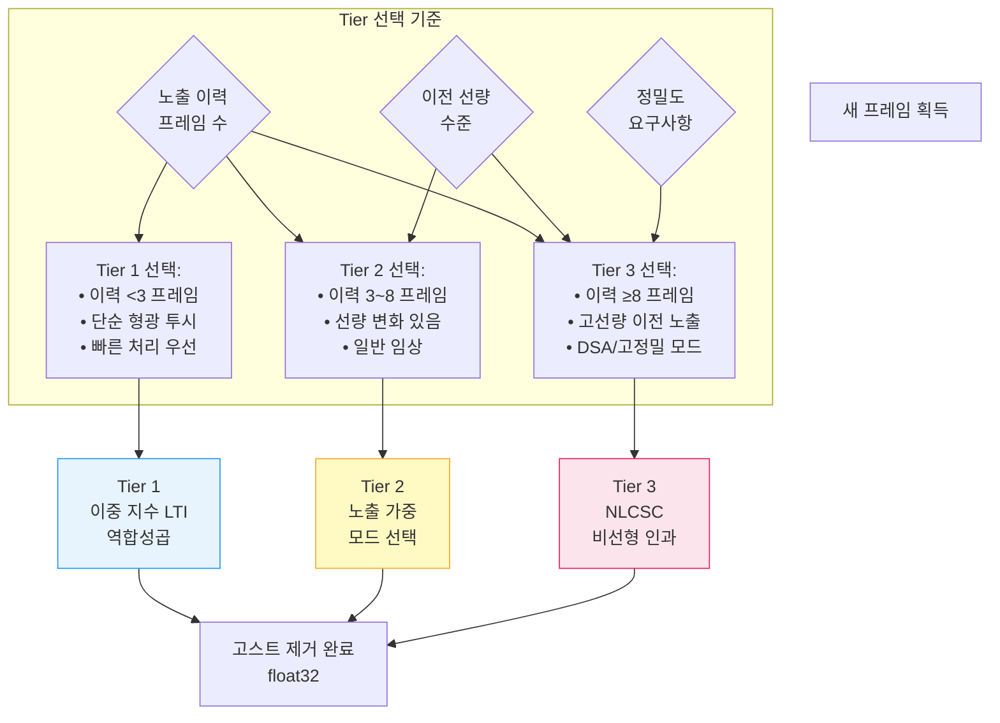

### 8.2 Tier 1: LTI 역합성곱

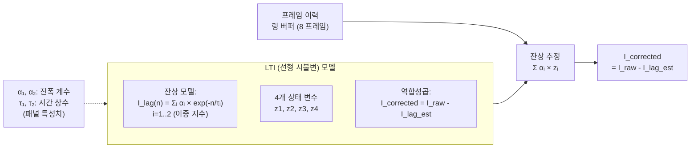

### 8.3 Tier 3: NLCSC (비선형 인과 공간 컨텍스트)

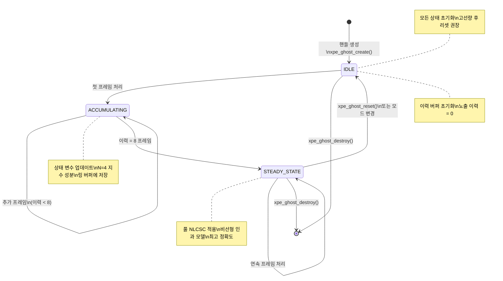

**구현 파일**: `modules/preprocess/src/ghost_correct.cpp`  
**관련 문서**: [`../ghost-correction/srs_ghost_correction.md`](../ghost-correction/srs_ghost_correction.md)

---

## 9. 온도 보상

> **개념**: NTC 서미스터로 측정한 검출기 온도 변화에 따른 암전류 드리프트 보상

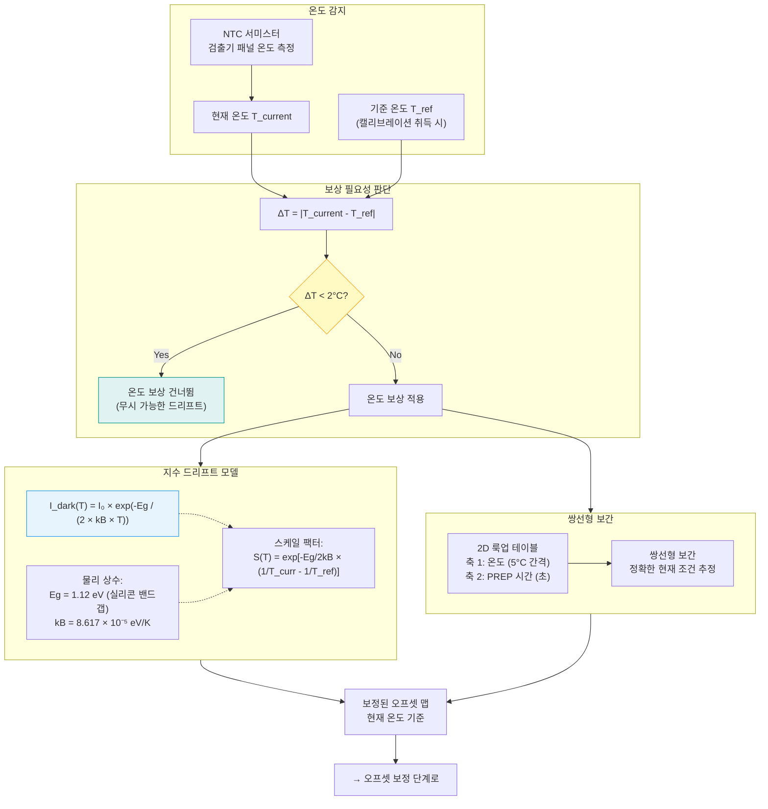

---

## 10. 바이패스 결정 로직

> **개념**: 각 보정 단계의 활성화/비활성화를 결정하는 중앙 로직

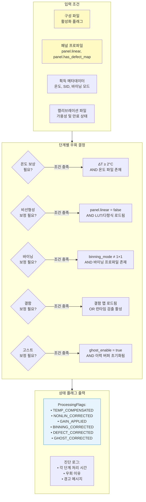

---

## 11. 캘리브레이션 데이터 생명주기

> **개념**: 팩토리 캘리브레이션 생성부터 현장 재캘리브레이션까지의 전체 생명주기

```mermaid
stateDiagram-v2
    [*] --> FACTORY_CALIB: 제조 시 팩토리 캘리브레이션

    state FACTORY_CALIB {
        [*] --> DARK_ACQ: 암전류 영상 취득
        DARK_ACQ --> FLAT_ACQ: 평탄 조도 영상 취득
        FLAT_ACQ --> BPM_GEN: BPM 생성 (RMM)
        BPM_GEN --> NL_CALIB: 비선형성 LUT 생성
        NL_CALIB --> SAVE: .xpe_calib 파일 저장\nCRC-32 + 만료 타임스탬프
    }

    FACTORY_CALIB --> DEPLOYED: 현장 배포

    state DEPLOYED {
        [*] --> VALID: 캘리브레이션 유효
        VALID --> VALID: 정상 사용\n(매 프레임 적용)
        VALID --> EXPIRY_CHECK: 만료 검사\n(24시간마다)
        EXPIRY_CHECK --> EXPIRED: 만료 시간 초과
        EXPIRY_CHECK --> VALID: 아직 유효
    }

    EXPIRED --> FIELD_RECALIB: 현장 재캘리브레이션 필요

    state FIELD_RECALIB {
        [*] --> DARK_COLLECT: 새 암전류 취득\n(IAP-CALIB-001 절차)
        DARK_COLLECT --> VALIDATE: 통계 검증\nσ/mean < 1%
        VALIDATE --> OVERWRITE: 새 파일로 덮어쓰기
        VALIDATE --> DARK_COLLECT: 검증 실패 → 재취득
    }

    FIELD_RECALIB --> DEPLOYED: 재배포

    DEPLOYED --> [*]: 시스템 폐기

    note right of FACTORY_CALIB: 취득 절차:\nIAP-CALIB-001 §3\n온도 안정화 30분 후
    note right of EXPIRED: 만료 전 경고:\nXPE_WARN_CALIB_EXPIRING_SOON\n(7일 전)
```

---

## 12. 소프트웨어 유닛 분해도

> **개념**: SWU 계층 구조 및 모듈 간 의존 관계

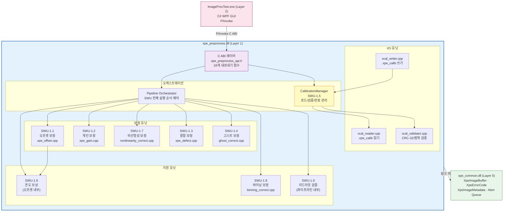

---

## 크로스 레퍼런스

| 다이어그램 | 관련 SRS 요건 | 관련 SAD 유닛 | 소스 파일 |
|----------|------------|------------|---------|
| 파이프라인 전체 | SRS-CALIB-FUNC-001~009 | SWU-1.1~1.9 | pipeline.cpp |
| 오프셋 보정 | SRS-CALIB-FUNC-004 | SWU-1.1 | xpe_offset.cpp |
| 게인 보정 | SRS-CALIB-FUNC-005 | SWU-1.2 | xpe_gain.cpp |
| 비선형성 보정 | SRS-CALIB-FUNC-006, 006-EXT | SWU-1.7 | nonlinearity_correct.cpp |
| 결함 보정 | SRS-CALIB-FUNC-007 | SWU-1.3 | xpe_defect.cpp |
| 고스트 보정 | SRS-CALIB-FUNC-008 | SWU-1.4 | ghost_correct.cpp |
| 온도 보상 | SRS-CALIB-FUNC-009 | SWU-1.6 | xpe_offset.cpp |
| 바이패스 로직 | 전 요건 | 전 SWU | pipeline.cpp |
| 데이터 생명주기 | SRS-CALIB-FUNC-001~003 | SWU-1.5 | calibration_manager.cpp |
| SWU 분해도 | 전체 | SAD-CALIB-001 §4 | — |

---

**다음 문서**: [KNOWLEDGE-BASE.md](KNOWLEDGE-BASE.md) — 전체 캘리브레이션 지식 베이스  
**관련 문서**: [README.md](README.md) — 파이프라인 기술 개요  
**검증 가이드**: [ALGORITHM-VERIFICATION-GUIDE.md](ALGORITHM-VERIFICATION-GUIDE.md)
