# X-ray FPD 래그/고스팅 소프트웨어 보정 모듈

**모듈**: `xpe_preprocess.dll` (Stage 4, Layer 1)  
**소유자**: 래그/고스팅 보정 팀  
**의존성**: `xpe_common.dll` (Layer 0)  
**안전 등급**: IEC 62304 Class B  
**문서 버전**: 1.0.0  
**날짜**: 2026-04-14  
**규범 사양**: [ALG-SPEC-001 v3.0.0](../../.moai/specs/xpe-algorithm-spec-deepsync.md), [PRD v2.0](sw_lag_correction_prd_v2.md)

---

## 모듈 문서 패키지 빠른 참조

이 README는 9개의 상호 연관된 래그/고스팅 보정 문서 중 하나입니다. 역할에 따라 바로 이동하세요:

| 역할 | 읽어야 할 문서 | 목적 |
|------|--------------|------|
| **소프트웨어 개발자** | 이 README → SRS → SAD | 파이프라인 구조, API, 알고리즘 이해 |
| **캘리브레이션 엔지니어** | IAP-GHOST-001 | FSRF/RSRF 영상 취득 절차 |
| **QA / 테스트 엔지니어** | TDS-GHOST-001 → STP-STC | 테스트 데이터 구성, 합격 기준 |
| **안전/위험 담당자** | SHA-GHOST-001 → RTM | 위험 식별, 리스크 관리 |
| **의료기기 규제** | SRS → RTM → SHA → SAD | IEC 62304 추적성 패키지 |

### 문서 생태계 구조

```
┌─────────────────────────────────────────────────────────────┐
│         래그/고스팅 보정 문서 패키지 (v1.0)                │
│                                                             │
│  ┌──────────────────────────────────────────────────────┐  │
│  │   sw_lag_correction_prd_v2.md (PRD)                 │  │
│  │   알고리즘 요구사항 · 성능 목표 · 평가 기준          │  │
│  └───────────────┬──────────────────────────────────────┘  │
│                  │ 파생                                     │
│        ┌─────────┼──────────────────┐                      │
│        │         │                  │                      │
│        v         v                  v                      │
│  ┌──────────┐ ┌──────────┐ ┌──────────────────────────┐   │
│  │  SRS     │ │   SAD    │ │   SHA                    │   │
│  │  소프트  │ │  소프트  │ │   소프트웨어 위험 분석  │   │
│  │  웨어    │ │  웨어    │ │   (ISO 14971)            │   │
│  │  요건    │ │  아키텍  │ │                          │   │
│  └──┬───────┘ └──┬───────┘ └──────────┬───────────────┘   │
│     │            │                     │                   │
│     └────────────┼─────────────────────┘                   │
│                  │ 추적                                     │
│                  v                                         │
│         ┌──────────────────┐                               │
│         │   RTM            │                               │
│         │   요구 → 테스트  │                               │
│         │   추적성         │                               │
│         └────────┬─────────┘                               │
│                  │ 테스트 입력                             │
│      ┌───────────┼──────────────────┐                     │
│      v           v                  v                     │
│  ┌────────┐ ┌────────┐              │                     │
│  │   IAP  │ │   TDS  │              │                     │
│  │ GHOST  │ │ GHOST  │              │                     │
│  │ 영상   │ │ 테스트 │──────────────┘                     │
│  │ 취득   │ │ 데이터 │                                     │
│  └────────┘ └────────┘                                     │
│                                                             │
│  ▶ 이 파일 (README.md) = 기술 개요 및 시스템 개요          │
└─────────────────────────────────────────────────────────────┘
```

---

## 목차

1. [개요](#1-개요)
2. [래그 vs 고스팅: 물리 기초](#2-래그-vs-고스팅-물리-기초)
3. [아키텍처](#3-아키텍처)
4. [3단계 보정 파이프라인](#4-3단계-보정-파이프라인)
5. [상태 관리](#5-상태-관리)
6. [우회 정책](#6-우회-정책)
7. [교정 데이터](#7-교정-데이터)
8. [성능 예산](#8-성능-예산)
9. [안전 제약](#9-안전-제약)
10. [API 참조](#10-api-참조)
11. [참고문헌](#11-참고문헌)

---

## 1. 개요

### 1.1 목적

`xpe_preprocess.dll`의 **Stage 4: Ghost/Lag Correction**은 간접 변환 X-ray FPD (a-Si TFT + CsI:Tl 신탁)에서 발생하는 **전하 갇힘(charge trapping) 현상**을 소프트웨어로 보정합니다.

```
입력 (원본 ADC 신호)
  ↓
Tier 1: Offset Correction        (항상)
Tier 2: Exposure-Weighted LTI    (조건부, 자동 활성)
Tier 3: NLCSC (비선형 신호-의존) (자동 에스컬레이션)
  ↓
출력 (보정된 float32 신호)
```

### 1.2 주요 특성

- **3단계 자동 에스컬레이션**: Tier 1 → Tier 2 → Tier 3 (필요시)
- **노출 의존 보정**: 신호 수준에 따라 래그 비율 변화 모델링
- **온도 보상**: 검출기 온도에 따른 계수 LUT 보간
- **상태 유지**: 16 프레임 노출 이력 추적 (ghost 누적 방지)
- **IEC 62304 Class B**: 안전 관련 진단 이미지용

### 1.3 성능 목표

| 지표 | 목표 |
|-----|------|
| **1st frame GCR** (미보정: ~0.33%) | < 0.1% (99.7% 감소) |
| **50th frame lag** | < 0.005% (극도로 작음) |
| **처리 시간** (Tier 1+2) | < 70 ms (3072×3072) |
| **처리 시간** (Tier 3) | < 200 ms (상태 포함) |
| **메모리 사용** | < 200 MB |

---

## 2. 래그 vs 고스팅: 물리 기초

### 2.1 a-Si TFT FPD에서의 전하 갇힘

#### 간접 변환 FPD의 신호 경로

```
X-ray
  ↓
CsI:Tl 신탁 → 가시광 변환
  ↓
a-Si 광다이오드 → 전자 신호
  ↓
TFT 트랜지스터 어레이 → 전자 수집 (그리고 일부는 갇힘)
  ↓
ADC 신호
```

#### 전하 갇힘의 원인

a-Si의 **결정 결함(crystal defects)** 중심에서 전자가 갇혀 느리게 방출:

```
전자 갇힘 메커니즘:

취득 1: X-ray 신호 → 다수 전자 생성
        ├─ 즉시 수집 (99%)
        └─ 결함 중심에 갇힘 (1%)

취득 2 (1ms 후): 새로운 신호
        ├─ 새 신호 + 갇혀있던 전자 방출
        → 신호 합산 오류 (artifact)

취득 N (충분한 시간 후): 모든 갇힌 전자 방출
        → 신호 정상
```

### 2.2 래그 (Lag) 정의

```
Lag = 이전 노출 후 남은 전자가 현재 신호에 오염시키는 비율

수학:
  GCR (Ghost Coefficient Ratio) = (남은 신호) / (새 신호) × 100%
  
예시:
  새 신호 = 2000 ADU
  남은 신호 = 6.6 ADU (1st frame lag)
  GCR = 6.6 / 2000 = 0.33% (FB 미적용 시 전형적 값)
```

### 2.3 고스팅 (Ghosting) 정의

```
Ghosting = frame-to-frame 누적 (과거 모든 촬영의 영향)

시나리오 (CBCT 시퀀스):
  Frame 1: 높은 신호 (3000 ADU)
           → 일부 갇힘 (일반적 1%, ~30 ADU)
  
  Frame 2: 신호 = 새 신호 1500 ADU + 이전 30 ADU
           = 1530 ADU (신호 오염, 2% 오차)
  
  Frame 3: 신호 = 1500 + (이전 30 감쇠) + (Frame 1 갇힘 2차 방출)
           = 누적 오염
  
  ...
  
  Frame 100: 누적 오염 심각
            (수십 프레임의 갇힌 전자 합산)
```

### 2.4 물리적 모델

#### 다중 지수 감쇠 모델 (Siewerdsen & Jaffray 1999)

```
한 번의 노출 후 갇힌 전자의 감쇠:

Q(t) = Σ( Q_n,0 × exp(-t / τ_n) )

여기서:
  Q_n,0 = n번 갇힘 레벨의 초기 전하
  τ_n = n번 갇힘의 이완 시간 상수 (~1ms ~ 1초)
  
일반적 4개 지수 항 (N=4):
  τ_1 ≈ 100ms  (주 래그)
  τ_2 ≈ 667ms  (중간)
  τ_3 ≈ 3.3s   (장시간)
  τ_4 ≈ 16.7s  (극장시간)
```

#### 프레임 단위 표현 (디지털 화상)

```
30 fps일 때, 프레임 간격 Δt = 33.3ms

Q(n) = Σ( b_n × (1 - a_n)^n )

여기서:
  a_n = 1 - exp(-Δt / τ_n)  (프레임당 감쇠율)
  b_n = Q_n,0 / (1 - exp(-Δt / τ_n))  (정규화된 계수)
  
예시:
  τ = 100ms → a = 1 - exp(-0.0333/0.1) = 0.286
             (매 프레임마다 약 28.6% 감소)
```

---

## 3. 아키텍처

### 3.1 레이어 위치

```
Layer 2  ImageProcTest.exe (C# WPF 오케스트레이터)
           │
           │ P/Invoke (C ABI 호출)
           │
Layer 1  xpe_preprocess.dll ← 이 모듈
           │
           │ 링크 의존성
           │
Layer 0  xpe_common.dll (타입, 메모리, 설정, 에러)
```

### 3.2 모듈 구성

```mermaid
graph TD
    subgraph App["Application Layer"]
        ACQ["Acquisition Manager"]
        DICOM["DICOM Encoder"]
    end
    
    subgraph Core["Correction Core (이 모듈)"]
        PIPE["CorrectionPipeline"]
        T1["Tier1: Offset"]
        T2["Tier2: LTI Lag"]
        T3["Tier3: NLCSC"]
        GHOST["Ghost State"]
    end
    
    subgraph Calib["Calibration Data"]
        CAL_MGR["CalibrationManager"]
        OFFSET["OffsetMap"]
        GAIN["GainMap"]
        LAG_COEFF["LagCoefficients"]
    end
    
    subgraph Infra["Infrastructure"]
        CONFIG["ConfigManager"]
        LOG["Logger"]
        DIAG["Diagnostics"]
    end
    
    ACQ --> PIPE
    PIPE --> T1 --> T2 --> T3 --> GHOST
    PIPE --> DICOM
    
    CAL_MGR --> OFFSET
    CAL_MGR --> LAG_COEFF
    CAL_MGR --> PIPE
    
    PIPE --> CONFIG
    PIPE --> DIAG
    
    style Core fill:#e94560
    style Calib fill:#0f3460
    style Infra fill:#1a1a2e
```



---

## 4. 3단계 보정 파이프라인

### 4.1 Tier 1: Offset Correction (항상)

**목적**: 어두운 전류 차감 (모든 검출기의 필수 보정)

```
처리:
  I_tier1[x,y] = max(0, I_raw[x,y] - I_dark[x,y])

특성:
  ├─ 온도 + PREP time에 따라 동적 보간
  ├─ 언더플로우 처리 (음수 → 0)
  └─ 모든 후속 단계의 기초

우회 불가: 
  어두운 전류가 모든 신호를 오염시키므로 필수
  
성능:
  < 5ms (픽셀 선형 연산)
```

**예시** (AUO R1717):

```
I_raw[100][100] = 1050 ADU (신호 + 어두운 전류)
I_dark[100][100] = 50 ADU  (어두운 전류)
─────────────────────────────
I_tier1[100][100] = 1000 ADU (순수 신호)
```

---

### 4.2 Tier 2: Exposure-Weighted LTI Lag Correction

**목적**: 첫 1-50 프레임에서 빠른 래그 감쇠 보정

```
원리:
  D_post 어두운 프레임에서 남은 래그 신호 측정
  → X-ray 프레임에서의 래그 비율 추정 (α 계수)
  → 빼기 보정

공식:
  α(E) = 노출 수준에 따른 잔여 래그 비율
  L_est[x,y] = α(E) × (D_post[x,y] - D_pre[x,y])
  I_tier2[x,y] = I_tier1[x,y] - L_est[x,y]

특성:
  ├─ 매우 빠름 (< 5ms)
  ├─ 비메모리 (상태 관리 불필요)
  ├─ 신호 의존 (높은 신호 = 낮은 래그 비율)
  └─ 포화 처리 불가 (계수 LUT 필요)

성능:
  → GCR: 0.33% → 0.25% (Starman et al. 2012)
  → 1st frame: 약 75% 개선

자동 활성화:
  dark_post 프레임 수집되면 자동 사용
  (현장 취득 때 대부분 포함)
```

---

### 4.3 Tier 3: NLCSC (Nonlinear Charge-dependent Signal Correction)

**목적**: Tier 2 이후 잔여 래그 제거 (신호 의존 + 장시간 감쇠)

```
원리:
  상태 변수 S_n을 프레임마다 유지
  → 갇힌 전자의 누적 상태 추적
  → 비선형 계수로 보정

상태 방정식:
  S_n[k] = S_n[k-1] × decay(τ_n, Δt) 
         + x_hat[k-1] × b_n(E[k-1])
  
  x_hat[k] = (y_k - Σ S_n[k]) / (1 - b_0)

여기서:
  S_n = n번 래그 레벨의 상태 (누적 갇힌 전자)
  decay = 시간 감쇠 LUT
  b_n(E) = 노출 의존 계수 (4차 다항식)
  
특성:
  ├─ 상태 유지 필요 (16 프레임 이력)
  ├─ 메모리 ~150MB (16 × 3072 × 3072 × 4바이트)
  ├─ 느림 (< 200ms/프레임)
  ├─ 매우 정확함 (잔여 래그 < 0.005%)
  └─ 임상적으로 최고 품질

자동 에스컬레이션:
  if (GCR_tier2 > threshold) then Tier 3
  
성능:
  → GCR: 0.25% → < 0.003% (극도로 작음)
  → 1st frame: < 0.29% (재정의)
  → 50th frame: < 0.0052% (거의 불감지)
```

---

### 4.4 자동 에스컬레이션 로직

```
START
  ├─ Tier 1: Offset Correction 적용
  │
  ├─ GCR 추정 (Tier 1 후)
  │
  ├─ Tier 2 시도 (dark_post 있으면)
  │   └─ GCR 재추정
  │
  ├─ GCR > threshold (예: 0.1%) ? (필요시)
  │   ├─ YES → Tier 3 활성화
  │   │   ├─ 상태 초기화
  │   │   └─ NLCSC 보정 적용
  │   │
  │   └─ NO → Tier 2 유지
  │
  └─ 출력 (다음 단계로)

결과:
  GCR < 0.1% 달성 (자동)
```

---

## 5. 상태 관리

### 5.1 ExposureHistory 구조

```c
typedef struct {
    uint64_t timestamp_us;          // 노출 시각 (마이크로초)
    uint32_t exposure_level;        // 신호 수준 (0~65535)
    uint8_t  fb_applied;            // FB (Feedback) 적용 여부
    uint8_t  fb_cycles;             // FB 반복 횟수
} ExposureRecord;

#define MAX_HISTORY 16              // Ring buffer 크기
```

### 5.2 Ghost State 수명 관리

```
프레임 취득 흐름:

프레임 N-1: 신호 = 2000 ADU
  └─ ExposureHistory 추가
  └─ S_n 업데이트 (갇힌 전자 축적)

프레임 N: 신호 = 1500 ADU
  ├─ S_n decay 적용 (이전 프레임에서 감쇠)
  ├─ 보정 계산 (갇힌 전자 빼기)
  ├─ ExposureHistory 추가 (새로운 노출)
  └─ S_n 업데이트 (새로운 갇힘)

프레임 N+1: 신호 = 1600 ADU
  ├─ S_n decay 적용 (더 감쇠)
  ├─ 보정 계산 (매우 작은 잔여)
  ├─ ExposureHistory 추가
  └─ ...

프레임 N+50 (충분히 오래됨):
  └─ S_n ≈ 0 (대부분 방출)
  └─ 신호 ≈ 원본 (래그 무시할 수 있는 수준)
```

### 5.3 상태 리셋 조건

```
자동 리셋 (프레임 취득 중):
  ├─ 노출 없음 > 1시간: S_n = 0 (전자 완전 방출)
  └─ 명시적 리셋 호출: xpe_ghost_reset()

수동 리셋 (응용 코드에서):
  ├─ 환자 변경 (장시간 대기)
  ├─ 검출기 재부팅
  └─ 수동 명령 (기술자)
```

---

## 6. 우회 정책

### 6.1 우회 가능 단계 (조건부)

| 단계 | 우회 가능 | 조건 |
|-----|---------|------|
| **Tier 1** | ❌ NO (FROZEN) | 필수 (모든 경우) |
| **Tier 2** | ⚠️ AUTO | dark_post 없으면 자동 skip |
| **Tier 3** | ⚠️ CONFIG | GCR < 임계값이면 skip |

### 6.2 Tier 2 우회 조건

```
dark_post == NULL이면:
  ├─ 이유: Tier 2는 D_post 필요
  ├─ 결과: Tier 1만 적용 → GCR ≈ 0.33% (높음)
  └─ 안내: "포장 후 어두운 프레임 수집 권장"
```

### 6.3 Tier 3 우회 조건

```
if (GCR_after_tier2 < threshold):
    skip Tier 3
    reason: "충분히 낮음, 비용 편익 불리함"
else:
    enable Tier 3
    reason: "자동 품질 달성"
```

### 6.4 첫 프레임 우회

```
Frame 0 (전력 온 후 첫 촬영):
  ├─ ExposureHistory: 비어있음
  ├─ 예상 래그: 0 (이전 노출 없음)
  ├─ 처리: Tier 1만 적용 (Tier 2/3 skip)
  └─ 안내: "첫 프레임 최고 품질"
```

---

## 7. 교정 데이터

### 7.1 교정 파일 구성

**파일**: `panel_XXXXXXXX.gcal` (검출기 S/N별)

```
구조:
  Header (64 바이트)
    ├─ Magic: "GCLB"
    ├─ Version: 0x00020000
    ├─ Panel S/N
    ├─ Calibration date
    └─ CRC32
  
  Data (28.3 MB)
    ├─ IRF Parameters (b_n, a_n 계수)
    ├─ Temperature LUT (5개 온도 × 4개 항)
    ├─ GainMap (18.9 MB)
    ├─ DefectMap (9.4 MB)
    └─ GhostParams (γ, τ_ghost)
```

### 7.2 교정 계수 갱신 주기

```
Factory: 1회 (제조 시)

Field (현장):
  ├─ 매년 또는
  ├─ 온도 드리프트 > 1°C 또는
  ├─ 예상 성능 저하 시
  └─ 최대 갱신 주기: 2년

감지: Tier 2 후 GCR > 0.5%이면
  → 진단 경고: "교정 갱신 권장"
```

---

## 8. 성능 예산

### 8.1 처리 시간 예산

```
입력: 3072×3072 uint16 프레임
출력: 3072×3072 float32

Tier 1 (Offset):     ~5ms
Tier 2 (LTI Lag):    ~5ms
────────────────────────
Tier 1+2 Total:     <70ms ✓

Tier 3 (NLCSC):     ~50ms
Gain/Defect:        ~20ms
────────────────────────
Full Pipeline:      <200ms ✓
```

### 8.2 메모리 예산

```
ExposureHistory:    ~150 MB (16 프레임 × 2.8 MB)
State maps S_n:     ~30 MB (4개 항 × 8 MB)
LUT & 임시:         ~20 MB
────────────────────────────
Total:             <200 MB ✓
```

---

## 9. 안전 제약

### 9.1 IEC 62304 Class B 준수

```
필수 문서:
  ✓ Software Requirements Specification (SRS)
  ✓ Software Architecture Document (SAD)
  ✓ Software Hazard Analysis (SHA)
  ✓ Requirements Traceability Matrix (RTM)
  ✓ Test Procedures & Test Cases (STP/STC)

버전 관리:
  ✓ 모든 변경 추적 (CLAUDE.md 기반)
  ✓ 회귀 테스트 (전체 기능)
  ✓ 사후 배포 모니터링
```

### 9.2 자동 에스컬레이션 안전성

```
규칙:
  1. Tier 높음 = 더 정확한 보정 (항상 안전)
  2. Tier 낮음 = 더 빠름 (품질 트레이드오프 명시)
  3. 전환 불가역: 다시 낮출 수 없음 (안전)
  4. 진단 기록: 사용된 Tier 항상 로깅
```

### 9.3 오류 처리

```
심각한 오류 (파이프라인 중단):
  ├─ XPE_ERR_NULL_PTR: 입력 NULL
  ├─ XPE_ERR_CALIB_INVALID: 교정 파일 손상
  └─ XPE_ERR_MEMORY: 메모리 부족

경고 (계속 진행, 품질 저하):
  ├─ XPE_WARN_OVERFLOW: 픽셀 포화
  ├─ XPE_WARN_TEMPERATURE: 온도 범위 벗어남
  └─ XPE_WARN_CALIB_EXPIRED: 교정 파일 오래됨
```

---

## 10. API 참조

### 10.1 핵심 함수

```c
// 초기화 (시작 시 1회)
CorrectionError xpe_ghost_create(
    const CalibrationData* calib,
    const CorrectionConfig* config
);

// 프레임 처리
CorrectionError xpe_ghost_correct(
    const Frame* raw,
    const Frame* dark_pre,
    const Frame* dark_post,  // NULL 가능
    Frame* output,
    CorrectionResult* result
);

// 노출 이력 업데이트
CorrectionError xpe_ghost_update_history(
    const ExposureRecord* record
);

// 상태 리셋 (환자 변경 등)
void xpe_ghost_reset(void);

// 정리 (종료 시)
void xpe_ghost_destroy(void);
```

### 10.2 에러 코드

```c
typedef enum {
    XPE_OK                  = 0,
    XPE_ERR_NULL_PTR        = -1,
    XPE_ERR_CALIB_INVALID   = -2,
    XPE_ERR_MEMORY          = -7,
    XPE_WARN_OVERFLOW       = 1,
    XPE_WARN_TEMPERATURE    = 2,
} CorrectionError;
```

---

## 11. 참고문헌

### 11.1 주요 논문

| 저자 | 연도 | 논문 제목 | 기여 |
|-----|-----|---------|------|
| **Starman et al.** | 2012 | "NLCSC for FPDs" | Tier 3 알고리즘 기초 |
| **Siewerdsen & Jaffray** | 1999 | "Lag in Flat-panel Detectors" | 물리 모델 (다중 지수) |
| **Pang** | 2006 | "a-Si Detector Characteristics" | 온도 의존성 |
| **Zhao** | 2004 | "Temperature Compensation" | 온도 LUT 모델 |

### 11.2 관련 문서

| 문서 | 경로 |
|-----|------|
| **Product Specification** | `sw_lag_correction_prd_v2.md` |
| **Software Requirements** | `srs_ghost_correction.md` |
| **Architecture Document** | `sad_ghost_correction.md` |
| **Acquisition Protocol** | `IAP-GHOST-001_Image_Acquisition_Protocol.md` |
| **Test Dataset Spec** | `TDS-GHOST-001_Test_Dataset_Specification.md` |
| **Test Plan** | `stp_stc_ghost_correction.md` |
| **Traceability Matrix** | `rtm_ghost_correction.md` |

### 11.3 표준

| 표준 | 관련 섹션 |
|-----|---------|
| **IEC 62304:2006+A1:2015** | SW lifecycle, 검증, 위험 관리 |
| **ISO 14971:2019** | 위험 분석 및 관리 |
| **IEC 62220-1-1:2015** | 의료용 X-ray 영상 장치 |

---

## 문서 네비게이션

```
다음 단계:

[소프트웨어 개발자]
  → SRS-GHOST-001 읽기 (상세 요구사항)
  → SAD-GHOST-001 읽기 (구현 설계)
  → 코드 개발 시작

[QA/테스트 엔지니어]
  → TDS-GHOST-001 읽기 (테스트 데이터)
  → STP-STC 읽기 (테스트 계획)
  → 테스트 케이스 개발

[캘리브레이션 엔지니어]
  → IAP-GHOST-001 읽기 (영상 취득 절차)
  → 교정 데이터 취득 시작

[안전/규제 담당자]
  → SHA-GHOST-001 읽기 (위험 분석)
  → RTM-GHOST-001 읽기 (추적성)
```

---

**문서 끝**

**승인**: [성명]  
**날짜**: 2026-04-14  
**버전**: 1.0.0 (최종)

---

*본 문서는 IEC 62304 Class B 의료기기 소프트웨어 개발 표준을 따릅니다.*

*마지막 갱신: 2026-04-14*
