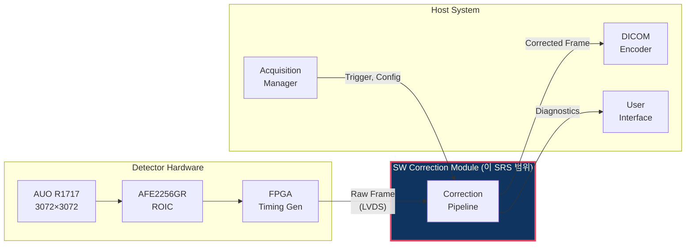

# SRS: 소프트웨어 요구사항 명세서

> **Document ID**: SRS-GHOST-001 | **Version**: 1.0 | **Date**: 2026-04-02
>
> **Product**: Lag/Ghost SW 보정 모듈 | **IEC 62304 Class**: B
>
> **Trace Source**: PRD v1.0, PRD v2.0

---

## 1. 목적 및 범위

이 문서는 a-Si FPD(AUO R1717 + AFE2256GR) 기반 Still DR 시스템의 Lag/Ghost SW 보정 모듈에 대한 소프트웨어 요구사항을 정의합니다.

### 1.1 시스템 컨텍스트

---

## 2. 기능 요구사항

### FR-100: 오프셋 보정 (Tier 1)

| ID | 요구사항 | 우선순위 | 검증 방법 |
|---|---|---|---|
| FR-101 | 시스템은 X-ray raw frame에서 pre-exposure dark frame을 pixel별로 차감하여 offset을 보정해야 한다 | **필수** | Unit test T1-01~06 |
| FR-102 | 차감 결과가 음수인 pixel은 0으로 clamp해야 한다 | 필수 | Unit test T1-02 |
| FR-103 | 차감 결과가 65535를 초과하는 pixel은 65535로 clamp해야 한다 | 필수 | Unit test T1-03 |
| FR-104 | Overflow/underflow 발생 pixel 수를 CorrectionResult에 기록해야 한다 | 필수 | Unit test |
| FR-105 | Dark frame이 NULL인 경우 CORR_ERR_NULL_PTR을 반환해야 한다 | 필수 | Unit test |

### FR-200: 래그 보정 (Tier 2)

| ID | 요구사항 | 우선순위 | 검증 방법 |
|---|---|---|---|
| FR-201 | 시스템은 post-exposure 어두운 프레임과 pre-exposure 어두운 프레임의 차분으로 잔류 래그 신호를 추정해야 한다 | 필수 | 단위 테스트 T2-01~05 |
| FR-202 | 래그 신호가 음수인 픽셀은 0으로 클램프하여 노이즈에 의한 역전을 방지해야 한다 | 필수 | 단위 테스트 T2-03 |
| FR-203 | 노출 의존 α(E) 계수를 캘리브레이션 LUT에서 조회하여 적용해야 한다 | 필수 | 단위 테스트 |
| FR-204 | Post-exposure 어두운 프레임이 NULL인 경우 Tier 2를 건너뛰고 Tier 1 결과를 출력해야 한다 | 필수 | 단위 테스트 |
| FR-205 | 촬영 이력(ExposureRecord)을 최대 16개까지 유지하고, 시간 간격에 따른 감쇠를 적용해야 한다 | 권장 | 단위 테스트 |

### FR-300: NLCSC 보정 (Tier 3)

| ID | 요구사항 | 우선순위 | 검증 방법 |
|---|---|---|---|
| FR-301 | 시스템은 N=4 multi-exponential 모델의 NLCSC 알고리즘을 구현해야 한다 | 선택 | Unit test |
| FR-302 | State variable Sₙ을 frame 간에 유지하고, 시간 간격에 따른 지수적 감쇠를 적용해야 한다 | 선택 | Unit test |
| FR-303 | Exposure-dependent bₙ(E)와 aₙ(E)를 교정 데이터에서 조회해야 한다 | 선택 | Unit test |
| FR-304 | exp(-a) 연산은 256-entry LUT + 선형 보간으로 구현해야 한다 | 선택 | Fixed-point test |
| FR-305 | NLCSC는 config에서 명시적으로 활성화된 경우에만 실행해야 한다 | 선택 | Integration test |

### FR-400: 게인 보정

| ID | 요구사항 | 우선순위 | 검증 방법 |
|---|---|---|---|
| FR-401 | 시스템은 공장 캘리브레이션 게인 맵을 사용하여 픽셀별 감도 보정을 수행해야 한다 | 필수 | 단위 테스트 G-01~05 |
| FR-402 | 게인 맵의 값이 0인 픽셀(데드 픽셀)은 보정을 건너뛰고 원본 값을 유지해야 한다 | 필수 | 단위 테스트 G-05 |
| FR-403 | 게인 보정 결과는 uint16 범위로 클램프해야 한다 | 필수 | 단위 테스트 G-04 |

### FR-500: 고스트 (게인 고스팅) 보정

| ID | 요구사항 | 우선순위 | 검증 방법 |
|---|---|---|---|
| FR-501 | 시스템은 노출 이력 기반 ΔG 추정을 구현해야 한다 | 선택 | 단위 테스트 |
| FR-502 | 고스트 보정은 구성에서 명시적으로 활성화된 경우에만 실행해야 한다. 기본값은 비활성이다 | 필수 | 통합 테스트 |
| FR-503 | ΔG 추정에 사용되는 τ_ghost와 γ 계수는 캘리브레이션 데이터에서 로드해야 한다 | 선택 | 단위 테스트 |

### FR-600: 결함 보정

| ID | 요구사항 | 우선순위 | 검증 방법 |
|---|---|---|---|
| FR-601 | 시스템은 결함 맵에 표시된 픽셀을 주변 정상 픽셀로 보간해야 한다 | 필수 | 단위 테스트 |
| FR-602 | 보간 방법은 근처 평균, 이중선형, 중앙값 중 구성에서 선택 가능해야 한다 | 필수 | 단위 테스트 |
| FR-603 | 결함 픽셀이 클러스터인 경우(3×3 내 복수 결함) 정상 이웃만 사용해야 한다 | 필수 | 단위 테스트 |
| FR-604 | 정상 이웃이 없는 경우 원본 값을 유지하고 경고를 기록해야 한다 | 필수 | 단위 테스트 |

### FR-700: 파이프라인 오케스트레이션

| ID | 요구사항 | 우선순위 | 검증 방법 |
|---|---|---|---|
| FR-701 | 보정 파이프라인은 Offset → Lag → Ghost → Gain → Defect 순서로 실행해야 한다 | 필수 | 통합 테스트 P-01~08 |
| FR-702 | 자동 계층 에스컬레이션이 활성화된 경우, Tier 1 후 GCR이 임계값을 초과하면 Tier 2로 승격해야 한다 | 권장 | 통합 테스트 |
| FR-703 | Tier 2 후에도 GCR 임계값을 초과하고 NLCSC가 활성화된 경우 Tier 3으로 승격해야 한다 | 선택 | 통합 테스트 |
| FR-704 | correction_process() 호출 시 CorrectionResult에 사용된 계층, GCR, 처리 시간을 기록해야 한다 | 필수 | 통합 테스트 |

---

## 3. 비기능 요구사항

### NFR-100: 성능

| ID | 요구사항 | 목표값 | 검증 방법 |
|---|---|---|---|
| NFR-101 | Tier 1+2 처리 시간 | < 70ms | Timer 측정 |
| NFR-102 | Tier 1+2+Gain+Defect 전체 처리 시간 | < 200ms | Timer 측정 |
| NFR-103 | Tier 3 포함 전체 처리 시간 | < 500ms | Timer 측정 |
| NFR-104 | Memory 사용량 (Tier 1+2) | < 100 MB | Runtime 측정 |
| NFR-105 | Memory 사용량 (Tier 3 포함) | < 200 MB | Runtime 측정 |

### NFR-200: 정확도

| ID | 요구사항 | 목표값 | 검증 방법 |
|---|---|---|---|
| NFR-201 | GCR (FB 적용 + Tier 1+2) | ≤ 0.1% | 계단 쐐기 팬텀 |
| NFR-202 | GCR (FB 미적용 + Tier 2+3) | ≤ 0.3% | 계단 쐐기 팬텀 |
| NFR-203 | 고정 소수점 정밀도 손실 | ≤ 0.5 LSB RMS | Float vs 고정 비교 |
| NFR-204 | PSNR (보정 전후) | ≥ 45 dB | 시뮬레이션 |
| NFR-205 | SSIM (보정 전후) | ≥ 0.998 | 시뮬레이션 |
| NFR-206 | MTF 보존 | ≥ 0.98 @나이퀴스트 | 에지 응답 |

### NFR-300: 신뢰성

| ID | 요구사항 | 검증 방법 |
|---|---|---|
| NFR-301 | 1000 프레임 연속 처리 시 충돌, 메모리 누수, 결과 열화 없음 | 스트레스 테스트 |
| NFR-302 | 캘리브레이션 데이터 CRC 불일치 시 CORR_ERR_CALIB_CRC 반환 | 단위 테스트 |
| NFR-303 | 온도 센서 미연결 시 25°C 폴백으로 정상 동작 | 단위 테스트 |
| NFR-304 | 모든 공개 함수는 NULL 포인터 입력에 대해 오류를 반환해야 한다 | 단위 테스트 |

### NFR-400: 유지보수성

| ID | 요구사항 | 검증 방법 |
|---|---|---|
| NFR-401 | 모든 공개 함수에 Doxygen 주석 | 코드 리뷰 |
| NFR-402 | 명령문 커버리지 ≥ 80% | 커버리지 도구 |
| NFR-403 | 분기 커버리지 ≥ 70% | 커버리지 도구 |
| NFR-404 | MISRA C:2012 권고 준수 (안전 중요 부분집합) | 정적 분석 |
| NFR-405 | 정적 분석 도구 (cppcheck/Coverity) 경고 0건 | CI 파이프라인 |

---

## 4. 인터페이스 요구사항

### IR-100: 입력 인터페이스

| ID | 인터페이스 | 데이터 | 소스 |
|---|---|---|---|
| IR-101 | 원본 X-ray 프레임 | 프레임 (3072×3072×uint16, 타임스탐프, 노출 레벨) | FPGA via DMA |
| IR-102 | Pre-exposure 어두운 프레임 | 프레임 | FPGA (촬영 직전 취득) |
| IR-103 | Post-exposure 어두운 프레임 | 프레임 (선택) | FPGA (촬영 직후 취득) |
| IR-104 | 구성 | CorrectionConfig 구조체 | 호스트 애플리케이션 |
| IR-105 | 캘리브레이션 데이터 | .gcal 파일의 CalibrationData | 플래시/EEPROM |
| IR-106 | 패널 온도 | float (°C) | 온도 센서 |

### IR-200: 출력 인터페이스

| ID | 인터페이스 | 데이터 | 목적지 |
|---|---|---|---|
| IR-201 | 보정된 프레임 | 프레임 (3072×3072×uint16) | DICOM 인코더 |
| IR-202 | 보정 결과 | CorrectionResult 구조체 | 호스트 애플리케이션 |
| IR-203 | 로그 메시지 | 텍스트 문자열 + 심각도 | 로깅 시스템 |
| IR-204 | 진단 | 오버플로우 수, GCR, 처리 시간 | 모니터링 시스템 |

---

## 5. 제약 조건

| ID | 제약 | 근거 |
|---|---|---|
| CON-01 | C99 이상, POSIX 비의존 | MCU 이식성 |
| CON-02 | 동적 메모리 할당 금지 (malloc/free) | 결정론적 메모리, IEC 62304 |
| CON-03 | 부동 소수점 사용 최소화 (캘리브레이션 시에만) | MCU에 FPU 없을 수 있음 |
| CON-04 | 외부 라이브러리 의존 금지 (math.h의 exp 제외, LUT로 대체) | 이식성 |
| CON-05 | 프레임 처리 중 blocking I/O 금지 | 실시간성 |
