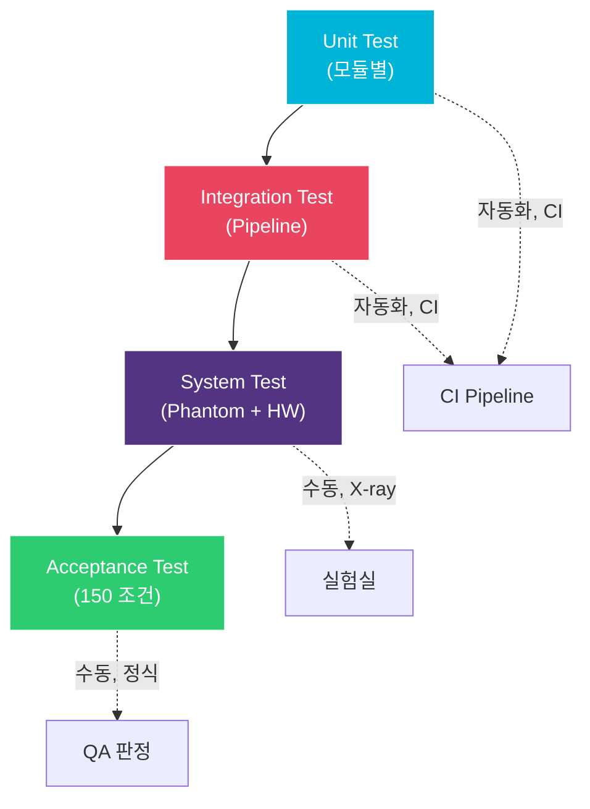

# STP/STC: 소프트웨어 테스트 계획 및 테스트 케이스

> **Document ID**: STP-GHOST-001 | **Version**: 1.0 | **Date**: 2026-04-02
>
> **Trace Source**: SRS-GHOST-001, SDD-GHOST-001

---

## 1. 테스트 전략

### 1.1 테스트 레벨



### 1.2 테스트 환경

| 환경 | Unit/Integration | System | Acceptance |
|---|---|---|---|
| HW | PC (x86_64) | 대상 MCU + FPGA + Panel | 동일 |
| 데이터 | 합성 frame | Phantom X-ray 이미지 | 임상 시뮬레이션 |
| 교정 | 합성 교정 데이터 | 실제 교정 데이터 | 동일 |
| 자동화 | 100% 자동 | 데이터 취득 수동, 분석 자동 | 수동 |

---

## 2. 단위 테스트 케이스

### 2.1 Tier 1: Offset Correction

| ID | 설명 | 입력 | 기대 출력 | 허용 오차 | SRS Trace |
|---|---|---|---|---|---|
| UT-T1-01 | 정상 차감 | raw=1000, dark=300 | 700 | 0 | FR-101 |
| UT-T1-02 | 언더플로우 클램프 | raw=100, dark=300 | 0 | 0 | FR-102 |
| UT-T1-03 | 최대값 | raw=65535, dark=0 | 65535 | 0 | FR-103 |
| UT-T1-04 | 둘 다 0 | raw=0, dark=0 | 0 | 0 | FR-101 |
| UT-T1-05 | 같은 frame | raw=dark=500 (uniform) | 0 (모든 pixel) | 0 | FR-101 |
| UT-T1-06 | Ghost 패턴 | ROI_A: raw=1050, dark=1000; ROI_B: raw=1000, dark=1000 | ROI_A=50, ROI_B=0 | 0 | FR-101 |
| UT-T1-07 | NULL raw | raw=NULL | CORR_ERR_NULL_PTR | - | FR-105 |
| UT-T1-08 | NULL dark | dark=NULL | CORR_ERR_NULL_PTR | - | FR-105 |
| UT-T1-09 | 오버플로우 카운트 | 1000 pixel 언더플로우 | count=1000 | 0 | FR-104 |
| UT-T1-10 | 전체 frame (3072×3072) | 합성 frame 쌍 | 모든 pixel 정확 | 0 | FR-101 |

### 2.2 Tier 2: Lag Correction

| ID | 설명 | 입력 | 기대 출력 | 허용 오차 | SRS Trace |
|---|---|---|---|---|---|
| UT-T2-01 | 정상 lag 보정 | I_oc=500, D_post=310, D_pre=300, α=0.5 | 495 | ±1 LSB | FR-201 |
| UT-T2-02 | 0 lag | D_post=D_pre=300 | I_oc 변경 없음 | 0 | FR-201 |
| UT-T2-03 | 음수 lag (노이즈) | D_post=295, D_pre=300 | I_oc 변경 없음 | 0 | FR-202 |
| UT-T2-04 | α=0 | 임의 lag 신호 | I_oc 변경 없음 | 0 | FR-203 |
| UT-T2-05 | α=1 (최대) | I_oc=500, lag=50 | 450 | ±1 | FR-203 |
| UT-T2-06 | NULL dark_post | dark_post=NULL | Tier 2 스킵 | - | FR-204 |
| UT-T2-07 | 온도 보정 | T=35°C vs T=25°C | α 차이 확인 | ±5% | FR-205 |
| UT-T2-08 | 빈 이력 | hist_count=0 | α_default 사용 | - | FR-205 |
| UT-T2-09 | 큰 lag 신호 | lag=5000, α=0.3 | 보정됨=I_oc-1500 | ±1 | FR-201 |
| UT-T2-10 | 보정 후 언더플로우 | I_oc=100, lag_est=200 | 0 (클램프) | 0 | FR-102 |

### 2.3 Tier 3: NLCSC

| ID | 설명 | 입력 | 기대 출력 | 허용 오차 | SRS Trace |
|---|---|---|---|---|---|
| UT-T3-01 | 0 상태 (초기) | 모든 state=0, I_oc=1000 | ~1000 (b₀ 나눗셈) | ±2 LSB | FR-301 |
| UT-T3-02 | 상태 감쇠 | state=1000, dt=τ₁ | state×exp(-1) ≈ 368 | ±5 | FR-302 |
| UT-T3-03 | 큰 dt (오래 idle) | dt=3600s (1h) | state ≈ 0 | ±1 | FR-302 |
| UT-T3-04 | Exposure-dependent bn | E=0.5×sat vs E=0.1×sat | bn 차이 확인 | 교정값 대비 ±10% | FR-303 |
| UT-T3-05 | exp LUT 정확도 | a=0.01~16 범위 | Float exp 대비 | ±0.1% | FR-304 |
| UT-T3-06 | NLCSC 비활성화 | nlcsc_enabled=0 | Tier 3 미실행 | - | FR-305 |

### 2.4 Gain Correction

| ID | 설명 | 입력 | 기대 출력 | 허용 오차 | SRS Trace |
|---|---|---|---|---|---|
| UT-G-01 | Unity gain | pixel=1000, gain=mean=32768 | 1000 | 0 | FR-401 |
| UT-G-02 | 낮은 gain pixel | pixel=1000, gain=16384, mean=32768 | 2000 | ±1 | FR-401 |
| UT-G-03 | 높은 gain pixel | pixel=1000, gain=65535, mean=32768 | 500 | ±1 | FR-401 |
| UT-G-04 | 오버플로우 클램프 | pixel=60000, gain=16384, mean=32768 | 65535 | 0 | FR-403 |
| UT-G-05 | Dead pixel (gain=0) | pixel=1000, gain=0 | 1000 변경 없음 | 0 | FR-402 |
| UT-G-06 | 전체 frame 균일성 | 균일 입력 + 비균일 gain | 출력 균일 ±1 LSB | ±1 | FR-401 |

### 2.5 Defect Correction

| ID | 설명 | 입력 | 기대 출력 | SRS Trace |
|---|---|---|---|---|
| UT-D-01 | 단일 결함, 평균 | center=0, 8 이웃=1000 | 1000 | FR-601 |
| UT-D-02 | 코너 결함 | (0,0) 결함, 3 유효 이웃=900,1000,1100 | 1000 (평균) | FR-601 |
| UT-D-03 | 클러스터 (2 인접) | 3×3 내 2 결함, 6 유효 이웃 | 6의 평균 | FR-603 |
| UT-D-04 | 고립됨 (모든 이웃이 결함) | 0 유효 이웃 | 변경 없음 + WARNING | FR-604 |
| UT-D-05 | 중앙값 방법 | 5 이웃: 100,200,1000,1000,1000 | 1000 (중앙값) | FR-602 |
| UT-D-06 | 행 결함 | 전체 행 결함 | 위/아래 행의 평균 | FR-601 |

### 2.6 고정소수점 정밀도

| ID | 설명 | 연산 | Float 결과 | Fixed 결과 | 허용 오차 |
|---|---|---|---|---|---|
| UT-FP-01 | Q16.16 곱셈 | 0.3 × 1000 | 300.0 | 300 | ±1 |
| UT-FP-02 | Q16.16 곱셈 근처 오버플로우 | 0.9999 × 65535 | 65528.5 | 65528~65529 | ±1 |
| UT-FP-03 | exp(-0.01) | 0.990050 | 64882~64883 (Q0.16) | ±1 |  |
| UT-FP-04 | exp(-1.0) | 0.367879 | 24109 (Q0.16) | ±2 |  |
| UT-FP-05 | exp(-10) | 0.0000454 | 3 또는 0 (Q0.16) | ±3 |  |
| UT-FP-06 | 작은 수로 나누기 | 65535 / 100 | 655.35 → 655 | ±1 |  |

---

## 3. 통합 테스트 케이스

| ID | 시나리오 | 입력 | 판정 기준 | SRS Trace |
|---|---|---|---|---|
| IT-01 | 균일 dark (no exposure) | raw=dark=uniform | 출력 ≈ 0, σ < 5 LSB | FR-701 |
| IT-02 | 균일 flat field | raw=flat, dark=uniform | 출력 균일 ±1%, 행/열 아티팩트 없음 | FR-701 |
| IT-03 | Tier 1만 | config.max_tier=1 | Tier 2/3 미실행, result.tier_used=1 | FR-701 |
| IT-04 | Tier 1+2 | dark_post 제공 | result.tier_used=2 | FR-701 |
| IT-05 | Tier 승격 | Tier 1 후 GCR > 임계값 | Tier 2로 자동 승격 | FR-702 |
| IT-06 | 설정 업데이트 | correction_set_config() 호출 | 즉시 반영 | - |
| IT-07 | 교정 CRC 실패 | 손상된 .gcal | CORR_ERR_CALIB_CRC | NFR-302 |
| IT-08 | 처리 시간 | 전체 pipeline | < 200ms | NFR-102 |
| IT-09 | 메모리 사용량 | Tier 1+2 | < 100 MB (측정) | NFR-104 |
| IT-10 | 1000 frame 스트레스 | 연속 1000 frame | 충돌 없음, 메모리 누수 없음 | NFR-301 |

---

## 4. 시스템 테스트 케이스

| ID | 시나리오 | X-ray 조건 | HW 설정 | 판정 기준 |
|---|---|---|---|---|
| ST-01 | Step-wedge 팬텀, FB 적용 | 70kVp, 10mAs | FB +4V, 3cy | GCR ≤ 0.1% |
| ST-02 | Step-wedge 팬텀, FB 미적용 | 동일 | Scrub만 | GCR ≤ 0.3% (Tier 2+3) |
| ST-03 | Lead marker ghost | 125kVp, 100mAs → dark | FB +4V, 5cy | Ghost 시인 불가 |
| ST-04 | 전체 포화 → dark | 최대 노광 | FB +4V, 10cy | 1st dark 잔류 ≤ 0.1% |
| ST-05 | 연속 10 촬영 | 70kVp, 5mAs, 7초 간격 | 각 FB | 모두 GCR ≤ 0.1% |
| ST-06 | 온도 25°C | 25°C ± 1°C | FB +4V, 3cy | 기준선 |
| ST-07 | 온도 35°C | 35°C ± 1°C | FB +4V, 3cy | GCR ≤ 0.15% |
| ST-08 | 온도 40°C | 40°C ± 1°C | FB +4V, 3cy | GCR ≤ 0.2% |
| ST-09 | SNR 보존 | RQA5 스펙트럼 | FB +4V | SNR 감소 ≤ 7% |
| ST-10 | MTF 보존 | 에지 팬텀 | FB +4V | MTF ≥ 0.98 @Nyquist |

---

## 5. 승인 테스트 행렬 (150 조건)

```
5 노광 × 6 시간 간격 × 5 온도 = 150 조건

노광 수준: 0.1, 0.5, 1.0, 5.0, 20.0 mR
시간 간격:  5, 15, 30, 60, 300, 900 초
온도:    20, 25, 30, 35, 40 °C

각 조건에서:
  1. FB conditioning 수행
  2. X-ray 촬영
  3. SW 보정 적용
  4. GCR 측정
  5. PASS: GCR ≤ 0.1% (FB), GCR ≤ 0.3% (non-FB)

기록: 조건, 보정 전 GCR, 보정 후 GCR, 사용된 tier, 처리 시간
```

---

## 6. 회귀 테스트 스위트

```
변경 시 자동 실행:
  1. 전체 단위 테스트 (UT-T1 ~ UT-FP, ~50 케이스)
  2. 전체 통합 테스트 (IT-01 ~ IT-10)
  3. Golden reference 비교
     - 5개 합성 frame에 대한 보정 결과를 golden으로 저장
     - Bit-exact 비교 (고정소수점 변경 감지)

CI 트리거:
  - 소스 코드 변경 시 자동
  - 교정 데이터 변경 시 자동
  - 주 1회 정기 실행
```
