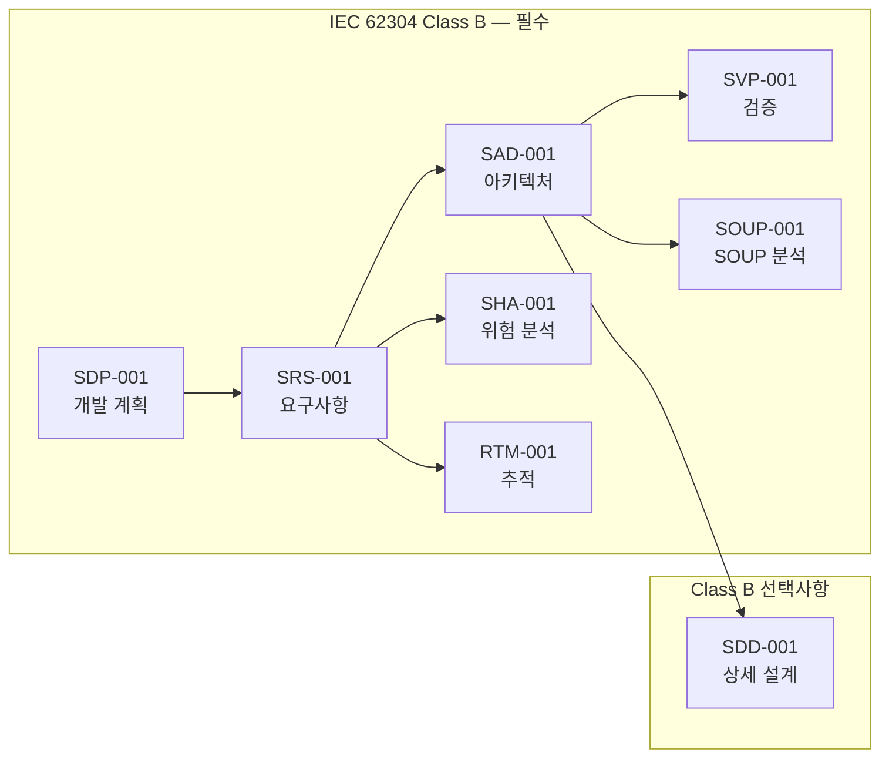

# GSVG 문서 패키지 — 마스터 인덱스

**프로젝트:** X-ray Grid Suppression & Virtual Grid Software  
**안전 분류:** IEC 62304 Class B  
**버전:** 1.0 | **작성일:** 2026-04-03  
**적용 표준:** IEC 62304:2015, ISO 14971:2019, IEC 62366-1:2015

---

## 문서 레지스트리

| 문서 ID | 제목 | IEC 62304 조항 | 파일명 |
|--------|------|-----------------|--------|
| GSVG-SDP-001 | 소프트웨어 개발 계획 | 5.1 | `GSVG-SDP-001_Development_Plan.md` |
| GSVG-SRS-001 | 소프트웨어 요구사항 명세 | 5.2 | `GSVG-SRS-001_Requirements.md` |
| GSVG-SAD-001 | 소프트웨어 아키텍처 설계 | 5.3 | `GSVG-SAD-001_Architecture.md` |
| GSVG-SDD-001 | 소프트웨어 상세 설계 | 5.4 (선택사항) | `GSVG-SDD-001_Detailed_Design.md` |
| GSVG-SVP-001 | 소프트웨어 검증 계획 | 5.5–5.7 | `GSVG-SVP-001_Verification_Plan.md` |
| GSVG-SOUP-001 | SOUP 분석 | 5.3.3 | `GSVG-SOUP-001_SOUP_Analysis.md` |
| GSVG-SHA-001 | 소프트웨어 위험 분석 | 조항 7 | `GSVG-SHA-001_Hazard_Analysis.md` |
| GSVG-RTM-001 | 요구사항 추적 매트릭스 | 5.7 | `GSVG-RTM-001_Traceability.md` |

## Class B 필수 vs 선택사항

## 개정 이력

| 버전 | 작성일 | 작성자 | 설명 |
|------|--------|--------|------|
| 1.0 | 2026-04-03 | — | 초기 배포 |
