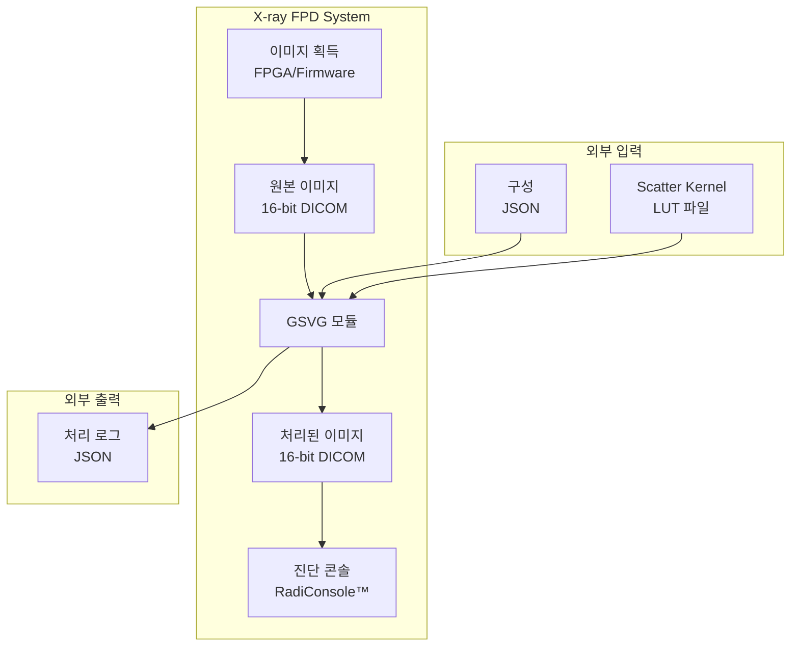
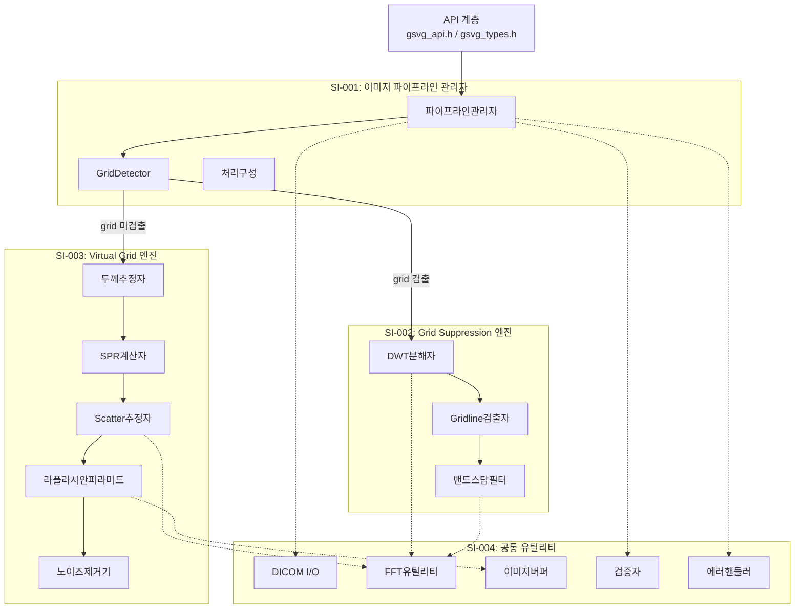
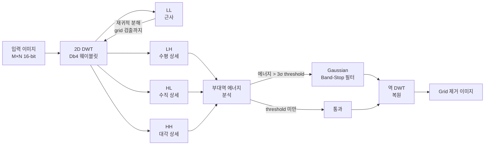
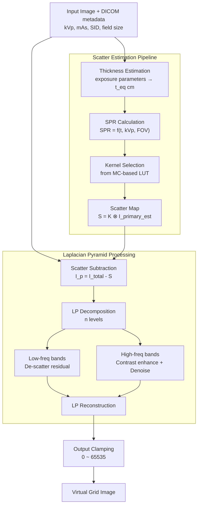
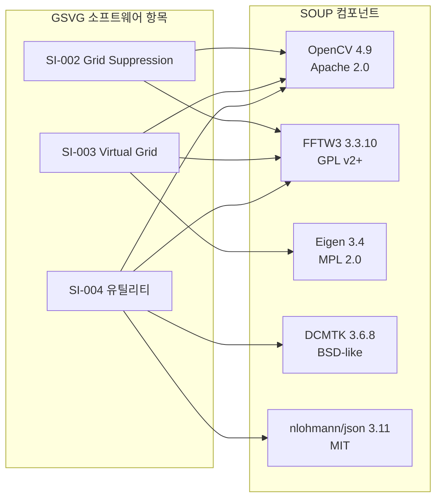
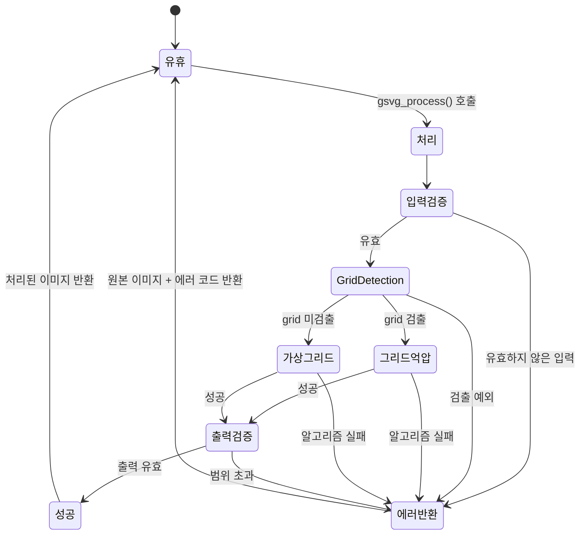

# GSVG-SAD-001: Software Architecture Design

**Document ID:** GSVG-SAD-001  
**Version:** 1.0 | **Date:** 2026-04-03  
**IEC 62304 Clause:** 5.3  
**Safety Classification:** Class B

---

## 1. 시스템 컨텍스트



---

## 2. 최상위 아키텍처



---

## 3. 소프트웨어 항목

| 항목 ID | 명칭 | 설명 | 안전 등급 | SOUP 의존성 |
|---------|------|-------------|--------------|-------------------|
| SI-001 | 이미지 파이프라인 관리자 | 영상 입출력 라우팅, grid 유무 판정, 에러 처리, config 관리 | B | DCMTK, nlohmann/json |
| SI-002 | Grid Suppression 엔진 | DWT 기반 grid artifact 검출 및 Gaussian band-stop filter 제거 | B | FFTW3, OpenCV |
| SI-003 | Virtual Grid 엔진 | Scatter estimation(kernel LUT) + Laplacian Pyramid 명암 향상 + 노이즈 제거 | B | FFTW3, OpenCV, Eigen |
| SI-004 | 공통 유틸리티 | DICOM I/O, FFT 래퍼, ImageBuffer(RAII), 검증, 에러 처리 | B | DCMTK, OpenCV, FFTW3 |

---

## 4. SI-002: Grid Suppression 엔진 — 데이터 흐름



**알고리즘 파라미터 (교차검증 근거):**

| 파라미터 | 값 | 출처 |
|-----------|-------|--------|
| Wavelet basis | Daubechies-4 (db4) | Tang 2015, Medical Physics |
| 최대 분해 레벨 | `log₂(min(M,N)) - 4` | 이미지 크기에 적응형 |
| Gridline 에너지 threshold | 3σ above mean sub-band energy | Tang 2015 |
| Band-stop 필터 대역폭 | ±2 픽셀 in frequency domain | Lin 2006, J Digital Imaging |
| Band-stop Gaussian σ | 1.5 픽셀 | 경험적 보정 |

---

## 5. SI-003: Virtual Grid Engine — Data Flow



**Laplacian Pyramid Processing (US8064676B2):**

```
Decomposition:
  g_{k+1} = [g_k * G_σ]↓2          (Gaussian convolution + 2x downsample)
  L_k     = g_k - [g_{k+1}]↑2 * G_σ  (Detail = original - upsampled approx)
  σ = 1.0, kernel = 5×5, n = log(N)/log(2) - 0.5

Per-band Processing:
  Low-freq:  g'_n = g_n × (1 + α × SPR_correction)
  High-freq: L'_k = β_k × L_k - WienerFilter(noise_k)
             β_k = contrast_gain_table[grid_ratio][level_k]

Reconstruction:
  g'_k = [g'_{k+1}]↑2 * G_σ + L'_k
```

**Scatter Kernel LUT Structure:**

| Axis | Range | Step | Unit |
|------|-------|------|------|
| Thickness | 5–35 | 1 | cm (water-equivalent) |
| kVp | 40–150 | 10 | kV |
| Field size | 10×10 – 43×43 | 5 | cm |
| Air gap | 0–20 | 5 | cm |

LUT 생성: GATE (Geant4) MC simulation → 4-Gaussian kernel model fitting per condition.

---

## 6. SOUP 인터페이스



상세 SOUP 분석은 GSVG-SOUP-001 참조.

---

## 7. 에러 처리 아키텍처



**SAFE-001/003 구현 원칙:**
- `gsvg_process()` 진입 시 `ImageBuffer::deepCopy()`로 원본 보관
- 모든 처리 단계를 try-catch로 wrapping
- 어떤 exception/error에서든 보관된 원본을 output buffer에 복사 후 에러 코드 반환

---

## 8. 아키텍처 검증 체크리스트

IEC 62304:2015 §5.3.6 기준:

| 항목 | 상태 |
|------|--------|
| Software items 식별 완료 | ✓ (SI-001 ~ SI-004) |
| Software items 간 interfaces 정의 | ✓ (Section 2 diagram) |
| SOUP 식별 및 기능/성능 요구사항 정의 | ✓ (Section 6 + GSVG-SOUP-001) |
| 위험 관리 조치가 아키텍처에 반영 | ✓ (Section 7 — error handling) |
| 아키텍처가 SRS 요구사항을 완전히 커버 | ✓ (GSVG-RTM-001에서 추적) |

---

## 개정 이력

| 버전 | 날짜 | 작성자 | 설명 |
|---------|------|--------|-------------|
| 1.0 | 2026-04-03 | — | 초판 |
