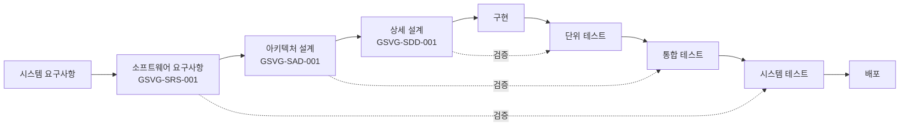
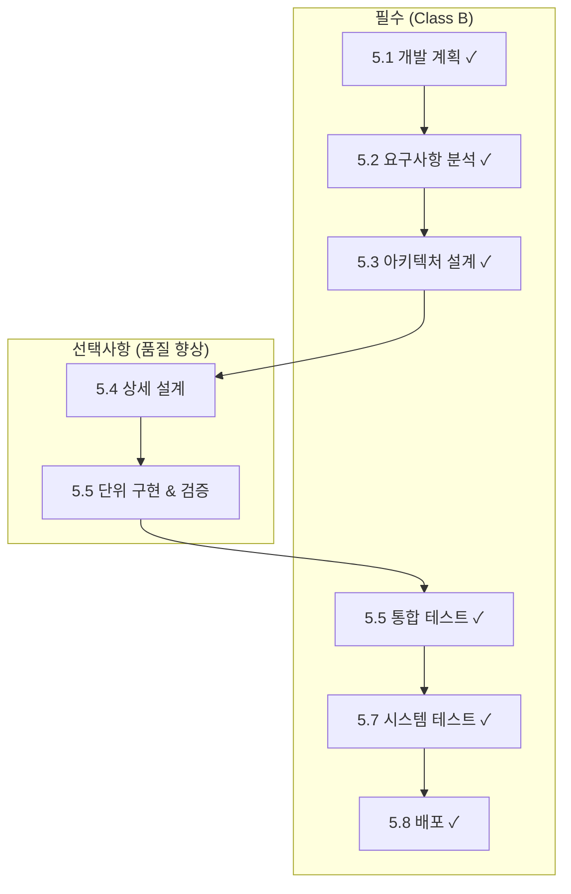
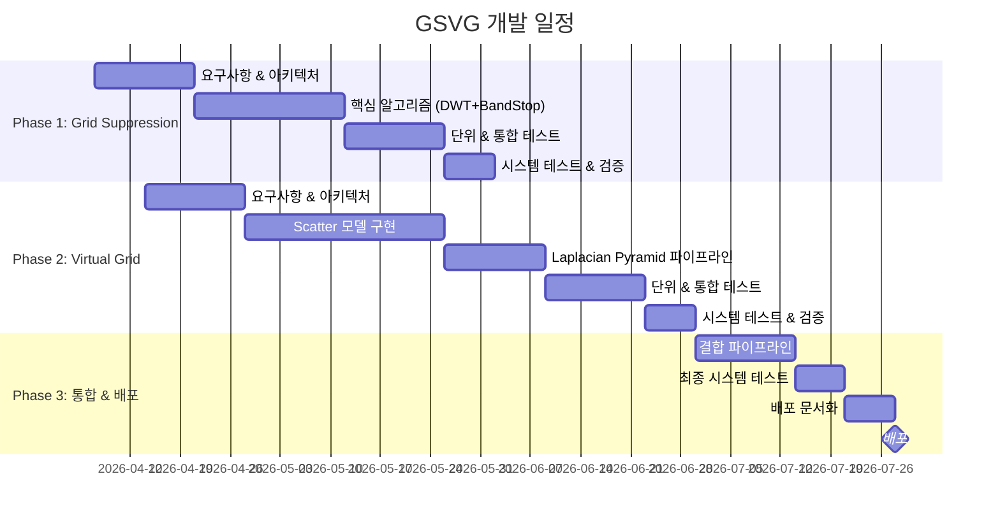

# GSVG-SDP-001: 소프트웨어 개발 계획

**문서 ID:** GSVG-SDP-001  
**버전:** 1.0 | **작성일:** 2026-04-03  
**IEC 62304 조항:** 5.1  
**안전 분류:** Class B

---

## 1. 목적 및 범위

본 문서는 X-ray FPD 시스템의 Grid Suppression(GS) 및 Virtual Grid(VG) 소프트웨어 모듈 개발에 대한 IEC 62304 Class B 준수 개발 계획을 정의한다.

**소프트웨어 명칭:** GSVG (Grid Suppression & Virtual Grid)  
**의도된 사용:** X-ray 진단 영상의 grid artifact 제거 및 gridless 촬영 시 scatter radiation 소프트웨어 보정  
**운영 환경:** RadiConsole™ 진단 콘솔 내 영상처리 모듈로 통합

---

## 2. 소프트웨어 안전 분류

**Class B** — 소프트웨어 오동작 시 non-serious injury 가능.

| 항목 | 분석 |
|------|------|
| GS 실패 | Grid artifact 잔류 → 진단 정보 일부 가려짐 → 재촬영 필요 |
| VG 실패 | Scatter 미보정 → contrast 저하 → 미세 병변 가시성 감소 |
| 방사선 위험 | 없음 — 영상 후처리 전용, 촬영 파라미터 제어 불가 |
| 하드웨어 완화 조치 | Exposure interlock이 독립적으로 존재 |
| **결론** | Non-serious injury 가능 → **Class B** |

---

## 3. 생명주기 모델

V-Model 적용.

---

## 4. Class B 필수 활동

---

## 5. Development Tools & Environment

| Category | Tool | Version | Purpose |
|----------|------|---------|---------|
| Language | C++ | C++17 | Core algorithm |
| Language | Python | 3.11+ | Prototyping, test automation |
| Build | CMake | 3.25+ | Cross-platform build |
| VCS | Git / Gitea | Latest | Configuration management |
| CI/CD | Gitea Actions | Latest | Automated build & test |
| Testing | Google Test | 1.14+ | Unit & integration testing |
| Testing | pytest | 8.0+ | Python test automation |
| Static Analysis | cppcheck, clang-tidy | Latest | Code quality enforcement |
| Coverage | gcov + lcov | Latest | Code coverage measurement |
| Memory | Valgrind | Latest | Memory leak detection |
| Image Processing | OpenCV 4.9 | SOUP | Image I/O, basic ops |
| FFT | FFTW3 3.3.10 | SOUP | Frequency domain ops |
| Math | Eigen 3.4 | SOUP | Linear algebra |
| DICOM | DCMTK 3.6.8 | SOUP | DICOM read/write |

---

## 6. 구성 관리

| 항목 | 정책 |
|------|------|
| 브랜치 전략 | `main` (배포) / `develop` (통합) / `feature/*` (개발) |
| Commit 규칙 | Conventional Commits: `feat:`, `fix:`, `test:`, `docs:` |
| 버전 관리 | Semantic versioning `vMAJOR.MINOR.PATCH` |
| 코드 검토 | `develop` merge 시 1명 이상의 검토자 승인 필수 |
| 기선 | 각 마일스톤에서 Git tag 생성 + 문서 동결 |
| 빌드 재현 가능성 | `CMakeLists.txt` + dependency lock file로 재현 가능 |

---

## 7. 문제 해결 프로세스

- **추적 도구:** Gitea Issues
- **심각도:** Critical / Major / Minor / Cosmetic
- **안전 관련 이슈:** GSVG-SHA-001과 교차 참조 필수
- **미해결 anomaly:** 배포 시 잔여 위험으로 문서화 (GSVG-SVP-001 부록)
- **회귀:** 모든 fix에 대해 회귀 테스트 스위트 실행

---

## 8. 일정

---

## 9. 납품물 체크리스트

| 납품물 | 문서 ID | Phase |
|-------------|-------------|-------|
| 소프트웨어 개발 계획 | GSVG-SDP-001 (본 문서) | Phase 1 |
| 소프트웨어 요구사항 명세 | GSVG-SRS-001 | Phase 1 |
| 소프트웨어 아키텍처 설계 | GSVG-SAD-001 | Phase 1 |
| 소프트웨어 상세 설계 | GSVG-SDD-001 | Phase 1–2 |
| SOUP 분석 | GSVG-SOUP-001 | Phase 1 |
| 소프트웨어 위험 분석 | GSVG-SHA-001 | Phase 1 |
| 소프트웨어 검증 계획 & 기록 | GSVG-SVP-001 | Phase 1–3 |
| 요구사항 추적 매트릭스 | GSVG-RTM-001 | Phase 3 |
| 배포 노트 | GSVG-REL-001 | Phase 3 |

---

## 개정 이력

| 버전 | 작성일 | 작성자 | 설명 |
|---------|------|--------|-------------|
| 1.0 | 2026-04-03 | — | 초기 배포 |
