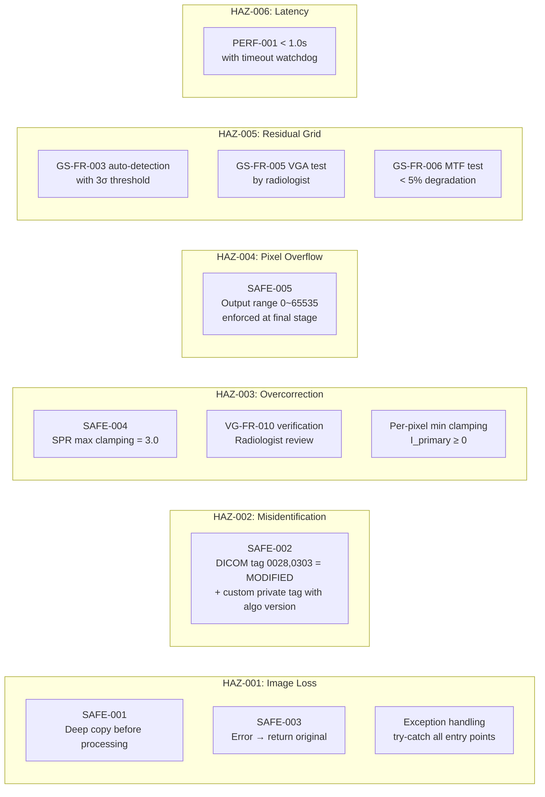

# GSVG-SHA-001: Software Hazard Analysis

**Document ID:** GSVG-SHA-001  
**Version:** 1.0 | **Date:** 2026-04-03  
**IEC 62304 Clause:** 7 (ISO 14971 통합)  
**Safety Classification:** Class B

---

## 1. 범위

GSVG 소프트웨어 모듈의 위험한 상황 식별, 위험 평가, 위험 관리 조치 정의.  
ISO 14971:2019 프로세스에 따라 수행.

---

## 2. 위험 식별

| HAZ ID | 위험한 상황 | 소프트웨어 원인 | 영향 함수 |
|--------|--------------------|----|---|
| HAZ-001 | 원본 영상 손실/훼손 — 진단 불가 | 알고리즘 충돌, 메모리 손상, 버퍼 오버라이트 | All |
| HAZ-002 | 처리된 영상을 원본으로 오인 — 오진 가능 | Processing marker 미삽입 | SI-001, SI-004 |
| HAZ-003 | Scatter 과보정 → 인체 구조물 소실 — 오진 | SPR 과대추정, clamping 미적용 | SI-003 |
| HAZ-004 | Pixel overflow/underflow → 영상 왜곡 — 오진 | 16-bit arithmetic overflow | SI-002, SI-003 |
| HAZ-005 | Grid artifact 잔류 → 병변 가려짐 | Grid frequency 오검출, filter 부적용 | SI-002 |
| HAZ-006 | 처리 지연 → 긴급 진단 지체 | 성능 미달, infinite loop | All |

---

## 3. 위험 평가 (완화 전)

| HAZ ID | 심각도 | 확률 | 위험 수준 |
|--------|----------|-------------|------------|
| HAZ-001 | 중간 (재촬영/진단 지연) | 낮음 (방어적 코딩) | **중간** |
| HAZ-002 | 낮음 (영상 비교 시 혼동) | 중간 (tag 누락 가능) | **낮음** |
| HAZ-003 | 중간 (미세 구조 소실) | 낮음 (SPR 모델 검증됨) | **중간** |
| HAZ-004 | 중간 (영상 왜곡) | 낮음 (표준 연산) | **중간** |
| HAZ-005 | 낮음 (재촬영으로 해결) | 낮음 (알고리즘 검증됨) | **낮음** |
| HAZ-006 | 낮음 (대기 시간 증가) | 낮음 (성능 테스트) | **낮음** |

---

## 4. Risk Control Measures

---

## 5. 위험 평가 (완화 후)

| HAZ ID | 잔여 심각도 | 잔여 확률 | 잔여 위험 | 수용가능? |
|--------|-------------------|---------------------|---------------|-------------|
| HAZ-001 | 낮음 (원본 항상 반환) | 매우 낮음 | **수용가능** | ✓ |
| HAZ-002 | 무시할 수준 | 매우 낮음 | **수용가능** | ✓ |
| HAZ-003 | 낮음 (clamping 적용) | 매우 낮음 | **수용가능** | ✓ |
| HAZ-004 | 무시할 수준 (clamping) | 매우 낮음 | **수용가능** | ✓ |
| HAZ-005 | 낮음 (재촬영 가능) | 매우 낮음 | **수용가능** | ✓ |
| HAZ-006 | 무시할 수준 | 매우 낮음 | **수용가능** | ✓ |

---

## 6. 추적성: 위험 → 안전 요구사항 → 테스트

| 위험 | 안전 요구사항 | 구현 | 검증 테스트 |
|--------|-------------------|----------------|-------------------|
| HAZ-001 | SAFE-001, SAFE-003 | ImageBuffer::deepCopy(), ErrorHandler | UT-SF-001 |
| HAZ-002 | SAFE-002 | DicomIO::markProcessed() | UT-SF-005, IT-004 |
| HAZ-003 | SAFE-004 | ScatterEstimator::MAX_SPR clamping | UT-SF-002, UT-VG-004 |
| HAZ-004 | SAFE-005 | PipelineManager의 출력 범위 조정 | UT-SF-003, UT-SF-004 |
| HAZ-005 | GS-FR-003/005/006 | GridlineDetector + BandStopFilter | UT-GS-003~006, ST-001/002 |
| HAZ-006 | PERF-001 | 성능 최적화 + timeout | ST-006 |

---

## 개정 이력

| 버전 | 날짜 | 작성자 | 설명 |
|---------|------|--------|-------------|
| 1.0 | 2026-04-03 | — | 초판 |
