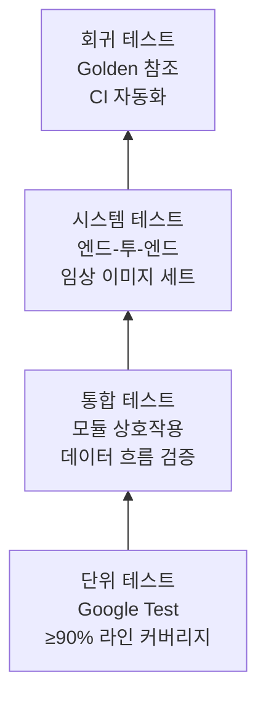

# GSVG-SVP-001: Software Verification Plan

**Document ID:** GSVG-SVP-001  
**Version:** 1.0 | **Date:** 2026-04-03  
**IEC 62304 Clause:** 5.5–5.7  
**Safety Classification:** Class B

---

## 1. 검증 전략

| 레벨 | 도구 | 커버리지 목표 | 자동화 |
|-------|------|----------------|------------|
| 단위 | Google Test + gcov | ≥90% 라인, ≥80% 브랜치 | 모든 push에서 CI |
| 통합 | Google Test + 커스텀 harness | 모든 SI 인터페이스 | develop merge에서 CI |
| 시스템 | pytest + 커스텀 DICOM 파이프라인 | 모든 SRS 요구사항 | 수동 트리거 + 야간 CI |
| 정적 분석 | cppcheck, clang-tidy | 0 critical/major 경고 | 모든 push에서 CI |
| 메모리 | Valgrind (memcheck) | 0 leaks, 0 errors | 야간 CI |

---

## 2. Unit Test Plan

### 2.1 Grid Suppression Module (SI-002)

| Test ID | Unit Under Test | Description | Pass Criteria |
|---------|-----------------|-------------|---------------|
| UT-GS-001 | DwtDecomposer | Perfect reconstruction: decompose → reconstruct → compare | PSNR > 100 dB |
| UT-GS-002 | DwtDecomposer | Synthetic sine wave at grid frequency → energy in correct sub-band | Energy ratio > 10× vs other bands |
| UT-GS-003 | GridlineDetector | Synthetic periodic pattern (103 LP/inch) → detect frequency | Detected freq = expected ± 0.1 lp/mm |
| UT-GS-004 | GridlineDetector | Clean image (no grid) → no detection | gridDetected == false |
| UT-GS-005 | BandStopFilter | Known spectrum with single peak → peak suppressed | Attenuation > 40 dB at target freq |
| UT-GS-006 | BandStopFilter | Non-grid image → minimal degradation | PSNR > 45 dB vs input |
| UT-GS-007 | DwtDecomposer | Multi-level auto-stop with embedded grid signal | stopLevel matches expected level |

### 2.2 Virtual Grid Module (SI-003)

| Test ID | Unit Under Test | Description | Pass Criteria |
|---------|-----------------|-------------|---------------|
| UT-VG-001 | ThicknessEstimator | Known phantom (20cm acrylic) at 80kVp → estimate thickness | Estimated = 20 ± 1 cm |
| UT-VG-002 | SprCalculator | Reference data (Kyriakou 2007: 20cm water, 80kVp) → SPR | Calculated SPR = reference ± 10% |
| UT-VG-003 | ScatterEstimator | Uniform field phantom → scatter map symmetry | Left-right asymmetry < 2% |
| UT-VG-004 | ScatterEstimator | SPR > MAX_SPR input → clamping applied (SAFE-004) | Output SPR ≤ 3.0 |
| UT-VG-005 | LaplacianPyramid | Perfect reconstruction (no processing) | PSNR > 100 dB |
| UT-VG-006 | LaplacianPyramid | Apply contrast gain = 1.5 → CNR increase | CNR_out / CNR_in ≥ 1.3 |
| UT-VG-007 | Denoiser | Known Gaussian noise (σ=50) → reduction | Output noise σ < 25 |

### 2.3 Common Utilities (SI-004)

| Test ID | Unit Under Test | Description | Pass Criteria |
|---------|-----------------|-------------|---------------|
| UT-CM-001 | ImageBuffer | Out-of-bounds access → exception | std::out_of_range thrown |
| UT-CM-002 | ImageBuffer | Deep copy → modify copy → check original unchanged | Original pixels unchanged |
| UT-CM-003 | ImageBuffer | Move semantics → source invalidated | Source data() == nullptr |
| UT-CM-004 | Validator | Invalid dimensions (0×0) → reject | Returns GSVG_ERR_INVALID_INPUT |
| UT-CM-005 | Validator | Valid DICOM metadata → accept | Returns GSVG_OK |
| UT-CM-006 | FftUtils | Known DFT pair (rect → sinc) → verify | Max error < 1e-6 |
| UT-CM-007 | DicomIO | DICOM round-trip: read → write → read → compare | All tags preserved |

### 2.4 Safety-Specific Tests

| Test ID | Safety Req | Description | Pass Criteria |
|---------|-----------|-------------|---------------|
| UT-SF-001 | SAFE-001/003 | Force algorithm exception → verify original returned | Output = pixel-exact copy of input |
| UT-SF-002 | SAFE-004 | Extreme thickness (50cm) → SPR clamped | SPR output ≤ 3.0 |
| UT-SF-003 | SAFE-005 | Scatter subtraction causing negative → clamped to 0 | All pixels ≥ 0 |
| UT-SF-004 | SAFE-005 | Contrast enhancement causing overflow → clamped to 65535 | All pixels ≤ 65535 |
| UT-SF-005 | SAFE-002 | Process → check DICOM tag (0028,0303) = "MODIFIED" | Tag present and correct |

---

## 3. Integration Test Plan

| Test ID | Modules | Description | Test Data | Pass Criteria |
|---------|---------|-------------|-----------|---------------|
| IT-001 | SI-001 + SI-002 | Full grid suppression: DICOM in → grid-free DICOM out | Synthetic 3072×3072 with 103 LP/inch grid | No visible grid lines, MTF loss < 5% |
| IT-002 | SI-001 + SI-003 | Full virtual grid: non-grid DICOM in → enhanced DICOM out | Scatter-corrupted phantom image | CNR ≥ 90% of 6:1 physical grid reference |
| IT-003 | SI-001 + SI-002 + SI-003 | Auto-detection routing: grid image → GS, non-grid → VG | Both image types | Correct path selected for each |
| IT-004 | SI-001 + SI-004 | DICOM metadata preservation through full pipeline | Clinical DICOM with all standard tags | All non-pixel tags preserved; SAFE-002 tag added |
| IT-005 | All | Memory stability: 100 consecutive frames | Mixed grid/non-grid batch | Valgrind: 0 leaks, RSS stable ± 10% |

---

## 4. System Test Plan

| Test ID | SRS Requirement | Description | Test Data | Pass Criteria |
|---------|----------------|-------------|-----------|---------------|
| ST-001 | GS-FR-005/007 | Grid suppression — 103 LP/inch, chest | JPI grid + RANDO phantom DICOM | Radiologist VGA ≥ 4/5 |
| ST-002 | GS-FR-005/007 | Grid suppression — 150 LP/inch, extremity | Grid + hand phantom DICOM | No visible grid lines |
| ST-003 | VG-FR-007/009 | Virtual grid — chest, 20cm equivalent | Non-grid chest DICOM | CNR ≥ 90% of 6:1 grid |
| ST-004 | VG-FR-007/009 | Virtual grid — pelvis, 25cm equivalent | Non-grid pelvis DICOM | CNR ≥ 85% of 8:1 grid |
| ST-005 | VG-FR-009/010 | Virtual grid — pediatric, 10cm | Non-grid pediatric DICOM | No overcorrection artifact |
| ST-006 | PERF-001 | Processing time | 3072×3072 clinical image | ≤ 1.0 second |
| ST-007 | SAFE-001/003 | Corrupted input handling | Truncated DICOM | No crash, original returned |
| ST-008 | SAFE-005 | Extreme pixel values | All-zero + all-65535 images | Valid output, no NaN/Inf |

---

## 5. Code Quality Metrics

| Metric | Target | Tool | Enforcement |
|--------|--------|------|-------------|
| Line coverage | ≥ 90% | gcov + lcov | CI gate |
| Branch coverage | ≥ 80% | gcov | CI gate |
| Static analysis | 0 critical, 0 major | cppcheck | CI gate |
| Clang-tidy | 0 warnings (enabled checks) | clang-tidy | CI gate |
| Cyclomatic complexity | ≤ 15 per function | lizard | CI warning |
| Memory errors | 0 definite leaks | Valgrind | CI nightly gate |

---

## 6. 테스트 환경

| 항목 | 사양 |
|------|--------------|
| 빌드 OS | Ubuntu 22.04 LTS |
| 컴파일러 | GCC 12+ or Clang 15+ |
| 대상 HW | Intel i7-12700 또는 동급 (벤치마크 참조) |
| 테스트 이미지 | 합성 phantoms + 익명화된 임상 DICOMs |
| 참조 데이터 | MC 시뮬레이션 golden 참조 (GATE/Geant4) |

---

## 개정 이력

| 버전 | 날짜 | 작성자 | 설명 |
|---------|------|--------|-------------|
| 1.0 | 2026-04-03 | — | 초판 |
