# X-ray Grid Suppression & Virtual Grid 소프트웨어

## IEC 62304 Class B 준수 문서 패키지

**Document ID:** GSVG-PKG-001  
**Version:** 1.0  
**Date:** 2026-04-02  
**Safety Classification:** IEC 62304 Class B (Non-serious injury possible)  
**Applicable Standards:** IEC 62304:2015, ISO 14971:2019, IEC 62366-1:2015

---

# 문서 인덱스

| Doc ID | 제목 | IEC 62304 조항 |
|--------|-------|------------------|
| GSVG-SDP-001 | Software Development Plan | 5.1 |
| GSVG-SRS-001 | Software Requirements Specification | 5.2 |
| GSVG-SAD-001 | Software Architecture Design | 5.3 |
| GSVG-SDD-001 | Software Detailed Design | 5.4 (Class B 선택 사항) |
| GSVG-SVP-001 | Software Verification Plan | 5.5–5.7 |
| GSVG-SOUP-001 | SOUP Analysis | 5.3.3 |
| GSVG-SHA-001 | Software Hazard Analysis | 7 |
| GSVG-RTM-001 | Requirements Traceability Matrix | 5.7 |

---

# GSVG-SDP-001: Software Development Plan

## 1. 목적

본 문서는 X-ray FPD 시스템의 Grid Suppression 및 Virtual Grid 소프트웨어 모듈 개발을 위한 IEC 62304 Class B 준수 개발 계획을 정의한다.

## 2. 소프트웨어 안전 분류

**Class B** — 소프트웨어 오동작 시 non-serious injury 가능.

근거:
- Grid Suppression 실패 시: grid artifact가 잔류하여 진단 정보 일부 가려짐 → 재촬영 필요
- Virtual Grid 실패 시: scatter 미보정으로 contrast 저하 → 미세 병변 가시성 감소
- 직접적 방사선 과다 노출이나 치료 영향은 없음 (영상 표시 목적)
- 하드웨어 안전 장치 (exposure interlock)가 독립적으로 존재

## 3. 생명주기 모델

V-Model 적용 (IEC 62304 권장 구조)

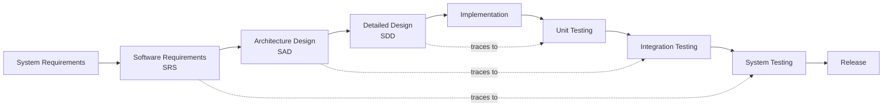

## 4. Class B 필수 활동

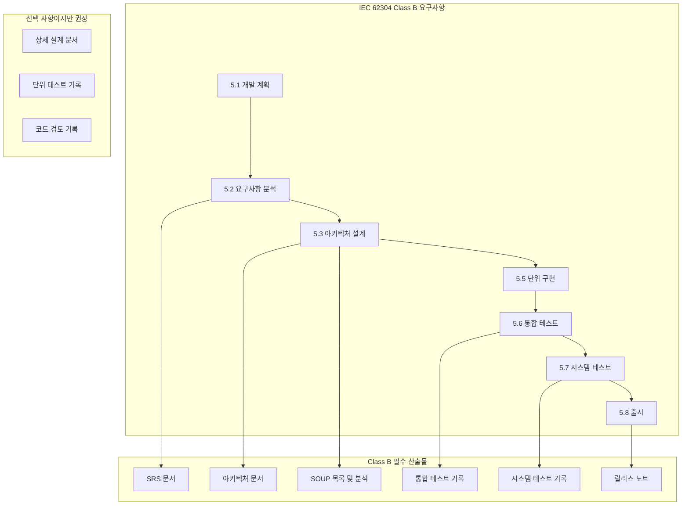

## 5. 개발 도구 & 환경

| 분류 | 도구 | 버전 | 목적 |
|----------|------|---------|---------|
| 언어 | C++ | C++17 | 핵심 알고리즘 구현 |
| 언어 | Python | 3.11+ | 프로토타이핑, 테스트 자동화 |
| 빌드 | CMake | 3.25+ | 크로스 플랫폼 빌드 |
| VCS | Git / Gitea | Latest | 구성 관리 |
| CI/CD | Gitea Actions | Latest | 자동화된 빌드 & 테스트 |
| 테스트 | Google Test | 1.14+ | 단위 및 통합 테스트 |
| 테스트 | pytest | 8.0+ | Python 테스트 자동화 |
| 정적 분석 | cppcheck, clang-tidy | Latest | MISRA 유사 규칙 검사 |
| 문서화 | Markdown + Mermaid | — | 모든 설계 문서 |
| 이미지 처리 | OpenCV | 4.9+ | SOUP — 이미지 I/O, 기본 연산 |
| FFT | FFTW3 | 3.3.10 | SOUP — 주파수 영역 연산 |
| 수학 | Eigen | 3.4+ | SOUP — 선형 대수 |

## 6. 구성 관리

- 브랜치 전략: `main` (release) / `develop` (통합) / `feature/*` (개발)
- Commit 메시지: Conventional Commits (`feat:`, `fix:`, `test:`, `docs:`)
- 태그: Semantic versioning `vMAJOR.MINOR.PATCH`
- 코드 검토: `develop`으로의 모든 merge는 1명 이상의 검토자 승인 필요
- Baseline: 각 milestone에서 tag 생성 및 문서 동결

## 7. 문제 해결

- Gitea Issues로 모든 anomaly/defect 추적
- 심각도: Critical / Major / Minor / Cosmetic
- Safety-related issue는 SHA(GSVG-SHA-001)와 상호 참조
- 미해결 anomaly는 release 시 잔여 위험으로 문서화

## 8. 일정

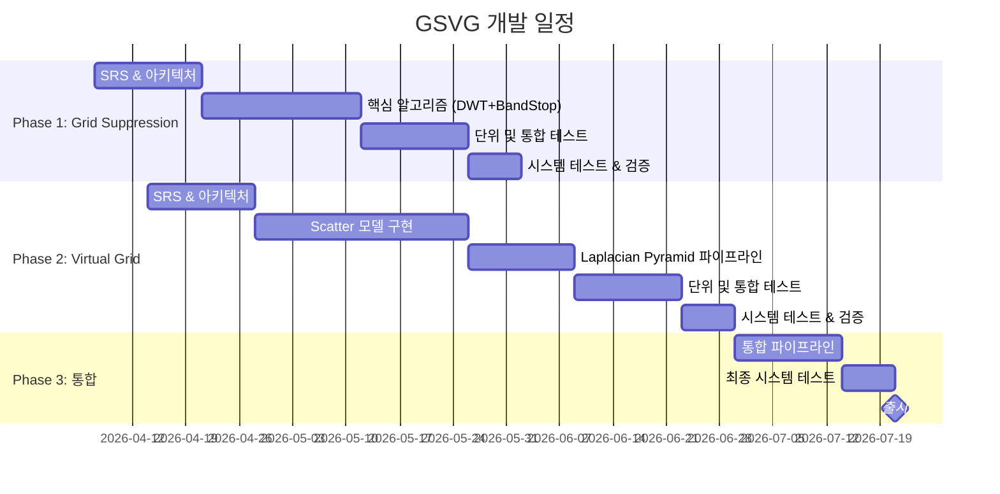

---

# GSVG-SRS-001: Software Requirements Specification

## 1. 범위

X-ray flat panel detector 시스템 영상에 대한 두 가지 독립 기능:
1. **Grid Suppression (GS)**: 물리적 anti-scatter grid 사용 영상의 grid line artifact 제거
2. **Virtual Grid (VG)**: Grid 미사용 영상의 scatter radiation 소프트웨어 보정

## 2. 기능 요구사항 — Grid Suppression

| ID | 요구사항 | 검증 |
|----|-------------|--------------|
| GS-FR-001 | 시스템은 DICOM 헤더 및 grid specification으로부터 grid line frequency를 자동 계산해야 한다 | Test |
| GS-FR-002 | 시스템은 2D DWT (Discrete Wavelet Transform)를 사용하여 입력 영상을 multi-scale sub-band로 분해해야 한다 | Test |
| GS-FR-003 | 시스템은 각 sub-band에서 gridline signal energy가 threshold를 초과하는지 자동 검출해야 한다 | Test |
| GS-FR-004 | 검출된 sub-band에 Gaussian band-stop filter를 적용하여 gridline signal을 제거해야 한다 | Test |
| GS-FR-005 | Inverse DWT로 복원된 영상은 gridline artifact가 시각적으로 인지 불가해야 한다 | Test + Review |
| GS-FR-006 | 처리 후 영상의 MTF 저하는 원본 대비 5% 이내여야 한다 | Test |
| GS-FR-007 | 60~200 lines/inch 범위의 grid에 대해 동작해야 한다 | Test |
| GS-FR-008 | Moiré pattern (aliasing artifact) 제거를 지원해야 한다 | Test |

## 3. 기능 요구사항 — Virtual Grid

| ID | 요구사항 | 검증 |
|----|-------------|--------------|
| VG-FR-001 | 시스템은 입력 영상과 촬영 조건(kVp, mAs, SID, field size)으로부터 body equivalent thickness를 추정해야 한다 | Test |
| VG-FR-002 | 시스템은 추정된 thickness와 촬영 조건으로부터 Scatter-to-Primary Ratio (SPR)를 계산해야 한다 | Test |
| VG-FR-003 | 시스템은 사전 계산된 scatter kernel LUT를 사용하여 scatter distribution을 추정해야 한다 | Test |
| VG-FR-004 | 추정된 scatter를 원본 영상에서 차감하여 primary-only 영상을 생성해야 한다 | Test |
| VG-FR-005 | Laplacian Pyramid decomposition으로 multi-scale contrast enhancement를 수행해야 한다 | Test |
| VG-FR-006 | 고주파 band에 대해 de-noising을 수행해야 한다 | Test |
| VG-FR-007 | 출력 영상의 CNR은 동일 조건 6:1 physical grid 영상 대비 90% 이상이어야 한다 | Test |
| VG-FR-008 | 사용자가 가상 grid ratio (6:1, 8:1, 10:1, 12:1)를 선택할 수 있어야 한다 | Test |
| VG-FR-009 | 10cm~30cm acrylic thickness 범위에서 동작해야 한다 | Test |
| VG-FR-010 | 처리 후 인체 구조물에 인위적 artifact가 생성되지 않아야 한다 | Test + Review |

## 4. 성능 요구사항

| ID | 요구사항 | 검증 |
|----|-------------|--------------|
| PERF-001 | 3072×3072 16-bit 영상 처리 시간 ≤ 1.0초 (target HW: Intel i7 또는 동급) | Test |
| PERF-002 | Peak memory usage ≤ 512MB per frame | Test |
| PERF-003 | Batch mode에서 연속 100 frame 처리 시 memory leak 없음 | Test |
| PERF-004 | 출력 영상 bit depth는 입력과 동일 (16-bit) | Test |

## 5. 인터페이스 요구사항

| ID | 요구사항 | 검증 |
|----|-------------|--------------|
| IF-001 | 입력: DICOM 형식 또는 Raw pixel array + metadata | Test |
| IF-002 | 출력: 동일 format의 처리된 영상 + processing log | Test |
| IF-003 | 에러 발생 시 원본 영상을 unmodified로 pass-through | Test |
| IF-004 | Processing parameters를 JSON config로 설정 가능 | Test |
| IF-005 | API는 C++ shared library (.so/.dll) 형태로 제공 | Test |

## 6. 안전 요구사항

| ID | 요구사항 | Hazard 참조 | 검증 |
|----|-------------|------------|--------------|
| SAFE-001 | 알고리즘 실패 시 원본 영상을 훼손하지 않아야 한다 | HAZ-001 | Test |
| SAFE-002 | 처리 영상에 "Processed" marking을 DICOM tag에 기록해야 한다 | HAZ-002 | Test |
| SAFE-003 | 처리 실패 시 에러 코드와 함께 원본 영상을 반환해야 한다 | HAZ-001 | Test |
| SAFE-004 | Scatter correction 강도가 물리적으로 불가능한 값을 초과하지 않도록 clamping | HAZ-003 | Test |
| SAFE-005 | 출력 영상의 pixel value 범위는 유효 DICOM 범위 내여야 한다 | HAZ-004 | Test |

---

# GSVG-SAD-001: Software Architecture Design

## 1. 시스템 컨텍스트

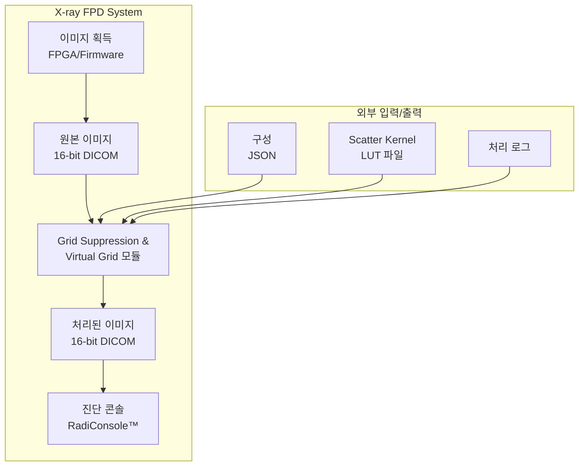

## 2. Software Architecture — Top Level

```mermaid
graph TD
    subgraph "GSVG Software System"
        API[API Layer<br/>gsvg_api.h]
        
        subgraph "SI-001: Image Pipeline Manager"
            PM[Pipeline Manager]
            DETECT[Grid Detection Module]
        end
        
        subgraph "SI-002: Grid Suppression Engine"
            DWT[2D DWT Decomposer]
            GDET[Gridline Detector]
            BSF[Gaussian Band-Stop Filter]
            IDWT[Inverse DWT Reconstructor]
        end
        
        subgraph "SI-003: Virtual Grid Engine"
            THICK[Thickness Estimator]
            SPR[SPR Calculator]
            SCAT[Scatter Estimator<br/>(Kernel LUT)]
            SUB[Scatter Subtractor]
            LAP[Laplacian Pyramid<br/>Contrast Enhancer]
            DENOISE[Denoising Module]
        end
        
        subgraph "SI-004: Common Utilities"
            DICOM_IO[DICOM I/O]
            FFT_UTIL[FFT Utilities]
            IMG_UTIL[Image Utilities]
            VALID[Input Validator]
            ERR[Error Handler]
        end
    end
    
    API --> PM
    PM --> DETECT
    DETECT -->|grid detected| DWT
    DETECT -->|no grid| THICK
    
    DWT --> GDET
    GDET --> BSF
    BSF --> IDWT
    
    THICK --> SPR
    SPR --> SCAT
    SCAT --> SUB
    SUB --> LAP
    LAP --> DENOISE
    
    DWT -.-> FFT_UTIL
    BSF -.-> FFT_UTIL
    LAP -.-> IMG_UTIL
    PM -.-> DICOM_IO
    PM -.-> VALID
    PM -.-> ERR
```

## 3. 소프트웨어 항목 정의

| 항목 ID | 명칭 | 설명 | 안전 등급 |
|---------|------|-------------|--------------|
| SI-001 | 이미지 파이프라인 관리자 | 영상 입출력, 파이프라인 라우팅, 에러 처리 | B |
| SI-002 | Grid Suppression 엔진 | DWT 기반 grid artifact 검출 및 제거 | B |
| SI-003 | Virtual Grid 엔진 | Scatter 추정 및 명암 향상 | B |
| SI-004 | 공통 유틸리티 | DICOM I/O, FFT, 검증, 에러 처리 | B |

## 4. Grid Suppression 엔진 — 데이터 흐름

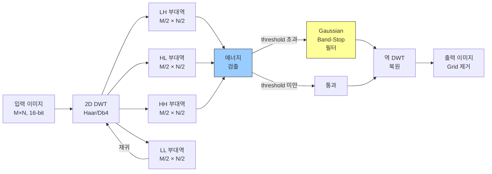

**핵심 알고리즘 파라미터:**

| 파라미터 | 값 | 출처 |
|-----------|-------|--------|
| Wavelet basis | Daubechies-4 (db4) | Tang 2015, Med Phys |
| 최대 분해 레벨 | `log₂(min(M,N)) - 4` | 적응형 |
| Gridline 에너지 threshold | 3σ above mean sub-band energy | Tang 2015 |
| Band-stop 필터 대역폭 | ±2 픽셀 in frequency domain | Lin 2006 |
| Band-stop 필터 형태 | Gaussian, σ = 1.5 pixels | 경험적 |

## 5. Virtual Grid 엔진 — 데이터 흐름

```mermaid
flowchart TD
    IN[입력 이미지<br/>+ DICOM 메타데이터] --> THICK_EST[Thickness<br/>추정]
    
    subgraph "Scatter 추정"
        THICK_EST --> SPR_CALC[SPR 계산<br/>SPR = f(t, kVp, FOV)]
        SPR_CALC --> KERNEL[Scatter Kernel<br/>LUT에서 선택]
        KERNEL --> SCATTER_MAP[Scatter Map<br/>생성<br/>S = K ⊗ I_primary]
    end
    
    IN --> SUBTRACT[Scatter<br/>차감<br/>I_p = I_total - S]
    SCATTER_MAP --> SUBTRACT
    
    subgraph "Laplacian Pyramid 처리"
        SUBTRACT --> LP_DEC[Laplacian Pyramid<br/>분해<br/>n 레벨]
        LP_DEC --> LOW_BANDS[저주파 대역:<br/>Scatter 제거<br/>잔여 보정]
        LP_DEC --> HIGH_BANDS[고주파 대역:<br/>명암 향상<br/>+ 노이즈 제거]
        LOW_BANDS --> LP_REC[Laplacian Pyramid<br/>복원]
        HIGH_BANDS --> LP_REC
    end
    
    LP_REC --> CLAMP[출력 범위 조정<br/>0 ~ 2¹⁶-1]
    CLAMP --> OUT[출력 이미지]
    
    style SCATTER_MAP fill:#fcc,stroke:#333
    style LP_DEC fill:#cfc,stroke:#333
```

**Laplacian Pyramid 구현 (US8064676B2 기반):**

```
분해:
  g_{k+1}(x,y) = [g_k(x,y) * G_σ(x,y)]↓2     # Gaussian convolution + 다운샘플
  L_k(x,y) = g_k(x,y) - [g_{k+1}(x,y)]↑2 * G_σ  # 차분 (상세) 이미지
  
  여기서: σ = 1.0, kernel = 5×5, n = log(N)/log(2) - 0.5

처리:
  저주파 (g_n):   g'_n = g_n × (1 + α × SPR_correction_factor)
  고주파 (L_k):  L'_k = L_k × β_k - noise_k
                     β_k = contrast_gain[grid_ratio][k]
                     noise_k = WienerFilter(L_k, σ_noise)

복원:
  g'_k = [g'_{k+1}]↑2 * G_σ + L'_k
```

**Scatter Kernel LUT 구조:**

| 축 | 범위 | 단계 | 설명 |
|------|-------|------|-------------|
| Thickness (t) | 5~35 cm | 1 cm | Water-equivalent thickness |
| kVp | 40~150 kVp | 10 kVp | Tube voltage |
| Field size | 10×10 ~ 43×43 cm | 5 cm step | Collimated field |
| Air gap | 0~20 cm | 5 cm | ODD (Object-to-Detector Distance) |

LUT 생성: GATE (Geant4) Monte Carlo simulation으로 사전 계산. 각 조건에서 scatter kernel을 4-Gaussian model로 fitting하여 저장.

## 6. SOUP 인터페이스

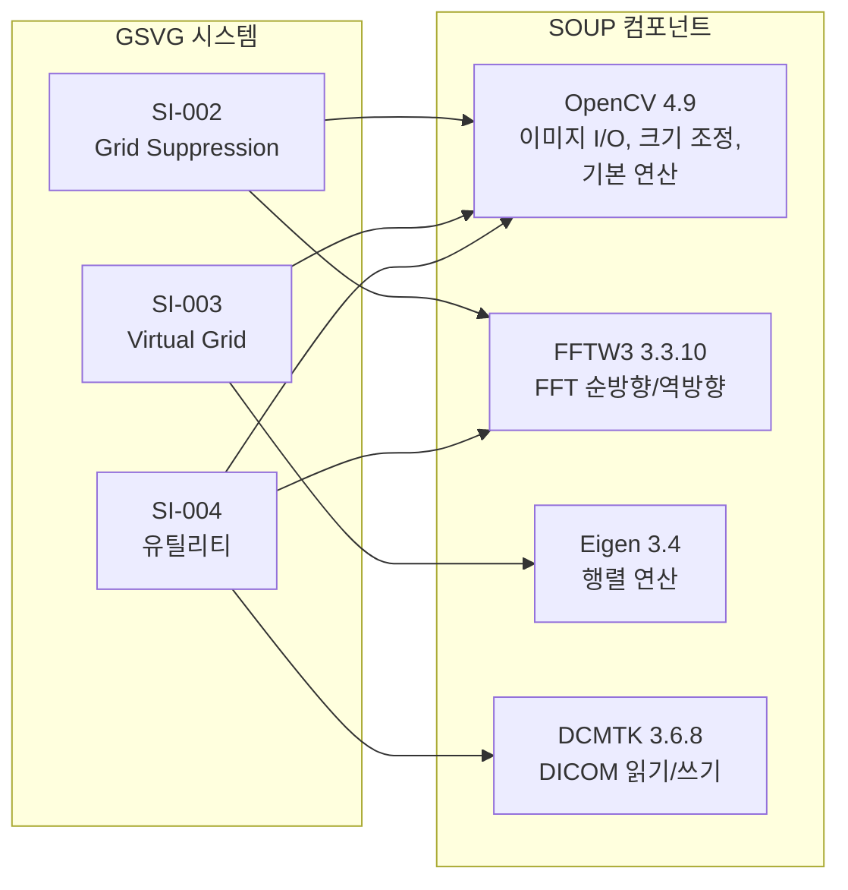

## 7. 에러 처리 전략

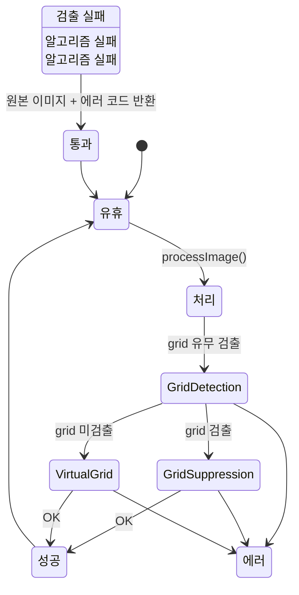

**SAFE-001/003 구현**: 모든 알고리즘 진입점에서 원본 영상의 deep copy를 보관. 어떤 예외/에러 발생 시에도 원본 반환.

---

# GSVG-SDD-001: Software Detailed Design

> Note: IEC 62304 Class B에서 Detailed Design은 필수가 아니나, 코드 품질과 유지보수성을 위해 작성.

## 1. Module Structure (C++ Namespace)

```
gsvg/
├── api/
│   ├── gsvg_api.h              # Public C API
│   └── gsvg_types.h            # Common types, error codes
├── pipeline/
│   ├── PipelineManager.h/cpp   # SI-001
│   ├── GridDetector.h/cpp      # Grid presence detection
│   └── ProcessingConfig.h      # JSON config parser
├── grid_suppression/
│   ├── DwtDecomposer.h/cpp     # 2D DWT forward/inverse
│   ├── GridlineDetector.h/cpp  # Sub-band energy analysis
│   └── BandStopFilter.h/cpp    # Gaussian band-stop
├── virtual_grid/
│   ├── ThicknessEstimator.h/cpp
│   ├── SprCalculator.h/cpp
│   ├── ScatterEstimator.h/cpp  # Kernel LUT lookup + convolution
│   ├── LaplacianPyramid.h/cpp  # Decompose/reconstruct
│   └── Denoiser.h/cpp          # Wiener / bilateral
├── common/
│   ├── DicomIO.h/cpp
│   ├── FftUtils.h/cpp
│   ├── ImageBuffer.h/cpp       # RAII 16-bit image container
│   ├── Validator.h/cpp
│   └── ErrorHandler.h/cpp
└── tests/
    ├── unit/
    ├── integration/
    └── test_data/
```

## 2. Core Class Design

### 2.1 ImageBuffer (RAII Container)

```cpp
// gsvg/common/ImageBuffer.h
namespace gsvg {

class ImageBuffer {
public:
    ImageBuffer(uint32_t width, uint32_t height, uint16_t bitsAllocated = 16);
    ImageBuffer(const ImageBuffer& other);           // Deep copy
    ImageBuffer(ImageBuffer&& other) noexcept;       // Move
    ~ImageBuffer();
    
    // Pixel access with bounds checking
    uint16_t& at(uint32_t x, uint32_t y);
    const uint16_t& at(uint32_t x, uint32_t y) const;
    
    // Raw data access (for SOUP library interop)
    uint16_t* data() noexcept;
    const uint16_t* data() const noexcept;
    
    uint32_t width() const noexcept;
    uint32_t height() const noexcept;
    size_t sizeBytes() const noexcept;
    
    // Deep copy for safety requirement SAFE-001
    ImageBuffer deepCopy() const;

private:
    std::unique_ptr<uint16_t[]> data_;
    uint32_t width_, height_;
    uint16_t bitsAllocated_;
};

} // namespace gsvg
```

### 2.2 Processing Pipeline (Entry Point)

```cpp
// gsvg/api/gsvg_api.h
extern "C" {

typedef enum {
    GSVG_OK = 0,
    GSVG_ERR_INVALID_INPUT = -1,
    GSVG_ERR_GRID_DETECTION_FAILED = -2,
    GSVG_ERR_SUPPRESSION_FAILED = -3,
    GSVG_ERR_VIRTUAL_GRID_FAILED = -4,
    GSVG_ERR_OUT_OF_MEMORY = -5,
    GSVG_ERR_CONFIG_INVALID = -6,
} GsvgErrorCode;

typedef enum {
    GSVG_MODE_AUTO = 0,        // Auto-detect grid presence
    GSVG_MODE_GRID_SUPPRESS,   // Force grid suppression
    GSVG_MODE_VIRTUAL_GRID,    // Force virtual grid
} GsvgProcessingMode;

typedef struct {
    GsvgProcessingMode mode;
    float virtualGridRatio;     // 6.0, 8.0, 10.0, 12.0
    const char* configPath;     // JSON config file path
    const char* lutPath;        // Scatter kernel LUT directory
} GsvgConfig;

// Main processing function
// Returns GSVG_OK on success, error code on failure
// On failure, output buffer contains unmodified copy of input (SAFE-001/003)
GsvgErrorCode gsvg_process(
    const uint16_t* inputPixels,
    uint32_t width, uint32_t height,
    const GsvgConfig* config,
    uint16_t* outputPixels,     // Pre-allocated output buffer
    char* errorMsg,             // Error message buffer (256 chars)
    size_t errorMsgLen
);

const char* gsvg_version(void);
const char* gsvg_error_string(GsvgErrorCode code);

} // extern "C"
```

### 2.3 DWT Decomposer

```cpp
// gsvg/grid_suppression/DwtDecomposer.h
namespace gsvg {

struct DwtSubBands {
    ImageBuffer LL;  // Approximation
    ImageBuffer LH;  // Horizontal detail
    ImageBuffer HL;  // Vertical detail
    ImageBuffer HH;  // Diagonal detail
};

class DwtDecomposer {
public:
    enum class WaveletType { HAAR, DB4, DB6 };
    
    explicit DwtDecomposer(WaveletType type = WaveletType::DB4);
    
    // Forward 2D DWT — one level
    DwtSubBands decompose(const ImageBuffer& input) const;
    
    // Inverse 2D DWT — one level
    ImageBuffer reconstruct(const DwtSubBands& bands) const;
    
    // Multi-level decomposition with auto-stop
    // Stops when gridline energy exceeds threshold in any sub-band
    struct MultiLevelResult {
        std::vector<DwtSubBands> levels;
        int stopLevel;               // Level where grid detected (-1 if not found)
        std::vector<bool> gridDetected;  // Per-level detection flag
    };
    MultiLevelResult decomposeMultiLevel(
        const ImageBuffer& input, 
        int maxLevels,
        float energyThreshold = 3.0f   // σ multiplier
    ) const;

private:
    WaveletType type_;
    std::vector<float> lowPassFilter_;
    std::vector<float> highPassFilter_;
    
    void initFilters();
    std::vector<float> convolveAndDecimate(
        const std::vector<float>& signal,
        const std::vector<float>& filter
    ) const;
};

} // namespace gsvg
```

### 2.4 Laplacian Pyramid (Virtual Grid Core)

```cpp
// gsvg/virtual_grid/LaplacianPyramid.h
namespace gsvg {

struct LaplacianLevel {
    ImageBuffer gaussian;     // g_k (low-pass approximation)
    ImageBuffer laplacian;    // L_k (detail / differential)
};

class LaplacianPyramid {
public:
    struct Config {
        float gaussianSigma = 1.0f;
        int kernelSize = 5;
        int numLevels = 0;      // 0 = auto: log2(N) - 0.5
    };
    
    explicit LaplacianPyramid(const Config& config = {});
    
    // Decompose into Gaussian + Laplacian pyramid
    std::vector<LaplacianLevel> decompose(const ImageBuffer& input) const;
    
    // Apply scatter correction to low-freq and contrast/denoise to high-freq
    void processLevels(
        std::vector<LaplacianLevel>& levels,
        float sprCorrectionFactor,      // From SPR calculation
        float contrastGain,             // From grid ratio selection
        float noiseSigma                // Estimated noise level
    ) const;
    
    // Reconstruct from processed pyramid
    ImageBuffer reconstruct(const std::vector<LaplacianLevel>& levels) const;

private:
    Config config_;
    
    ImageBuffer gaussianBlur(const ImageBuffer& input) const;
    ImageBuffer downsample2x(const ImageBuffer& input) const;
    ImageBuffer upsample2x(const ImageBuffer& input) const;
};

} // namespace gsvg
```

### 2.5 Scatter Estimator

```cpp
// gsvg/virtual_grid/ScatterEstimator.h
namespace gsvg {

// 4-Gaussian scatter kernel model (per Bhatia 2017)
struct ScatterKernel {
    float a[4];    // Amplitudes
    float sigma[4]; // Widths (Gaussian σ)
    // S(r) = Σ a_i × exp(-r² / (2σ_i²))
};

class ScatterEstimator {
public:
    // Load pre-computed scatter kernel LUT from directory
    explicit ScatterEstimator(const std::string& lutDirectory);
    
    // Estimate scatter distribution for given conditions
    ImageBuffer estimateScatter(
        const ImageBuffer& inputImage,
        float thicknessCm,
        float kvp,
        float fieldSizeCm,
        float airGapCm
    ) const;
    
    // Subtract scatter from input (with clamping for SAFE-004)
    ImageBuffer subtractScatter(
        const ImageBuffer& totalImage,
        const ImageBuffer& scatterMap
    ) const;

private:
    // LUT indexed by [thickness][kvp][fieldSize][airGap]
    std::map<std::tuple<int,int,int,int>, ScatterKernel> kernelLut_;
    
    // Interpolate kernel for non-LUT-point conditions
    ScatterKernel interpolateKernel(
        float thickness, float kvp, float fieldSize, float airGap
    ) const;
    
    // Convolve primary estimate with scatter kernel
    ImageBuffer convolveWithKernel(
        const ImageBuffer& primary,
        const ScatterKernel& kernel
    ) const;
};

} // namespace gsvg
```

---

# GSVG-SVP-001: Software Verification Plan

## 1. Verification Strategy

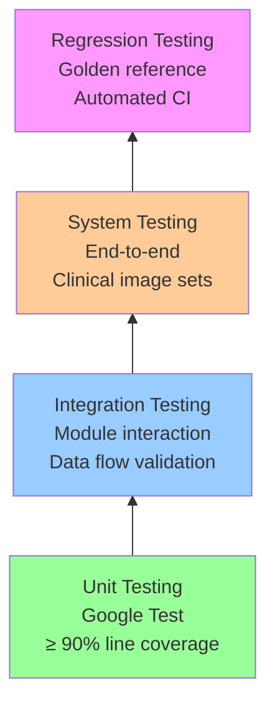

## 2. Unit Test Plan

| Test ID | Module | Test Description | Pass Criteria |
|---------|--------|-----------------|---------------|
| UT-GS-001 | DwtDecomposer | Known synthetic signal → verify perfect reconstruction | PSNR > 100 dB |
| UT-GS-002 | DwtDecomposer | Sine wave at grid frequency → verify energy concentration in correct sub-band | Energy ratio > 10× |
| UT-GS-003 | GridlineDetector | Synthetic grid pattern → detect correct frequency ± 0.1 lp/mm | Frequency match |
| UT-GS-004 | BandStopFilter | Apply to known spectrum → verify target frequency suppressed > 40 dB | Attenuation check |
| UT-GS-005 | BandStopFilter | Apply to non-grid image → verify PSNR > 45 dB vs original | Minimal degradation |
| UT-VG-001 | ThicknessEstimator | Known phantom → verify thickness ± 1 cm accuracy | Within tolerance |
| UT-VG-002 | SprCalculator | Reference SPR data (Kyriakou 2007) → verify ± 10% | Match reference |
| UT-VG-003 | ScatterEstimator | Uniform field → verify scatter map symmetry and smoothness | Visual + SSIM |
| UT-VG-004 | LaplacianPyramid | Perfect reconstruction test (no processing) | PSNR > 100 dB |
| UT-VG-005 | LaplacianPyramid | Apply contrast gain → verify CNR improvement | CNR increase > 0 |
| UT-VG-006 | Denoiser | Known noise level → verify noise reduction > 50% | NPS measurement |
| UT-CM-001 | ImageBuffer | Boundary access → exception thrown | Exception caught |
| UT-CM-002 | ImageBuffer | Deep copy independence | Modify copy, check original unchanged |
| UT-CM-003 | Validator | Invalid DICOM → return error code | Error code match |
| UT-SF-001 | PipelineManager | Algorithm failure → original image returned | Pixel-exact match |
| UT-SF-002 | ScatterEstimator | SPR > physical max → clamping applied | Output within range |

## 3. Integration Test Plan

| Test ID | Modules | Test Description | Pass Criteria |
|---------|---------|-----------------|---------------|
| IT-001 | SI-001 + SI-002 | Full grid suppression pipeline with synthetic grid image | Grid artifact invisible, MTF < 5% loss |
| IT-002 | SI-001 + SI-003 | Full virtual grid pipeline with scatter-corrupted phantom | CNR within 90% of physical grid |
| IT-003 | SI-001 + SI-002 + SI-003 | Auto-detection: grid image → GS path, non-grid → VG path | Correct routing |
| IT-004 | SI-004 (all SOUP) | DICOM read → process → DICOM write round-trip | Metadata preserved |
| IT-005 | All | 100 consecutive frames, check memory stability | No leak (Valgrind) |

## 4. System Test Plan

| Test ID | Description | Test Data | Pass Criteria |
|---------|-------------|-----------|---------------|
| ST-001 | Grid suppression — 103 LP/inch grid, chest phantom | JPI grid + RANDO phantom | Radiologist VGA score ≥ 4/5 |
| ST-002 | Grid suppression — 150 LP/inch grid, extremity | Grid + hand phantom | No visible grid lines |
| ST-003 | Virtual grid — chest, 20cm equivalent | Non-grid chest DICOM | CNR ≥ 90% of 6:1 grid image |
| ST-004 | Virtual grid — pelvis, 25cm equivalent | Non-grid pelvis DICOM | CNR ≥ 85% of 8:1 grid image |
| ST-005 | Virtual grid — pediatric, 10cm equivalent | Non-grid pediatric DICOM | No overcorrection artifact |
| ST-006 | Performance — 3072×3072 | Clinical size image | Processing time ≤ 1.0s |
| ST-007 | Safety — corrupted input | Truncated DICOM file | Graceful error, no crash |
| ST-008 | Safety — extreme values | All-zero / all-max image | Valid output, no NaN/Inf |

## 5. Code Quality Metrics

| Metric | Target | Tool |
|--------|--------|------|
| Line coverage | ≥ 90% | gcov + lcov |
| Branch coverage | ≥ 80% | gcov |
| Static analysis warnings | 0 critical, 0 major | cppcheck, clang-tidy |
| Cyclomatic complexity | ≤ 15 per function | lizard |
| MISRA C++:2023 compliance | No mandatory rule violations | clang-tidy (MISRA checks) |

---

# GSVG-SOUP-001: SOUP Analysis

## 1. SOUP Component List

| ID | Component | Version | License | Function | Risk Mitigation |
|----|-----------|---------|---------|----------|-----------------|
| SOUP-001 | OpenCV | 4.9.0 | Apache 2.0 | Image I/O, resize, basic filtering | Published anomaly list reviewed; integration tests cover all used APIs |
| SOUP-002 | FFTW3 | 3.3.10 | GPL v2+ | Forward/inverse FFT | Well-validated (20+ years); unit tests verify known transforms |
| SOUP-003 | Eigen | 3.4.0 | MPL 2.0 | Matrix/vector operations | Widely used in production; unit tests verify matrix ops accuracy |
| SOUP-004 | DCMTK | 3.6.8 | BSD-like | DICOM read/write | FDA-recognized; integration tests verify DICOM conformance |
| SOUP-005 | Google Test | 1.14.0 | BSD-3 | Unit test framework | Test-only, not deployed in production |
| SOUP-006 | nlohmann/json | 3.11.3 | MIT | JSON config parsing | Input validation wraps all parsed values |

## 2. SOUP Risk Assessment

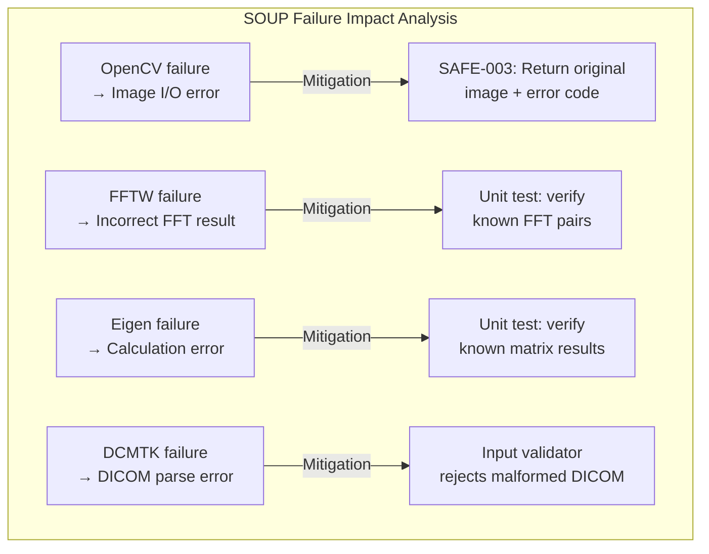

## 3. SOUP Functional Requirements

| SOUP ID | Required Functionality | Performance Requirement |
|---------|----------------------|------------------------|
| SOUP-001 | `cv::imread`, `cv::imwrite`, `cv::resize`, `cv::GaussianBlur` | 3072×3072 ops < 100ms |
| SOUP-002 | `fftw_plan_dft_r2c_2d`, `fftw_plan_dft_c2r_2d`, `fftw_execute` | 3072×3072 FFT < 200ms |
| SOUP-003 | Matrix multiply, SVD, element-wise ops | 3072×3072 matrix ops < 50ms |
| SOUP-004 | Read/write DICOM Part 10 files, tag manipulation | Single file I/O < 200ms |

---

# GSVG-SHA-001: Software Hazard Analysis

## 1. Hazard Identification

| Hazard ID | Hazardous Situation | Cause | Severity | Probability | Risk Level |
|-----------|--------------------|----|----------|-------------|------------|
| HAZ-001 | 원본 영상 손실/훼손 | Algorithm crash, memory corruption | Medium | Low | Medium |
| HAZ-002 | 처리된 영상을 원본으로 오인 | Processing marking 누락 | Low | Medium | Low |
| HAZ-003 | Scatter 과보정으로 인체 구조물 소실 | SPR 과대추정, clamping 미적용 | Medium | Low | Medium |
| HAZ-004 | Pixel overflow/underflow로 영상 왜곡 | Arithmetic overflow in 16-bit | Medium | Low | Medium |
| HAZ-005 | Grid artifact 잔류로 병변 가려짐 | Grid frequency 오검출 | Low | Low | Low |
| HAZ-006 | 처리 지연으로 긴급 진단 지체 | Performance 미달 | Low | Low | Low |

## 2. Risk Control Measures

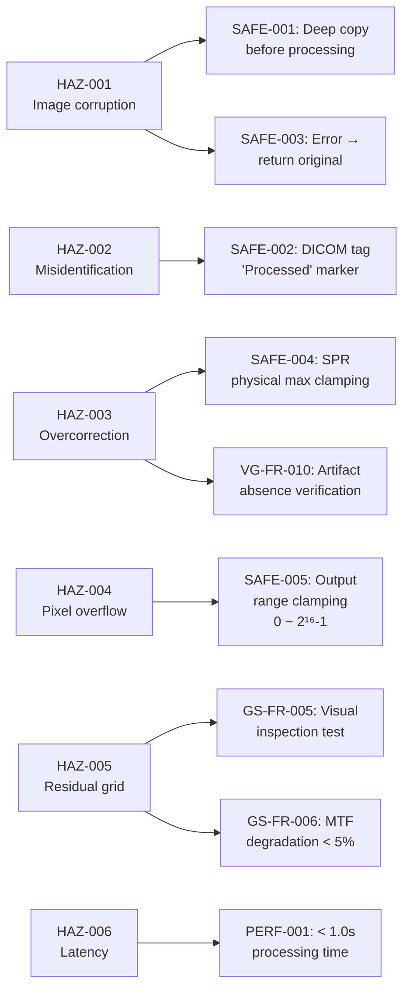

## 3. Residual Risk Assessment

모든 hazard에 대해 risk control 적용 후:
- **HAZ-001~004**: Risk reduced to **Acceptable** (원본 보존 + clamping으로 worst case = 미처리 영상 반환)
- **HAZ-005~006**: Risk reduced to **Acceptable** (성능/정확도 요구사항으로 검증)

---

# GSVG-RTM-001: Requirements Traceability Matrix

## Grid Suppression Traceability

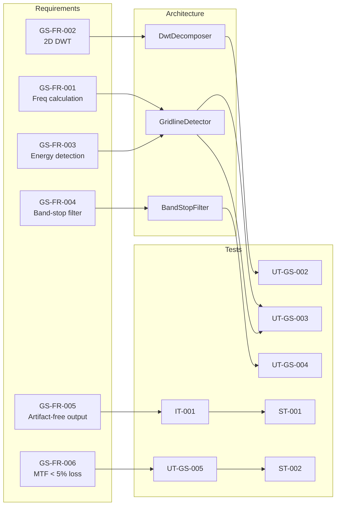

## Virtual Grid Traceability

| Requirement | Architecture Module | Unit Test | Integration Test | System Test |
|-------------|-------------------|-----------|-----------------|-------------|
| VG-FR-001 | ThicknessEstimator | UT-VG-001 | IT-002 | ST-003 |
| VG-FR-002 | SprCalculator | UT-VG-002 | IT-002 | ST-003 |
| VG-FR-003 | ScatterEstimator | UT-VG-003 | IT-002 | ST-003 |
| VG-FR-004 | ScatterEstimator | UT-VG-003 | IT-002 | ST-003 |
| VG-FR-005 | LaplacianPyramid | UT-VG-004 | IT-002 | ST-003 |
| VG-FR-006 | Denoiser | UT-VG-006 | IT-002 | ST-003 |
| VG-FR-007 | — (system level) | — | IT-002 | ST-003, ST-004 |
| VG-FR-008 | PipelineManager | — | IT-003 | ST-003 |
| VG-FR-009 | ThicknessEstimator | UT-VG-001 | IT-002 | ST-003~005 |
| VG-FR-010 | — (system level) | — | — | ST-003~005 |

## Safety Requirements Traceability

| Safety Req | Hazard | Architecture | Test | Risk Control |
|------------|--------|-------------|------|-------------|
| SAFE-001 | HAZ-001 | ImageBuffer::deepCopy() | UT-SF-001 | Deep copy before processing |
| SAFE-002 | HAZ-002 | DicomIO::markProcessed() | IT-004 | DICOM tag insertion |
| SAFE-003 | HAZ-001 | PipelineManager error path | UT-SF-001 | Original returned on error |
| SAFE-004 | HAZ-003 | ScatterEstimator::clamping | UT-SF-002 | SPR max physical limit |
| SAFE-005 | HAZ-004 | Output clamping in pipeline | UT-CM-001 | 0~65535 range enforcement |

---

# Appendix A: Algorithm Reference Summary

## A.1 Grid Suppression — 교차검증된 알고리즘 선택 근거

| Approach | Pros | Cons | Reference | 선택 |
|----------|------|------|-----------|------|
| 1D FFT + blur kernel | Simple | Image blur | Barski 1999 | ✗ |
| 1D notch filter | Fast | Ringing artifact | Belykh 2001 | ✗ |
| Gaussian band-stop (freq domain) | Effective | Grid freq 사전 지식 필요 | Lin 2006 | △ (sub-component) |
| Homomorphic filtering | Good for rotated grids | Complex, a-Se specific | Kim 2013 | ✗ |
| **2D DWT + Gaussian band-stop** | **Preserve info, auto-stop** | **Moderate complexity** | **Tang 2015** | **✓ Selected** |
| NSCT + band-pass | Good for Moiré | Higher complexity | Kim 2023 | ✗ (future option) |
| Mixed-norm regularization | Crisscross grid support | Iterative, slow | Jeon 2022 | ✗ (future option) |
| Deep learning hybrid | High accuracy | Training data needed | 2024 | ✗ (future option) |

**선택 근거**: 2D DWT 기반 방법은 (1) auto-stop condition으로 over-decomposition 방지, (2) sub-band 레벨에서 targeted filtering으로 원본 정보 보존 최대화, (3) Tang 2015에서 Medical Physics 게재로 peer-reviewed 검증 완료.

## A.2 Virtual Grid — 교차검증된 알고리즘 선택 근거

| 방법 | 장점 | 단점 | 참고 자료 | 선택 |
|----------|------|------|-----------|------|
| **라플라시안 피라미드** | **특허 공개 구현, 검증됨** | **Scatter model 별도 필요** | **US8064676B2** | **✓ 핵심 프레임워크** |
| **Scatter Kernel LUT** | **MC 정확도, 실시간** | **LUT 생성 필요** | **Philips SkyFlow Plus** | **✓ Scatter 추정** |
| Monte Carlo 실시간 | 가장 정확 | 임상용으로 너무 느림 | 다양함 | ✗ |
| 딥러닝 (U-Net) | 빠르고 적응형 | 학습 데이터, 검증 부담 | Lee 2018 | ✗ (Phase 2 옵션) |
| GAN 노이즈 감소 | 노이즈 처리 | 추가 복잡도 | Lim 2023 | ✗ (향후 옵션) |
| Beam stopper 배열 | 직접 측정 | 추가 하드웨어 필요 | Nature 2023 | ✗ (하드웨어 방법) |

**선택 근거**: 라플라시안 피라미드 + Scatter Kernel LUT 조합은 (1) US8064676B2에 완전한 구현이 공개되어 구현 위험 최소, (2) Philips SkyFlow Plus가 동일 원리로 임상 검증 완료, (3) MC 기반 LUT로 물리적 정확도 확보, (4) 실시간 처리 가능.

---

# 부록 B: 핵심 방정식 빠른 참고

## B.1 Scatter-to-Primary Ratio

```
SPR(t, kVp, FOV) = a(kVp) × t^b(kVp) × FOV^c(kVp)

여기서:
  t = water-equivalent thickness [cm]
  FOV = field size [cm²]
  a, b, c = MC LUT fitting의 경험적 계수
  
일반적인 값 (80 kVp, 35×43 cm):
  10 cm → SPR ≈ 0.4
  20 cm → SPR ≈ 1.0
  30 cm → SPR ≈ 2.0
```

## B.2 Grid 효과 에뮬레이션

```
I_grid_like = I_primary × (1 + α × GR / (GR + 1))

여기서:
  I_primary = I_total / (1 + SPR)    # Scatter 제거된 이미지
  GR = 선택된 grid ratio (6, 8, 10, 12)
  α = 명암 향상 계수 (해부학적 구조별 보정)
```

## B.3 Gaussian Band-Stop 필터

```
H(u,v) = 1 - exp(-((u - u_g)² + (v - v_g)²) / (2σ²))

여기서:
  (u_g, v_g) = grid artifact 주파수 위치 [cycles/pixel]
  σ = 필터 대역폭 [cycles/pixel]
  DWT 부대역 FFT 후 주파수 영역에서 적용됨
```

## B.4 Wiener 노이즈 제거

```
G(u,v) = H*(u,v) / (|H(u,v)|² + σ_n² / σ_s²)

여기서:
  H(u,v) = 이미징 시스템 OTF (근사)
  σ_n = 노이즈 표준편차 (scatter 보정 잔여에서 추정)
  σ_s = 신호 전력 스펙트럼 밀도
```

---

*문서 끝*  
*다음 조치: DwtDecomposer 및 단위 테스트로 시작하는 Grid Suppression 엔진의 Phase 1 구현.*
