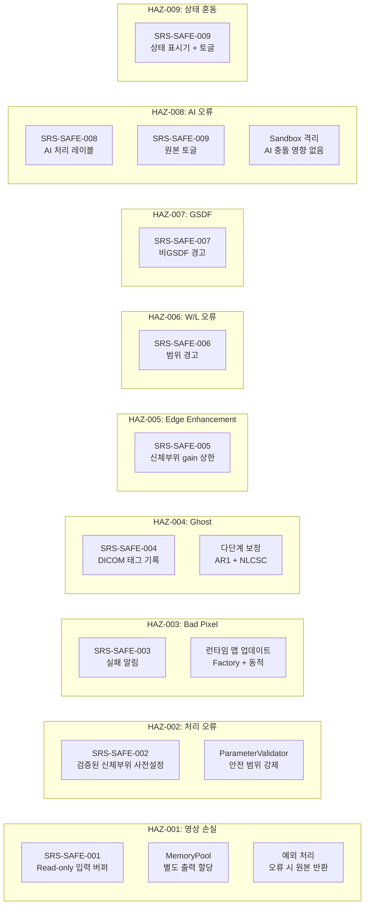

# 소프트웨어 해저드 분석

> **Document ID**: XPE-SHA-001 | **Version**: 1.0 | **Date**: 2026-04-14
>
> **IEC 62304 Clause**: 7 (ISO 14971 integration)
>
> **Safety Classification**: Class B
>
> **Trace Source**: XPE-SRS-001, XPE-SRM-001, XPE-SAD-001

---

## 1. 범위

XPE 소프트웨어 시스템의 hazardous situations를 독립적으로 식별, 평가하고 risk control measures를 정의한다.
ISO 14971:2019 프로세스에 따라 수행한다.

> **Note**: 본 문서는 XPE-SRM-001(Software Risk Management File)에서 참조하는 Hazard 정의의
> 정식 출처(source of truth)이다. SRM은 risk control 관리 프로세스를,
> SHA는 hazard 식별 및 평가를 담당한다.

---

## 2. 리스크 수용 매트릭스

ISO 14971 Annex C 기반:

| | 무시할 수 있음 | 경미 | 심각 | 심각함 | 재앙적 |
|---|:-:|:-:|:-:|:-:|:-:|
| **빈번함** | 낮음 | 중간 | **높음** | **수용 불가** | **수용 불가** |
| **가능성 높음** | 낮음 | 중간 | **높음** | **높음** | **수용 불가** |
| **가끔** | 낮음 | 낮음 | 중간 | **높음** | **높음** |
| **원격** | 낮음 | 낮음 | 낮음 | 중간 | **높음** |
| **불가능** | 낮음 | 낮음 | 낮음 | 낮음 | 중간 |

---

## 3. 해저드 식별

### HAZ-001: 원본 영상 손실/훼손

| 항목 | 설명 |
|-------|-------------|
| **위험한 상황** | 원본 영상 손실 → 재촬영(추가 피폭) |
| **소프트웨어 원인** | 처리가 원본 buffer를 덮어씀 → 재처리 불가 → 재촬영 필요 |
| **영향받는 기능** | SWI-1 전처리 (모든 유닛), SWI-5 MemoryPool |
| **사건의 순서** | 파이프라인 시작 → MemoryPool이 입력 buffer에 쓰기 허용 → Offset correction이 원본 덮어씀 → 오류 발생 시 원본 복구 불가 → 재촬영 |
| **해(Harm)** | 환자 추가 X-ray 피폭 (경미) |

### HAZ-002: 부적절한 처리로 진단 정보 손실

| 항목 | 설명 |
|-------|-------------|
| **위험한 상황** | 부적절한 처리 파라미터 → 진단 정보 손실 |
| **소프트웨어 원인** | 기본 사전설정 오류 또는 수동 조정 실수 → 과도한/부족한 처리 |
| **영향받는 기능** | SWI-2 핵심 처리 (SWU-2.2~2.4), SWI-5 ParameterValidator |
| **사건의 순서** | 체형 부적합 사전설정 적용 → 과도한 노이즈 감소 → 미세 석회화 비가시 → 오진 |
| **해(Harm)** | 진단 지연 또는 오진 (심각) |

### HAZ-003: 미보정 bad pixel → 병변 오인

| 항목 | 설명 |
|-------|-------------|
| **위험한 상황** | Bad pixel 미보정 → 허위 병변 오인 |
| **소프트웨어 원인** | Bad pixel 맵 미갱신 또는 결함 보정 실패 |
| **영향받는 기능** | SWI-1 SWU-1.3 DefectPixelCorrector |
| **사건의 순서** | 새로운 결함 발생 → factory 맵에 미등록 → 밝은/어두운 점 잔존 → 의사가 micro-calcification으로 오인 |
| **해(Harm)** | 불필요한 추가 검사 또는 오진 (심각) |

### HAZ-004: Ghost artifact → 병변 오인

| 항목 | 설명 |
|-------|-------------|
| **위험한 상황** | Ghost/lag artifact → 허위 구조물 오인 |
| **소프트웨어 원인** | Lag correction 미적용 또는 부정확한 IRF 파라미터 |
| **영향받는 기능** | SWI-1 SWU-1.4 GhostCorrector |
| **사건의 순서** | 이전 고선량 촬영 → lag signal 잔류 → 다음 영상에 이전 이미지 잔상 → 허위 구조물 오인 |
| **해(Harm)** | 오진 (심각) |

### HAZ-005: 과도한 edge enhancement → 허위 구조물

| 항목 | 설명 |
|-------|-------------|
| **위험한 상황** | Edge enhancement 과다 → overshoot halo → 허위 구조물 |
| **소프트웨어 원인** | Enhancement gain 제한 미적용 또는 신체부위별 안전 범위 설정 오류 |
| **영향받는 기능** | SWI-2 SWU-2.4 EdgeEnhancer, SWI-5 SWU-5.5 ParameterValidator |
| **사건의 순서** | 높은 gain 적용 → edge overshoot halo 발생 → 미세 골절/결절로 오인 |
| **해(Harm)** | 오진 (심각) |

### HAZ-006: 부적절한 W/L → 병변 비가시

| 항목 | 설명 |
|-------|-------------|
| **위험한 상황** | 부적절한 Window/Level → 진단 영역 밖 window → 병변 비가시 |
| **소프트웨어 원인** | W/L 사전설정 오류 또는 사용자가 극단적 W/L로 조정 |
| **영향받는 기능** | SWI-3 SWU-3.2 VoiLUT, SWI-5 SWU-5.3 ErrorHandler |
| **사건의 순서** | 좁은 window 설정 → 폐 실질의 미묘한 density 차이 비가시 → 결절 미발견 |
| **해(Harm)** | 진단 지연 (심각) |

### HAZ-007: GSDF 미준수 디스플레이 → contrast 왜곡

| 항목 | 설명 |
|-------|-------------|
| **위험한 상황** | GSDF 미보정 모니터 → perceptual linearity 미확보 → 미묘한 contrast 비가시 |
| **소프트웨어 원인** | 비보정 모니터에서 GSDF correction 미적용 |
| **영향받는 기능** | SWI-3 SWU-3.3 PresentationLUT |
| **사건의 순서** | 비보정 모니터 사용 → GSDF 미적용 → JND spacing 불균일 → 미묘한 density 차이 놓침 |
| **해(Harm)** | 진단 성능 저하 (경미) |

### HAZ-008: AI가 병변 제거 또는 허위 생성

| 항목 | 설명 |
|-------|-------------|
| **위험한 상황** | DL bone suppression이 실제 병변을 함께 제거하거나 artifact 생성 |
| **소프트웨어 원인** | AI 모델의 오분류 또는 학습 데이터 편향 |
| **영향받는 기능** | SWI-2 SWU-2.11 BoneSuppressionEngine, SWU-2.12 DLDenoiser |
| **사건의 순서** | Bone suppression 적용 → 폐 결절이 bone과 중첩 → 모델이 결절을 bone으로 오분류하여 제거 → 결절 비가시 |
| **해(Harm)** | 진단 지연 또는 오진 (심각) |

### HAZ-009: 처리 상태 혼동

| 항목 | 설명 |
|-------|-------------|
| **위험한 상황** | 원본 vs 처리 영상 구분 불가 → AI 결과를 원본으로 오인 |
| **소프트웨어 원인** | 처리 상태 표시기 미표시 또는 토글 기능 부재 |
| **영향받는 기능** | SWI-3 SWU-3.3 PresentationLUT, SWI-5 SWU-5.7 PipelineOrchestrator |
| **사건의 순서** | AI bone suppression 적용 → 사용자가 원본으로 오인 → bone suppression으로 변형된 영상 기반 진단 |
| **해(Harm)** | 진단 오류 가능 (경미) |

---

## 4. 리스크 평가 (제어 전)

| 해저드 ID | 심각도 | 확률 | 제어 전 리스크 |
|--------|:--------:|:-----------:|:----------------:|
| HAZ-001 | 경미 | 가끔 | **중간** |
| HAZ-002 | 심각 | 가끔 | **중간** |
| HAZ-003 | 심각 | 원격 | **낮음** |
| HAZ-004 | 심각 | 가끔 | **중간** |
| HAZ-005 | 심각 | 가끔 | **중간** |
| HAZ-006 | 심각 | 가능성 높음 | **높음** |
| HAZ-007 | 경미 | 가끔 | **낮음** |
| HAZ-008 | 심각 | 가끔 | **중간** |
| HAZ-009 | 경미 | 가능성 높음 | **중간** |

---

## 5. 리스크 제어 조치

### 리스크 제어 상세

| 해저드 ID | 리스크 제어 | 유형 | 구현 유닛 | SRS 요구사항 |
|--------|-------------|------|-------------------|---------|
| HAZ-001 | 비파괴 처리 (read-only 입력) | Inherent safety | SWU-5.1 MemoryPool | SRS-SAFE-001 |
| HAZ-002 | 검증된 신체부위 사전설정 자동 선택 | Inherent safety | SWU-5.5 ParameterValidator | SRS-SAFE-002 |
| HAZ-003 | 결함 보정 실패 시각적 알림 | Protective measure | SWU-1.3 + SWU-5.3 ErrorHandler | SRS-SAFE-003 |
| HAZ-004 | DICOM 태그의 Ghost correction 상태 | Information for safety | SWU-1.4 + SWU-4.2 DicomWriter | SRS-SAFE-004 |
| HAZ-005 | Enhancement gain 안전 범위 제한 | Inherent safety | SWU-2.4 + SWU-5.5 ParameterValidator | SRS-SAFE-005 |
| HAZ-006 | W/L 범위 초과 경고 | Protective measure | SWU-3.2 + SWU-5.3 ErrorHandler | SRS-SAFE-006 |
| HAZ-007 | 비GSDF 디스플레이 경고 | Information for safety | SWU-3.3 PresentationLUT | SRS-SAFE-007 |
| HAZ-008 | AI 처리 레이블 + 원본 토글 | Information for safety | SWU-2.11 + SWU-3.3 | SRS-SAFE-008, 009 |
| HAZ-009 | 처리 상태 표시기 + 원클릭 토글 | Protective measure | SWU-3.3 + SWU-5.7 | SRS-SAFE-009 |

---

## 6. 리스크 평가 (제어 후)

| 해저드 ID | 잔여 심각도 | 잔여 확률 | 잔여 리스크 | 수용 가능? |
|--------|:-----------------:|:-------------------:|:-------------:|:-----------:|
| HAZ-001 | 경미 | 불가능 | **낮음** | 예 |
| HAZ-002 | 심각 | 원격 | **낮음** | 예 |
| HAZ-003 | 경미 (경고 표시) | 원격 | **낮음** | 예 |
| HAZ-004 | 경미 (DICOM 기록) | 원격 | **낮음** | 예 |
| HAZ-005 | 경미 (gain 제한) | 원격 | **낮음** | 예 |
| HAZ-006 | 경미 (경고 표시) | 가끔 | **낮음** | 예 |
| HAZ-007 | 무시할 수 있음 | 가끔 | **낮음** | 예 |
| HAZ-008 | 경미 (레이블 + 토글) | 가끔 | **낮음** | 예 |
| HAZ-009 | 무시할 수 있음 | 원격 | **낮음** | 예 |

---

## 7. 추적성: 해저드 → 안전 요구사항 → 아키텍처 → 유닛 → 테스트

| 해저드 ID | 안전 요구사항 | 아키텍처 (SAD) | 소프트웨어 유닛 (SDD) | 검증 테스트 |
|--------|-----------|-------------------|--------------------|--------------------|
| HAZ-001 | SRS-SAFE-001 | SWI-1, SWI-5 분리 | SWU-5.1 MemoryPool | ST-SAFE-001 |
| HAZ-002 | SRS-SAFE-002 | SWI-5 ParameterValidator | SWU-5.5 ParameterValidator | ST-SAFE-002 |
| HAZ-003 | SRS-SAFE-003 | SWI-1, SWI-5 ErrorHandler | SWU-1.3, SWU-5.3 | ST-SAFE-003 |
| HAZ-004 | SRS-SAFE-004 | SWI-1, SWI-4 메타데이터 | SWU-1.4, SWU-4.2 | ST-004 |
| HAZ-005 | SRS-SAFE-005 | SWI-2, SWI-5 검증자 | SWU-2.4, SWU-5.5 | ST-013 |
| HAZ-006 | SRS-SAFE-006 | SWI-3, SWI-5 ErrorHandler | SWU-3.2, SWU-5.3 | ST-SAFE-006 |
| HAZ-007 | SRS-SAFE-007 | SWI-3, SWI-5 ErrorHandler | SWU-3.3, SWU-5.3 | ST-SAFE-007 |
| HAZ-008 | SRS-SAFE-008 | SWI-2, SWI-3 오버레이 | SWU-2.11, SWU-3.3 | ST-SAFE-008 |
| HAZ-009 | SRS-SAFE-009 | SWI-3, SWI-5 오케스트레이터 | SWU-3.3, SWU-5.7 | ST-SAFE-009 |

---

## 8. 전체 잔여 리스크 평가

모든 식별된 hazard에 대해 risk control 적용 후 잔여 리스크가 **낮음** 또는 **수용 가능** 수준이다.

**Benefit-risk 평가**:
- XPE의 의도된 사용 목적(X-ray 영상 처리 및 진단 지원)에 의한 이점이
  잔여 위험을 상회한다.
- 모든 **높음** 리스크 (HAZ-006 제어 전)는 제어 후 **낮음**으로 경감되었다.
- AI 관련 위험(HAZ-008, 009)은 sandbox 격리 + 레이블 + 토글로 관리 가능 수준이다.

---

## 개정 이력

| 개정판 | 날짜 | 작성자 | 설명 |
|-----|------|--------|-------------|
| 1.0 | 2026-04-14 | XPE Team | 초기 릴리스 — 9개 해저드 식별 및 경감 |

---

*문서 끝 — XPE-SHA-001 v1.0*
