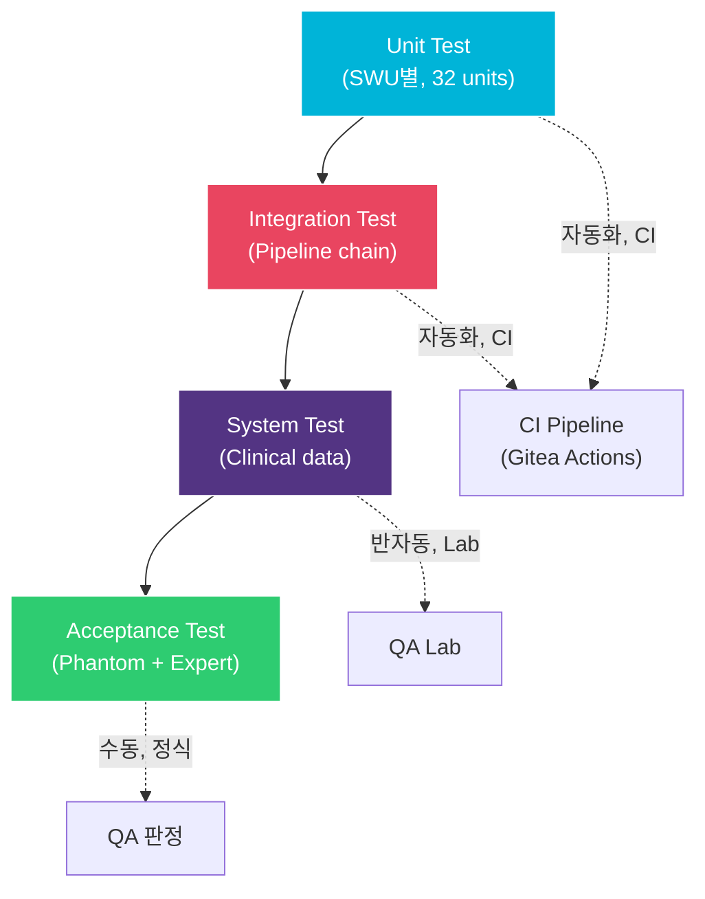

# STP/STC: 소프트웨어 테스트 계획 & 테스트 케이스

> **문서 ID**: XPE-STP-001 | **버전**: 1.0 | **날짜**: 2026-04-14
>
> **IEC 62304 Clause**: 5.5 — 5.7
>
> **추적 원본**: XPE-SRS-001, XPE-SDD-001, XPE-SDD-002

---

## 1. 테스트 전략

### 1.1 테스트 수준



### 1.2 Test Environment

| Environment | Unit/Integration | System | Acceptance |
|---|---|---|---|
| OS | Windows 11 (x64) | 동일 | 동일 |
| Compiler | MSVC 19.x (VS2022), C++17 | 동일 | 동일 |
| Framework | Google Test 1.14 | 동일 + Playwright | Manual + auto |
| Data | Synthetic frames | Phantom X-ray images | Clinical simulation |
| Calibration | Synthetic cal data | Real cal data | Real cal data |
| Automation | 100% | 90% auto, 10% manual | Manual |

### 1.3 Test Naming Convention

```
UT-{SWU_ID}-{SEQ:3d}      Unit test        (e.g., UT-1.1-001)
IT-{SEQ:3d}                Integration test (e.g., IT-001)
ST-{SRS_ID or SEQ}         System test      (e.g., ST-001, ST-SAFE-001)
ST-PERF-{SEQ:3d}           Performance test (e.g., ST-PERF-001)
```

---

## 2. Unit Test Cases

### 2.1 SWU-1.1: OffsetCorrector

| ID | Description | Input | Expected Output | Tolerance | SRS Trace |
|---|---|---|---|---|---|
| UT-1.1-001 | Normal subtraction | raw=1000, offset=300 | 700 | 0 | SRS-FUNC-001 |
| UT-1.1-002 | Underflow clamp | raw=100, offset=300 | 0 | 0 | SRS-FUNC-001 |
| UT-1.1-003 | Max value | raw=65535, offset=0 | 65535 | 0 | SRS-FUNC-001 |
| UT-1.1-004 | Zero both | raw=0, offset=0 | 0 | 0 | SRS-FUNC-001 |
| UT-1.1-005 | Equal frames | raw=offset=500 (uniform) | 0 (all pixels) | 0 | SRS-FUNC-001 |

### 2.2 SWU-1.2: GainCorrector

| ID | Description | Input | Expected Output | Tolerance | SRS Trace |
|---|---|---|---|---|---|
| UT-1.2-001 | Unity gain | pixel=1000, gain=mean=32768 | 1000 | 0 | SRS-FUNC-002 |
| UT-1.2-002 | Low gain pixel | pixel=1000, gain=16384, mean=32768 | 2000 | +-1 | SRS-FUNC-002 |
| UT-1.2-003 | High gain pixel | pixel=1000, gain=65535, mean=32768 | 500 | +-1 | SRS-FUNC-002 |
| UT-1.2-004 | Overflow clamp | pixel=60000, gain=16384, mean=32768 | 65535 | 0 | SRS-FUNC-002 |
| UT-1.2-005 | Dead pixel (gain=0) | pixel=1000, gain=0 | 1000 (bypass) | 0 | SRS-FUNC-002 |
| UT-1.2-006 | Full frame uniformity | uniform input + non-uniform gain | output uniform | +-1 LSB | SRS-FUNC-002 |

### 2.3 SWU-1.3: DefectPixelCorrector

| ID | Description | Input | Expected Output | SRS Trace |
|---|---|---|---|---|
| UT-1.3-001 | Single defect, avg method | center=0, 8 neighbors=1000 | 1000 | SRS-FUNC-003 |
| UT-1.3-002 | Corner defect (0,0) | 3 valid neighbors=900,1000,1100 | 1000 (avg) | SRS-FUNC-003 |
| UT-1.3-003 | Cluster (2 adjacent) | 2 defect in 3x3, 6 valid | avg of 6 valid | SRS-FUNC-003 |
| UT-1.3-004 | No valid neighbors | all 8 neighbors defect | unchanged + WARNING | SRS-ALERT-001 |
| UT-1.3-005 | Median method | 5 neighbors: 100,200,1000,1000,1000 | 1000 (median) | SRS-FUNC-003 |
| UT-1.3-006 | Row defect | entire row bad | avg(above, below) | SRS-FUNC-003 |
| UT-1.3-007 | Bilinear method | 4-directional nearest | distance-weighted avg | SRS-FUNC-003 |
| UT-1.3-008 | Failure alert check | forced failure | SRS-ALERT-001 emitted | SRS-SAFE-003 |

### 2.4 SWU-1.4: GhostCorrector

| ID | Description | Input | Expected Output | Tolerance | SRS Trace |
|---|---|---|---|---|---|
| UT-1.4-001 | Normal Tier 2 correction | input=500, darkPost=310, darkPre=300, alpha=0.5 | 495 | +-1 | SRS-FUNC-004 |
| UT-1.4-002 | Zero lag | darkPost=darkPre=300 | input unchanged | 0 | SRS-FUNC-004 |
| UT-1.4-003 | Negative lag (noise) | darkPost=295, darkPre=300 | input unchanged | 0 | SRS-FUNC-004 |
| UT-1.4-004 | darkPost=nullptr | no post dark | Skip Tier 2, Tier 1 only | - | SRS-FUNC-004 |
| UT-1.4-005 | Temperature compensation | T=35C vs T=25C | alpha increased ~20% | +-5% | SRS-FUNC-004 |
| UT-1.4-006 | DICOM ghost tag set | after correction | metadata.ghostCorrected=true | - | SRS-SAFE-004 |

### 2.5 SWU-1.5: CalibrationManager

| ID | Description | Input | Expected Output | SRS Trace |
|---|---|---|---|---|
| UT-1.5-001 | Normal load | valid cal dir | XPE_OK, data populated | SRS-FUNC-001..004 |
| UT-1.5-002 | CRC mismatch | corrupted file | XPE_ERR_CONFIG_INVALID | SRS-ALERT-005 |
| UT-1.5-003 | Expired calibration | age > 30 days | XPE_ERR_CALIBRATION_EXPIRED | SRS-ALERT-005 |
| UT-1.5-004 | Missing file | non-existent path | XPE_ERR_IO_FAILED | Error handling |
| UT-1.5-005 | Dimension mismatch | offsetMap 1024x1024 for 3072x3072 image | XPE_ERR_INVALID_INPUT | Precondition |

### 2.6 SWU-2.1: LogTransform

| ID | Description | Input | Expected Output | Tolerance | SRS Trace |
|---|---|---|---|---|---|
| UT-2.1-001 | Normal transform | pixel=1000, I0=65535 | -ln(1000/65535) = 4.183 | +-0.001 | SRS-FUNC-010 |
| UT-2.1-002 | Zero pixel (epsilon) | pixel=0, I0=65535 | -ln(1e-6/65535) | +-0.01 | SRS-FUNC-010 |
| UT-2.1-003 | I0=0 | invalid | XPE_ERR_INVALID_INPUT | - | SRS-FUNC-010 |

### 2.7 SWU-2.2: NoiseReducer

| ID | Description | Input | Expected Output | Tolerance | SRS Trace |
|---|---|---|---|---|---|
| UT-2.2-001 | Bilateral basic | noisy synthetic (sigma=0.05) | SNR improved | SNR gain >= 2dB | SRS-FUNC-011 |
| UT-2.2-002 | Edge preservation | step edge + noise | edge sharpness retained | MTF >= 0.95 | SRS-FUNC-011 |
| UT-2.2-003 | NLM mode | noisy synthetic | SNR improved over bilateral | - | SRS-FUNC-011 |
| UT-2.2-004 | Uniform image | constant value | unchanged | +-0.001 | SRS-FUNC-011 |
| UT-2.2-005 | Noise sigma est (MAD) | known sigma=0.1 input | estimated sigma in [0.08, 0.12] | +-20% | SRS-FUNC-011 |

### 2.8 SWU-2.3: ContrastEnhancer

| ID | Description | Input | Expected Output | Tolerance | SRS Trace |
|---|---|---|---|---|---|
| UT-2.3-001 | CLAHE basic | low contrast image | improved contrast | dynamic range increased | SRS-FUNC-012 |
| UT-2.3-002 | Uniform tile | all same value | pass through | 0 | SRS-FUNC-012 |
| UT-2.3-003 | Default params | block=8, clip=2.0, bins=256 | valid output | - | SRS-FUNC-012 |
| UT-2.3-004 | blockSize=1 | invalid | XPE_ERR_INVALID_INPUT | - | SRS-FUNC-012 |
| UT-2.3-005 | clipLimit=0 | standard HE | valid output | - | SRS-FUNC-012 |
| UT-2.3-006 | clipLimit > 40 | excessive | clamped to 40 | - | SRS-SAFE-002 |

### 2.9 SWU-2.4: EdgeEnhancer

| ID | Description | Input | Expected Output | Tolerance | SRS Trace |
|---|---|---|---|---|---|
| UT-2.4-001 | Basic unsharp mask | gain=1.0, sigma=2.0 | edges enhanced | - | SRS-FUNC-013 |
| UT-2.4-002 | Gain=0 | no enhancement | output = input | 0 | SRS-FUNC-013 |
| UT-2.4-003 | Gain > body-part max | gain=10, maxGain=3 | clamped to 3 | - | SRS-SAFE-005 |
| UT-2.4-004 | Overshoot check | enhanced edge | overshoot <= 5% | 5% | HAZ-005 |

### 2.10 SWU-2.5: MultiscaleProcessor

| ID | Description | Input | Expected Output | Tolerance | SRS Trace |
|---|---|---|---|---|---|
| UT-2.5-001 | 8-level pyramid build/reconstruct | synthetic image | PSNR >= 80dB (lossless roundtrip) | - | SRS-FUNC-014 |
| UT-2.5-002 | All gains=1.0 | identity | output = input | +-0.01 | SRS-FUNC-014 |
| UT-2.5-003 | Small image (64x64) | 8 levels requested | auto-reduce levels | - | SRS-FUNC-014 |
| UT-2.5-004 | Non-linear gain | per-level gain array | enhanced frequency bands | - | SRS-FUNC-014 |
| UT-2.5-005 | numLevels=0 | invalid | XPE_ERR_INVALID_INPUT | - | SRS-FUNC-014 |
| UT-2.5-006 | gainsCount mismatch | gains.length != levels | XPE_ERR_INVALID_INPUT | - | SRS-FUNC-014 |
| UT-2.5-007 | Large image (4096x4096) | performance | < 500ms | - | SRS-PERF-002 |
| UT-2.5-008 | Numerical stability | extreme pixel values | no NaN/Inf | 0 | Safety |

### 2.11 SWU-2.7: BodyPartRecognizer

| ID | Description | Input | Expected Output | Tolerance | SRS Trace |
|---|---|---|---|---|---|
| UT-2.7-001 | Chest PA recognition | chest PA image | "CHEST", conf >= 0.95 | - | SRS-FUNC-016 |
| UT-2.7-002 | Low confidence | ambiguous image | DICOM tag fallback | - | SRS-FUNC-016 |
| UT-2.7-003 | Worker timeout | simulated 6s delay | DICOM tag + WARNING | - | SRS-FUNC-016 |

### 2.12 SWU-2.9: ImageStitcher

| ID | Description | Input | Expected Output | Tolerance | SRS Trace |
|---|---|---|---|---|---|
| UT-2.9-001 | 2-image stitch | 2 images, 20% overlap | seamless panoramic | seam invisible | SRS-FUNC-017 |
| UT-2.9-002 | Translation accuracy | known shift | measured shift | sub-pixel (< 0.5px) | SRS-FUNC-017 |
| UT-2.9-003 | Cobb angle accuracy | full-spine phantom | measured vs reference | <= 2 degrees | SRS-FUNC-017 |
| UT-2.9-004 | 4-image stitch | long-leg sequence | complete panoramic | seam invisible | SRS-FUNC-017 |
| UT-2.9-005 | Insufficient overlap | < 10% overlap | XPE_ERR_PROCESSING_FAILED | - | SRS-FUNC-017 |
| UT-2.9-006 | Single image | only 1 image | pass through | 0 | SRS-FUNC-017 |

### 2.13 SWU-2.11: BoneSuppressionEngine

| ID | Description | Input | Expected Output | Tolerance | SRS Trace |
|---|---|---|---|---|---|
| UT-2.11-001 | Normal bone suppression | chest PA | soft-tissue image | PSNR >= 33dB vs ref | SRS-FUNC-018 |
| UT-2.11-002 | Enabled=false | disabled | output = input | 0 | SRS-FUNC-018 |
| UT-2.11-003 | Non-chest image | hand image | skip + return input | 0 | SRS-FUNC-018 |
| UT-2.11-004 | Worker crash | simulated crash | input + alert | - | HAZ-008 |
| UT-2.11-005 | AI label check | after processing | AI-processed flag set | - | SRS-SAFE-008 |

### 2.14 SWU-3.1: ModalityLUT

| ID | Description | Input | Expected Output | Tolerance | SRS Trace |
|---|---|---|---|---|---|
| UT-3.1-001 | Default (slope=1, intercept=0) | pixel=1000 | 1000.0 | 0 | SRS-FUNC-020 |
| UT-3.1-002 | Custom slope/intercept | pixel=1000, slope=2.0, intercept=-500 | 1500.0 | 0 | SRS-FUNC-020 |
| UT-3.1-003 | Slope=0 | invalid | XPE_ERR_INVALID_INPUT | - | SRS-FUNC-020 |

### 2.15 SWU-3.2: VoiLUT

| ID | Description | Input | Expected Output | Tolerance | SRS Trace |
|---|---|---|---|---|---|
| UT-3.2-001 | LINEAR W/L | center=2048, width=4096 | full range mapping | +-1 gray | SRS-FUNC-021 |
| UT-3.2-002 | LINEAR_EXACT | same params | slightly different mapping | +-1 gray | SRS-FUNC-021 |
| UT-3.2-003 | SIGMOID | center=2048, width=1000 | S-curve output | +-1 gray | SRS-FUNC-021 |
| UT-3.2-004 | Width=0 | invalid | XPE_ERR_INVALID_INPUT + WARNING | - | SRS-SAFE-006 |
| UT-3.2-005 | Out-of-range W/L | extreme values | SRS-ALERT-002 emitted | - | SRS-SAFE-006 |

### 2.16 SWU-3.3: PresentationLUT

| ID | Description | Input | Expected Output | Tolerance | SRS Trace |
|---|---|---|---|---|---|
| UT-3.3-001 | GSDF enabled | calibrated input | P-Value output | delta JND <= 1% | SRS-FUNC-022 |
| UT-3.3-002 | GSDF disabled | uncalibrated | linear LUT + WARNING | - | SRS-SAFE-007 |
| UT-3.3-003 | MONOCHROME1 | inversion needed | inverted output | 0 | SRS-FUNC-023 |
| UT-3.3-004 | GSDF warning check | non-GSDF display | SRS-ALERT-003 emitted | - | SRS-SAFE-007 |
| UT-3.3-005 | MONOCHROME2 | no inversion | direct output | 0 | SRS-FUNC-023 |
| UT-3.3-006 | Round-trip | apply then reverse | original restored | +-1 gray | SRS-FUNC-022 |
| UT-3.3-007 | AI label display | AI-processed flag set | "AI-processed" visible | - | SRS-SAFE-008 |
| UT-3.3-008 | Toggle timing | switch original/processed | < 100ms | - | SRS-SAFE-009 |

### 2.17 SWU-4.1/4.2: DicomReader/Writer

| ID | Description | Input | Expected Output | Tolerance | SRS Trace |
|---|---|---|---|---|---|
| UT-4.1-001 | DX IOD read | valid DICOM DX file | image + metadata | exact | SRS-FUNC-030 |
| UT-4.1-002 | Non-DX SOP | CR image | XPE_ERR_UNSUPPORTED_FORMAT | - | SRS-FUNC-030 |
| UT-4.1-003 | Corrupt pixel data | truncated file | XPE_ERR_IO_FAILED | - | Error handling |
| UT-4.1-004 | J2K decompression | J2K Lossless | pixel-exact decode | 0 | SRS-FUNC-032 |
| UT-4.2-001 | DX write (ExplicitVRLE) | valid image | conformant DICOM | DVTk pass | SRS-FUNC-030 |
| UT-4.2-002 | DX write (J2K Lossless) | valid image | conformant DICOM | DVTk pass | SRS-FUNC-032 |
| UT-4.2-003 | Type 1 tag completeness | write output | all Type 1 present | - | SRS-FUNC-030 |
| UT-4.2-004 | Round-trip | read → write → read | pixel identical | 0 | SRS-FUNC-030 |
| UT-4.2-005 | MODIFIED tag | processed image | (0028,0303)=MODIFIED | - | SRS-SAFE-004 |
| UT-4.2-006 | AI private tag | AI-processed | private tag present | - | SRS-SAFE-008 |
| UT-4.2-007 | Write failure | read-only path | XPE_ERR_IO_FAILED | - | SRS-ALERT-006 |
| UT-4.2-008 | Large image (4096x4096) | max size | write success | - | SRS-PERF-005 |

### 2.18 SWU-4.3: PresentationStateIO

| ID | Description | Input | Expected Output | SRS Trace |
|---|---|---|---|---|
| UT-4.3-001 | GSPS create | current W/L + annotations | valid GSPS file | SRS-FUNC-031 |
| UT-4.3-002 | GSPS apply | GSPS file + source image | W/L applied | SRS-FUNC-031 |
| UT-4.3-003 | Round-trip | create → apply | pixel identical display | SRS-FUNC-031 |
| UT-4.3-004 | Wrong SOP reference | mismatched UID | warning + skip | SRS-FUNC-031 |

### 2.19 SWU-5.1: MemoryPool

| ID | Description | Input | Expected Output | SRS Trace |
|---|---|---|---|---|
| UT-5.1-001 | Acquire and release | normal allocation | XPE_OK | SRS-SAFE-001 |
| UT-5.1-002 | Pool exhaustion | acquire beyond max | XPE_ERR_OUT_OF_MEMORY | SRS-PERF-004 |
| UT-5.1-003 | Double release | release same buffer twice | no crash (idempotent) | Safety |

### 2.20 SWU-5.5: ParameterValidator

| ID | Description | Input | Expected Output | SRS Trace |
|---|---|---|---|---|
| UT-5.5-001 | Valid parameter | gain=2.0, range [0, 5] | 2.0 (unchanged) | SRS-SAFE-002 |
| UT-5.5-002 | Exceed max | gain=10.0, max=5.0 | 5.0 (clamped) | SRS-SAFE-005 |
| UT-5.5-003 | Below min | gain=-1.0, min=0.0 | 0.0 (clamped) | SRS-SAFE-005 |
| UT-5.5-004 | Unknown bodyPart | "UNKNOWN" | most conservative range | SRS-SAFE-002 |
| UT-5.5-005 | Default preset load | all body parts | all presets valid | SRS-SAFE-002 |

### 2.21 SWU-5.7: PipelineOrchestrator

| ID | Description | Input | Expected Output | SRS Trace |
|---|---|---|---|---|
| UT-5.7-001 | Full pipeline execution | raw + cal data | processed output | SRS-PERF-002 |
| UT-5.7-002 | Toggle original/processed | after processing | < 100ms switch | SRS-SAFE-009 |

---

## 3. Integration Test Cases

| ID | Scenario | Input | Pass Criteria | SRS Trace |
|---|---|---|---|---|
| IT-001 | Offset→Gain→Defect→Ghost chain | synthetic raw + cal data | PSNR >= 60dB vs reference | SRS-FUNC-001..004 |
| IT-002 | Pre→Core pipeline (Phase 1) | phantom image | visual IQ >= 3.5/5 | SRS-FUNC-010..013 |
| IT-003 | Pipeline → DICOM output | full pipeline | DVTk conformance pass | SRS-FUNC-030 |
| IT-004 | W/L interactive response | W/L drag event | display update <= 16ms | SRS-PERF-003 |
| IT-005 | Error propagation | corrupted cal data | no crash, alert shown | SRS-SAFE-003 |
| IT-006 | Memory stability | 100 images sequential | RSS growth < 5% | SRS-PERF-004 |
| IT-007 | Thread safety | 2 concurrent pipelines | both complete, no race | SRS-PERF-006 |
| IT-008 | SOUP interface (OpenCV CLAHE) | known input | pixel-exact vs reference | SRS-FUNC-012 |
| IT-009 | Pipeline timing (Phase 1) | 3072x3072 image | total <= 3s | SRS-PERF-002 |
| IT-010 | Pre-processing timing | 3072x3072 image | pre-proc <= 500ms | SRS-PERF-001 |
| IT-011 | Safety controls chain | forced failures | all alerts emitted correctly | SRS-SAFE-001..009 |
| IT-012 | AI worker IPC | body-part + bone supp | IPC roundtrip < 5s | SRS-FUNC-016, 018 |

---

## 4. Performance Test Cases

| ID | Scenario | Input | Pass Criteria | SRS Trace |
|---|---|---|---|---|
| ST-PERF-001 | Pre-processing latency | 3072x3072 single-thread | <= 500ms | SRS-PERF-001 |
| ST-PERF-002 | Full pipeline latency | 3072x3072 Phase 1 | <= 3s | SRS-PERF-002 |
| ST-PERF-003 | VOI LUT interactive | W/L drag at 60fps | <= 16ms per frame | SRS-PERF-003 |
| ST-PERF-004 | Peak memory | full pipeline | <= 2GB | SRS-PERF-004 |
| ST-PERF-005 | DICOM write (uncompressed) | 3072x3072 | <= 1s | SRS-PERF-005 |
| ST-PERF-006 | DICOM write (J2K) | 3072x3072 | <= 3s | SRS-PERF-005 |
| ST-PERF-007 | Concurrent processing | 2 images simultaneously | both complete within 2x single | SRS-PERF-006 |

---

## 5. Safety Test Cases

| ID | Hazard | Scenario | Pass Criteria | SRS Trace |
|---|---|---|---|---|
| ST-SAFE-001 | HAZ-001 | Raw byte comparison after full pipeline | byte-identical raw preserved | SRS-SAFE-001 |
| ST-SAFE-002 | HAZ-002 | All body-part preset validation | all params within safe range | SRS-SAFE-002 |
| ST-SAFE-003 | HAZ-003 | Forced defect correction failure | warning within 2s | SRS-SAFE-003 |
| ST-SAFE-004 | HAZ-004 | DICOM ghost tag after correction | tag present and correct | SRS-SAFE-004 |
| ST-SAFE-005 | HAZ-005 | Edge enhancement max gain | no overshoot > 5% | SRS-SAFE-005 |
| ST-SAFE-006 | HAZ-006 | W/L out-of-range injection | warning displayed | SRS-SAFE-006 |
| ST-SAFE-007 | HAZ-007 | Non-GSDF display simulation | warning displayed | SRS-SAFE-007 |
| ST-SAFE-008 | HAZ-008 | AI bone suppression output | "AI-processed" label visible | SRS-SAFE-008 |
| ST-SAFE-009 | HAZ-009 | Toggle original/processed timing | switch < 100ms | SRS-SAFE-009 |

---

## 6. Regression Test Suite

```
CI 자동 실행 조건:
  1. 소스 코드 변경 (develop/feature branch push)
  2. Calibration 데이터 변경
  3. 주 1회 정기 실행 (cron)

Regression suite 구성:
  1. 전체 Unit Test (~120 cases)
  2. 전체 Integration Test (IT-001 ~ IT-012)
  3. Golden reference comparison:
     - 5개 synthetic frame에 대한 pipeline 결과를 golden으로 저장
     - Pixel-exact comparison (float32: tolerance 1e-6)
  4. Safety test subset (ST-SAFE-001 ~ ST-SAFE-009)

Blocking criteria:
  - Any UT failure → PR merge 차단
  - Any IT failure → release 차단
  - Any ST-SAFE failure → release 차단
  - Coverage < 80% statement → PR merge 차단
```

---

## 7. Test Record Template

각 test execution에 대해 기록:

| Field | Description |
|-------|-------------|
| Test ID | UT-x.y-zzz / IT-zzz / ST-zzz |
| Date | Execution timestamp |
| SW Version | Git commit SHA |
| Environment | OS, compiler version, HW spec |
| Result | Pass / Fail |
| Measured values | PSNR, latency, memory 등 (해당 시) |
| Anomalies | Problem report reference (있을 경우) |
| Executor | Name |

---

## Revision History

| Rev | Date | Author | Description |
|-----|------|--------|-------------|
| 1.0 | 2026-04-14 | XPE Team | Initial release — ~120 unit + 12 integration + 7 perf + 9 safety test cases |

---

*Document End — XPE-STP-001 v1.0*
