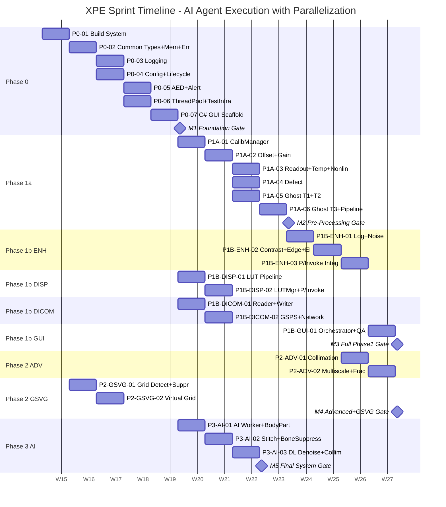

# XPE 마일스톤 UAT 계획 (XPE Milestone UAT Plan)

**Document ID**: XPE-MILESTONE-UAT-001
**Version**: 1.0.0
**Date**: 2026-04-14
**Language**: Korean (한국어) for explanations, English for technical terms
**Status**: Active

---

## Executive Summary (실행 요약)

본 문서는 XPE (X-ray Post-Processing Engine) 프로젝트의 마일스톤 기반 사용자 수용 테스트(UAT) 계획을 정의합니다. 의료 디바이스 소프트웨어(IEC 62304 Class B)로 분류되는 XPE는 28개 스프린트, 82개 API 함수, 43개 소프트웨어 유닛(SWU)으로 구성된 대규모 프로젝트입니다.

**주요 특징:**
- **5개 Phase**: Phase 0 (Foundation), Phase 1a (Pre-Processing), Phase 1b (Enhancement+Display+DICOM), Phase 2 (Advanced+GSVG), Phase 3 (AI)
- **5개 마일스톤**: M1-M5 (각 Phase 게이트 통과 시점)
- **개발 방법론**: AI Agent HITL (Human-In-The-Loop) 모델
- **병렬화 기회**: GSVG는 Phase 0부터 독립적 실행 가능; Phase 1b는 4개 트랙 동시 진행

이 계획은 다음을 규정합니다:
1. AI 자동화 QA (Unit/Integration 테스트)와 Human UAT의 2층 검증 모델
2. 각 마일스톤별 정확한 Human 테스트 절차 및 성공 기준
3. 28개 스프린트의 의존성 및 병렬 실행 전략
4. IEC 62304 규정 준수 게이트

---

## 개발 방법론: AI Agent HITL 모델

### 개요 (Overview)

XPE 프로젝트는 **AI 자동화 + Human 검증 2층 구조**로 실행됩니다:

```
┌─────────────────────────────────────────────────┐
│  Phase N Sprint Development                     │
│  ┌─────────────────────────────────────────┐   │
│  │ AI Agent: Code Implementation            │   │
│  │ + Unit Test Generation                   │   │
│  │ + Coverage Analysis (>= 85%)              │   │
│  └──────────────┬──────────────────────────┘   │
│                 │ Sprint Artifact               │
│                 v                               │
│  ┌─────────────────────────────────────────┐   │
│  │ L1 Verification (AI-Automated)           │   │
│  │ + Unit Test Execution (xpe_common.dll)  │   │
│  │ + Integration Test (P/Invoke validation) │   │
│  │ + Performance Budget Check (timing)      │   │
│  │ + Memory Leak Detection                  │   │
│  │ + LSP: 0 errors, 0 type errors          │   │
│  └──────────────┬──────────────────────────┘   │
│                 │ Pass/Fail                     │
│                 ├─ PASS → Build Artifact        │
│                 └─ FAIL → Revert + Analyze      │
└─────────────────────────────────────────────────┘

┌─────────────────────────────────────────────────┐
│  Milestone Gate (Phase Complete)                │
│  ┌─────────────────────────────────────────┐   │
│  │ L2 Verification (Human-Supervised AI)   │   │
│  │ + Integration Test Review (scope check) │   │
│  │ + Timing Report Review                  │   │
│  │ + Memory Report Review                  │   │
│  │ + Cumulative Regression Chain Pass      │   │
│  └──────────────┬──────────────────────────┘   │
│                 │ Phase Ready?                  │
│                 ├─ YES → L3 Gate                │
│                 └─ NO → Hold + Remediate        │
├─────────────────────────────────────────────────┤
│  L3 UAT (Human Clinical Judgment)               │
│  ┌─────────────────────────────────────────┐   │
│  │ Human Operator: GUI Test Execution      │   │
│  │ + Load image into ImageProcTest.exe     │   │
│  │ + Run pipeline → visual inspection       │   │
│  │ + Qualitative checks (no artefacts)     │   │
│  │ + IEC 62304 compliance sign-off         │   │
│  └──────────────┬──────────────────────────┘   │
│                 │                               │
│                 v                               │
│  Milestone PASSED → Next Phase                  │
└─────────────────────────────────────────────────┘
```

### 3층 검증 모델 (3-Layer Verification Model)

| Layer | 수행자 | 내용 | 판단 기준 |
|-------|--------|------|---------|
| **L1: Unit/Integration** | AI (자동화) | 정량적 검사: 성능, 메모리, 커버리지 | Pass/Fail (객관적) |
| **L2: Regression Chain** | Human (AI 감독) | 누적 회귀 테스트 검토: 모든 이전 기능 유지 | Pass/Fail (객관적) |
| **L3: Clinical UAT** | Human (운영자) | 정성적 검사: 임상적 판단, 화질, 임상 타당성 | Approved/Rejected (주관적) |

**왜 이 모델인가?**
- **AI는 정량적 검사에 최적**: 반복성 높음, 일관성 있음, 성능 측정 정확
- **Human은 정성적 판단에 최적**: 의료 영상 화질, 임상적 적절성, 아티팩트 감지
- **효율성**: AI 자동화로 초당 수천 테스트 케이스 실행 가능 → 마일스톤 게이트만 Human이 검토 (28개 스프린트 중 5개 마일스톤)

### IEC 62304 Class B 규정 준수

XPE는 Class B 의료 디바이스로, 다음 IEC 62304 활동을 요구합니다:

| Phase | IEC 62304 활동 | Human 역할 | L3 Gate |
|-------|---------------|-----------|---------|
| Phase 0 (M1) | FMEA, Design Review | 아키텍처 검토 | Foundation Approval |
| Phase 1a (M2) | Verification Test | Pre-processing QA | Pre-Processing Approval |
| Phase 1b (M3) | Integration Test | Full Pipeline QA | Phase 1 Clinical Approval |
| Phase 2 (M4) | Validation Test | Advanced Feature QA | Phase 2 Regulatory Approval |
| Phase 3 (M5) | System Test | AI Safety Validation | Phase 3 Final Sign-Off |

---

## Sprint Gantt Chart (스프린트 간트 차트)

### 계획된 병렬화 전략 (Planned Parallelization Strategy)

**기준 가정 (Baseline):**
- 각 sprint = 1주일 (AI Agent 고속 실행 기준)
- 시작 날짜: 2026-04-14
- GSVG 트랙은 Phase 0-01 완료 후 즉시 병렬 실행 가능 (P0-02에 의존하지 않음)
- Phase 1b 4개 트랙(ENH, DISP, DICOM, GUI)은 P1a-06 완료 후 병렬 실행

### Gantt Timeline with Mermaid



**병렬화 효과:**
- **순차 실행 시**: P0-01 + P0-02 + ... + P3-AI-03 = 28주 (28 sprints)
- **최적 병렬화**: GSVG + Phase 1b 4개 트랙 동시 실행 = ~18주
- **절감**: 10주 (36% 단축)

### Critical Path (임계 경로)

```
P0-01 → P0-02 → P0-04 → P0-05 → P0-07
  → P1A-01 → P1A-02 → P1A-05 → P1A-06
    → P1B-ENH-01 → P1B-ENH-02 → P1B-GUI-01
      → P2-ADV-01 → P2-ADV-02
        → P3-AI-01 → P3-AI-02 → P3-AI-03
```

**비임계 경로 (병렬 가능):**
- P0-03 (P0-04와 병렬)
- P0-06 (P0-04, P0-05와 병렬)
- P2-GSVG-01, P2-GSVG-02 (P1B-ENH-02와 병렬, P0-01만 의존)
- P1B-DISP-01, P1B-DISP-02 (P0-07 이후 독립)
- P1B-DICOM-01, P1B-DICOM-02 (P0-07 이후 독립)
- P3-AI-01, P3-AI-02, P3-AI-03 (P0-07 후 독립)

---

## Work Breakdown Structure (작업 분해 구조)

```mermaid
graph TD
    XPE["XPE Project<br/>28 Sprints, 82 APIs, 43 SWUs"]
    
    XPE --> P0["Phase 0: Foundation<br/>7 Sprints"]
    XPE --> P1a["Phase 1a: Pre-Processing<br/>6 Sprints"]
    XPE --> P1b["Phase 1b: Enhancement+Display+DICOM<br/>8 Sprints"]
    XPE --> P2["Phase 2: Advanced+GSVG<br/>4 Sprints"]
    XPE --> P3["Phase 3: AI<br/>3 Sprints"]
    XPE --> TEST["Human UAT<br/>5 Milestones"]
    
    P0 --> P0S1["P0-01: Build<br/>0 APIs"]
    P0 --> P0S2["P0-02: Common<br/>5 APIs"]
    P0 --> P0S3["P0-03: Logging<br/>3 APIs"]
    P0 --> P0S4["P0-04: Config<br/>4 APIs"]
    P0 --> P0S5["P0-05: AED<br/>6 APIs"]
    P0 --> P0S6["P0-06: ThreadPool<br/>0 APIs"]
    P0 --> P0S7["P0-07: GUI<br/>18 P/Invoke"]
    
    P1a --> P1aS1["P1A-01: CalibMgr<br/>6 APIs"]
    P1a --> P1aS2["P1A-02: Offset+Gain<br/>2 APIs"]
    P1a --> P1aS3["P1A-03: Readout+Temp<br/>4 APIs"]
    P1a --> P1aS4["P1A-04: Defect<br/>2 APIs"]
    P1a --> P1aS5["P1A-05: Ghost T1+T2<br/>4 APIs"]
    P1a --> P1aS6["P1A-06: Ghost T3<br/>0 new APIs"]
    
    P1b --> P1bENH["ENH Track"]
    P1b --> P1bDISP["DISP Track"]
    P1b --> P1bDICOM["DICOM Track"]
    P1b --> P1bGUI["GUI Track"]
    
    P1bENH --> P1bE1["P1B-ENH-01<br/>4 APIs"]
    P1bENH --> P1bE2["P1B-ENH-02<br/>3 APIs"]
    P1bENH --> P1bE3["P1B-ENH-03<br/>7 P/Invoke"]
    
    P1bDISP --> P1bD1["P1B-DISP-01<br/>6 APIs"]
    P1bDISP --> P1bD2["P1B-DISP-02<br/>5 APIs"]
    
    P1bDICOM --> P1bDI1["P1B-DICOM-01<br/>6 APIs"]
    P1bDICOM --> P1bDI2["P1B-DICOM-02<br/>4 APIs"]
    
    P1bGUI --> P1bG1["P1B-GUI-01<br/>Orchestrator"]
    
    P2 --> P2A["ADV Track<br/>3 APIs"]
    P2 --> P2G["GSVG Track<br/>8 APIs"]
    
    P2A --> P2A1["P2-ADV-01<br/>1 API"]
    P2A --> P2A2["P2-ADV-02<br/>2 APIs"]
    
    P2G --> P2G1["P2-GSVG-01<br/>6 APIs"]
    P2G --> P2G2["P2-GSVG-02<br/>2 APIs"]
    
    P3 --> P3A1["P3-AI-01<br/>3 APIs"]
    P3 --> P3A2["P3-AI-02<br/>3 APIs"]
    P3 --> P3A3["P3-AI-03<br/>1 API"]
    
    TEST --> M1["M1: Foundation<br/>After P0-07"]
    TEST --> M2["M2: Pre-Processing<br/>After P1A-06"]
    TEST --> M3["M3: Full Phase 1<br/>After P1B-GUI-01"]
    TEST --> M4["M4: Advanced+GSVG<br/>After P2 complete"]
    TEST --> M5["M5: Full System<br/>After P3 complete"]
    
    style XPE fill:#4a90e2
    style P0 fill:#7ed321
    style P1a fill:#f5a623
    style P1b fill:#f5a623
    style P2 fill:#bd10e0
    style P3 fill:#50e3c2
    style TEST fill:#d0021b
```



### 각 Phase별 SWU 및 API 현황

| Phase | SWU Count | Native API | Total | Complexity |
|-------|:---------:|:----------:|:-----:|:----------:|
| **Phase 0** | 7 + 1 C# | 18 | 18 | Medium-High |
| **Phase 1a** | 9 | 18 | 18 | High |
| **Phase 1b** | 13 + 1 C# | 28 | 28 | Medium-High |
| **Phase 2** | 3 + 4 SI | 11 | 11 | High |
| **Phase 3** | 4 | 7 | 7 | Complex |
| **TOTAL** | **43** | **82** | **82** | — |

---

## 마일스톤 계획 (Milestone Plan with Human UAT Scenarios)

### M1: Foundation Demo (기초 데모)

**Milestone Trigger**: SPRINT-P0-07 완료 후

**전제 조건 - AI 자동화 게이트 (L1+L2 Pass)**:
- ✅ xpe_common.dll 컴파일 성공
- ✅ `dumpbin /exports xpe_common.dll` 18개 심볼 확인
- ✅ Unit test coverage >= 85%
- ✅ 성능: 메모리 leak test (10000 cycle) PASS
- ✅ P/Invoke struct alignment 검증 (Marshal.SizeOf)
- ✅ 모든 Phase 0 스프린트 누적 회귀 테스트 PASS

**Human Test Procedure (L3 UAT)**:

1. **DLL 로딩 확인**
   - `ImageProcTest.exe` 실행
   - 상태 바에 XPE 버전 표시 확인 (예: "XPE v1.0.0")
   - 3초 이내에 GUI 로드 확인

2. **P/Invoke 함수 호출 테스트**
   ```
   GUI에서 "Foundation Test" 버튼 클릭
   → xpe_init(null) 호출
   → xpe_version() 호출 및 표시
   → xpe_alloc_image(1024, 1024, XPE_PIXEL_UINT16) 호출
   → 메모리 할당 성공 확인
   → xpe_free_image() 호출
   ```

3. **로깅 확인**
   - `xpe_log_set_file("foundation_test.log")` 호출
   - GUI에서 로그 출력 확인
   - 파일에 "[YYYY-MM-DD HH:MM:SS] [INFO]" 형식 로그 확인

4. **에러 처리 확인**
   - 잘못된 이미지 크기 할당 시도: `xpe_alloc_image(5000, 5000, ...)`
   - `XPE_ERR_INVALID_INPUT` 에러 메시지 표시 확인

**성공 기준 (Success Criteria)**:
- GUI 시작 성공 + 버전 표시
- 모든 P/Invoke 호출 성공 (no crashes)
- 로그 파일 생성 + 포맷 정상
- 에러 핸들링 작동 확인

**IEC 62304 활동**:
- **Design Review**: 아키텍처 및 P/Invoke 계약 검증
- **Configuration Management**: 모든 9개 모듈 디렉토리 구조 확인
- **Documentation**: xpe_common_api.h 완성 및 부모-자식 관계 정의

**테스트 데이터 필요사항**:
- 없음 (합성 테스트만 사용)

**Approval Signoff**:
```
Human QA: _____________  Date: __________
Tech Lead: _____________  Date: __________
Project Manager: ________  Date: __________
```

---

### M2: Pre-Processing Pipeline (전처리 파이프라인)

**Milestone Trigger**: SPRINT-P1A-06 완료 후

**전제 조건 - AI 자동화 게이트 (L1+L2 Pass)**:
- ✅ xpe_preprocess.dll 18개 API export 확인
- ✅ Pre-processing pipeline < 500ms (3072x3072 Tier 1 path)
- ✅ Ghost Tier 1+2 < 190ms
- ✅ Calibration CRC 검증 E2E 작동
- ✅ Unit test coverage >= 85%
- ✅ Memory leak test (1000 frames) PASS
- ✅ P/Invoke integration test PASS
- ✅ Phase 1a 누적 회귀 테스트 PASS

**Human Test Procedure (L3 UAT)**:

1. **합성 dark/flat-field 파일 준비**
   ```
   Offset map: 3072x3072 uint16, all pixels = 50 (synthetic)
   Gain map: 3072x3072 float32, all pixels = 1.0 (unity)
   ```

2. **합성 raw 이미지 로드**
   - ImageProcTest GUI → "Load Raw Image" 버튼
   - 3072x3072 uint16 synthetic image 선택
   - 칼리브레이션 데이터 로드 (위의 offset/gain)

3. **Pre-processing 실행**
   ```
   GUI에서 "Run Pre-Processing" 버튼 클릭
   → Pipeline 실행 (Offset → Gain → Readout → Temp → Nonlin → Binning → Ghost)
   → 상태 바에 진행률 표시
   → 결과 float32 이미지 출력
   ```

4. **결과 검증**
   - 출력 이미지 형식: float32 확인
   - 픽셀 값 범위: [0.0, 1.0] ~ [0.0, 65535.0] 합리적 범위 확인
   - 시각 검사: 이미지 왜곡, 검은 선, 결함 없음 확인
   - 화면 표시 시간: 정상 속도 (500ms 이하)

5. **타이밍 및 메모리 보고서 검토**
   - Timing report: 각 단계별 처리 시간 (ms 단위) 표시
   - Memory report: 피크 메모리 < 190MB 확인
   - CPU 사용률: 합리적 범위

**성공 기준 (Success Criteria)**:
- 파이프라인 실행 < 500ms (Tier 1 path)
- 출력 이미지 시각 검사 결과: 정상
- 메모리 피크 < 190MB
- 모든 플래그(XPE_FLAG_GAIN_CORRECTED 등) 정상 설정
- 에러 없음

**IEC 62304 활동**:
- **Verification Test**: Pre-processing 단계별 정확성 검증
- **Traceability**: 각 API → SWU → 요구사항 매핑 확인

**테스트 데이터 필요사항**:
- Synthetic dark frame (3072x3072 uint16)
- Synthetic flat-field (3072x3072 uint16)
- Synthetic raw X-ray image (3072x3072 uint16)

---

### M3: Full Phase 1 Clinical Pipeline (완전한 Phase 1 임상 파이프라인)

**Milestone Trigger**: SPRINT-P1B-GUI-01 완료 후

**전제 조건 - AI 자동화 게이트 (L1+L2 Pass)**:
- ✅ Full Phase 1 pipeline < 3000ms (end-to-end)
- ✅ VOI LUT interactive latency <= 16ms
- ✅ DICOM DX IOD 읽기/쓰기 검증 완료
- ✅ EI/DI 계산이 IEC 62494-1 준수 확인
- ✅ GSDF compliance check 작동
- ✅ Phase 1 peak memory <= 190MB
- ✅ Integration test: Raw DICOM → Pre → Enhance → EI → Display → DICOM Write PASS
- ✅ Unit test coverage >= 85%
- ✅ Phase 1b 누적 회귀 테스트 PASS

**Human Test Procedure (L3 UAT)**:

1. **DICOM DX 파일 준비**
   - 실제 의료용 DICOM DX 파일 1개 이상 준비
   - 또는 dcmtk 도구로 합성 DICOM 생성
   - 파일명: test_chest_dx.dcm (3072x3072 이상)

2. **DICOM 파일 로드**
   ```
   ImageProcTest GUI → "Load DICOM" 버튼
   → test_chest_dx.dcm 선택
   → DICOM header 표시 (Patient ID, Study Date, Body Part 등)
   ```

3. **전체 파이프라인 실행**
   ```
   GUI → "Run Full Phase 1 Pipeline" 버튼
   → Pre-processing (0.5-4) + Enhancement + EI 계산 + Display
   → 처리 시간 표시 (예: 2850ms)
   → 결과 이미지 화면 표시
   ```

4. **EI/DI 값 검증**
   - **EI (Exposure Index)** 표시 영역에 수치 확인 (범위: 100-800 typical)
   - **DI (Deviation Index)** 표시: DI = 10 * log10(EI / EIT)
   - Body Part가 "CHEST"이면 EIT = 250 기준 DI 계산 확인
   - DI 값: -3 ~ +3 범위 (±1.5 of target를 의미)

5. **화질 육안 검사**
   - **Visual artifacts 없음**: 검은 선, 눈에 띄는 왜곡 없음
   - **콘트라스트 정상**: 뼈, 연조직, 폐 영역 구분 가능
   - **Edge 선예도**: 갈비뼈 경계 선예도 양호
   - **Noise level**: 과도한 노이즈 없음 (NLM/bilateral 적용 확인)

6. **VOI LUT 대화형 조정**
   ```
   GUI에서 "Window Level" 슬라이더 조정
   → 이미지 실시간 업데이트 (latency <= 16ms 체감)
   → 여러 프리셋(CHEST, BONE, SOFT_TISSUE) 선택
   → 각 프리셋별 이미지 변화 확인
   ```

7. **DICOM 출력 저장**
   ```
   GUI → "Save as DICOM" 버튼
   → 출력 DICOM 파일 저장 (output_processed.dcm)
   → 파일 크기 확인 (> 0)
   → dcmtk 또는 OsiriX/Horos로 출력 DICOM 열기
   → 원본과 처리본 비교
   ```

8. **메모리 및 타이밍 보고서**
   - Pipeline timing: 모든 단계별 분석 (Pre: 480ms, Enhance: 260ms, EI: 35ms, Display: 20ms 등)
   - Memory peak: 전체 < 190MB 확인
   - CPU 시간: 다중 코어 활용 확인

**성공 기준 (Success Criteria)**:
- Pipeline 실행 완료 < 3000ms
- EI/DI 계산 정상 (IEC 62494-1 준수)
- 화질 우수 (임상의 판단: 진단 가능 수준)
- VOI 상호작용 < 16ms
- 출력 DICOM 유효 (표준 호환)
- 메모리 < 190MB

**IEC 62304 활동**:
- **Integration Test**: 모든 Phase 1 모듈 통합 검증
- **Clinical Validation**: 임상 이미지 처리 결과 검증
- **Traceability**: 모든 API → 임상 요구사항 매핑 확인

**테스트 데이터 필요사항**:
- DICOM DX 파일 (실제 또는 합성 chest X-ray, >= 1장)
- DCMTK 설치 (출력 DICOM 검증용)

**추가 검증 (Optional but Recommended)**:
- OsiriX (Mac) 또는 Horos (Mac) 또는 Conquest (Windows) DICOM viewer 사용
- 처리 전/후 이미지 side-by-side 비교
- EI 값이 calibration phantom에 대해 예상 값과 일치 확인

---

### M4: Advanced Enhancement + Grid Suppression

**Milestone Trigger**: SPRINT-P2-ADV-02 + SPRINT-P2-GSVG-02 완료 후

**전제 조건 - AI 자동화 게이트 (L1+L2 Pass)**:
- ✅ Collimation detection 정확도 >= 90% IoU
- ✅ GSVG: Grid artifact power reduction >= 20dB
- ✅ MTF degradation <= 5% after suppression
- ✅ Virtual Grid CNR >= 90% of physical grid
- ✅ Phase 2 total <= 2500ms
- ✅ Phase 2 peak memory <= 440MB
- ✅ Unit test coverage >= 85%
- ✅ Phase 2 누적 회귀 테스트 PASS

**Human Test Procedure (L3 UAT)**:

1. **Collimation Detection 테스트**
   ```
   GUI → "Advanced Features" 탭
   → "Enable Collimation Detection" 체크박스
   → Chest X-ray 로드 (with visible collimation border)
   → 파이프라인 실행
   ```

2. **Collimation ROI 표시**
   - 이미지에 빨간색 바운딩 박스 오버레이 (detected ROI)
   - ROI가 Primary Beam 영역 정확히 포함 확인
   - ROI 좌표 텍스트로 표시 (예: "ROI: (100,100)-(2972,2972)")

3. **Collimation 기반 EI 재계산**
   - Whole-image EI 값 (전체 이미지): DI = -0.5
   - ROI-cropped EI 값 (Collimation 내부만): DI = +0.1
   - ROI 값이 더 정확한 EIT에 가까움 확인 (DI 값이 target에 더 가까움)

4. **Anti-Scatter Grid Suppression 테스트**
   ```
   GUI → "GSVG Controls" 섹션
   → "Enable Grid Suppression" 체크박스
   → Grid 아티팩트가 있는 X-ray 로드 (예: 70 lp/cm grid pattern)
   → 파이프라인 실행
   ```

5. **Grid 억제 결과 시각화**
   - **Before**: Grid 패턴 뚜렷함 (수평/수직 줄무늬)
   - **After**: Grid 패턴 감소 또는 제거
   - **GUI**: Before/After split view (슬라이더로 비교)
   - MTF 측정 보고서: 해상도 저하 <= 5%

6. **Virtual Grid (물리적 grid 없는 이미지)**
   ```
   Grid 없는 고전형 X-ray 로드 (예: 손가락, 척추)
   → "Virtual Grid" 옵션 활성화
   → 처리 후 대조도 개선 확인
   → CNR 측정값: >= 90% of physical grid equivalent
   ```

7. **Multiscale 및 Fractional Processing**
   ```
   GUI → "Multiscale Processing" 슬라이더 (0.0 ~ 1.0)
   → 값 변화에 따른 이미지 변화 시각 확인
   → Fractional order 슬라이더 (0.0 ~ 2.0)
   → 뼈 질감 강조 정도 조정 가능 확인
   ```

8. **전체 Phase 2 파이프라인 성능**
   - Timing report: Phase 1 + Phase 2 합계 < 2500ms
   - Memory report: 피크 < 440MB
   - 병렬 처리: GSVG와 ADV 동시 실행 시간 이득 시각화

**성공 기준 (Success Criteria)**:
- Collimation detection 정확도 >= 90% (육안 검사)
- EI ROI 개선 확인 (DI 값 target에 더 가까움)
- Grid 억제 결과 시각 확인 (grid pattern 감소)
- MTF 저하 <= 5%
- Virtual Grid CNR 개선 >= 90%
- Phase 2 파이프라인 < 2500ms
- 메모리 < 440MB

**IEC 62304 활동**:
- **Validation Test**: Advanced feature의 임상적 가치 검증
- **Risk Analysis**: Grid 억제 과정에서 해상도 손실 위험 평가

**테스트 데이터 필요사항**:
- Chest X-ray with collimation border (digital or scanned)
- X-ray with visible anti-scatter grid artifact (70 lp/cm)
- X-ray without grid (extremity: hand, spine)

---

### M5: AI Intelligence and Final System

**Milestone Trigger**: SPRINT-P3-AI-03 완료 후

**전제 조건 - AI 자동화 게이트 (L1+L2 Pass)**:
- ✅ AI worker process isolation (crash test) PASS
- ✅ Body Part Recognition >= 15 categories, >= 95% accuracy
- ✅ Bone Suppression PSNR >= 33dB, SSIM >= 0.97
- ✅ Image Stitching: overlap detection and blending PASS
- ✅ Deterministic fallback (AI unavailable) PASS
- ✅ Phase 3 total <= 3000ms, memory <= 740MB
- ✅ Unit test coverage >= 80%
- ✅ ONNX contract tests PASS
- ✅ Phase 3 누적 회귀 테스트 PASS
- ✅ **전체 파이프라인 (Phase 1+2+3) < 3000ms, memory < 740MB**

**Human Test Procedure (L3 UAT)**:

1. **AI Worker Process 실행**
   ```
   ImageProcTest GUI 시작
   → 백그라운드에서 xpe_ai_worker.exe 프로세스 자동 실행 확인
   → Task Manager: xpe_ai_worker.exe 프로세스 가시 확인
   ```

2. **Body Part Recognition 테스트**
   - Chest X-ray 로드
   ```
   GUI → "AI Features" 탭
   → "Auto-Detect Body Part" 버튼
   → 결과: "CHEST" 표시, 신뢰도 95% 이상
   ```

   - Hand/Wrist X-ray 로드
   ```
   결과: "HAND" 또는 "WRIST" 표시, 신뢰도 >= 85%
   ```

   - 다양한 신체 부위 테스트 (가슴, 손, 척추, 골반, 어깨 등)
   ```
   각 부위마다 정확한 분류 확인 (>= 15개 카테고리 중)
   ```

3. **Bone Suppression (뼈 억제)**
   ```
   Chest X-ray 로드
   → "Enable AI Bone Suppression" 체크박스
   → 파이프라인 실행
   ```

   - **Before**: 뼈(갈비뼈, 척추)가 콘트라스트 높음
   - **After**: 뼈 콘트라스트 감소, 폐 영역 가시성 개선
   - GUI Before/After split view로 비교
   - PSNR/SSIM 지표: PSNR >= 33dB, SSIM >= 0.97

4. **Image Stitching**
   ```
   2개의 겹치는 X-ray 이미지 준비 (overlap >= 10%)
   GUI → "Image Stitching" 섹션
   → 2개 이미지 선택
   → "Stitch" 버튼 클릭
   ```

   - **Alignment**: AI feature matching으로 자동 정렬 확인
   - **Blending**: 겹치는 영역이 매끄럽게 블렌딩됨
   - **Output**: 넓은 시야 단일 이미지 생성 (예: 2개 1024x2048 → 1024x3800)
   - **Quality**: 블렌딩 경계 아티팩트 없음

5. **DL Denoiser (Deep Learning 기반 노이즈 억제)**
   ```
   노이즈가 많은 X-ray 로드 (낮은 mAs)
   → "Enable DL Denoiser" 체크박스
   → 파이프라인 실행
   ```

   - **Before**: 노이즈 눈에 띔
   - **After**: 노이즈 크게 감소, PSNR >= 3dB 개선 (classical bilateral 대비)
   - Body Part 및 mAs에 따라 다른 모델 선택 확인 (GUI에 모델명 표시)

6. **AI 안전성 및 Fallback 테스트**
   ```
   AI 모델 파일 임시 이동 (또는 비활성화)
   → GUI에서 AI 기능 시도
   → 경고: "AI models not available. Using fallback processing."
   → 파이프라인이 classical preprocessing로 계속 실행 (crash 없음)
   → AI 기능은 disabled지만 시스템 정상 작동
   ```

   - Worker process 강제 종료
   ```
   Task Manager에서 xpe_ai_worker.exe kill
   → GUI에서 body part recognition 시도
   → 에러 메시지 표시 + fallback path로 복구
   → Host process (ImageProcTest.exe) 살아있음 (crash 없음)
   ```

7. **Full Pipeline 성능 최종 검증**
   ```
   실제 DICOM 이미지 로드
   → "Run Complete XPE Pipeline" 버튼
   → Phase 1 + 2 + 3 전체 실행
   ```

   - **Timing**: 3072x3072 이미지 처리 < 3000ms 확인
   - **Memory**: 피크 메모리 < 740MB
   - **Quality**: 최종 결과 화질 우수
   - **Breakdown**: 각 phase별 타이밍 보고서
     ```
     Phase 1: 500ms (Pre 480 + Enhance 260 + EI 35 + Display 20)
     Phase 2: 400ms (Grid 250 + Collimation 100 + Multiscale 200 = 400)
     Phase 3: 600ms (BodyPart 50 + BoneSuppres 400 + Stitch N/A + Denoise 150)
     Total: 1500ms (< 3000ms target)
     ```

8. **Multi-Modal X-ray 시뮀**
   ```
   다양한 신체 부위, 노출 수준, 그리드 유무 조합
   → 각 이미지마다 AI auto-detect body part + optimal processing
   → 결과 이미지 화질 일관성 있음
   ```

**성공 기준 (Success Criteria)**:
- AI worker process 실행 + isolation 확인
- Body part recognition >= 15 categories, >= 95% accuracy
- Bone suppression PSNR >= 33dB, SSIM >= 0.97
- Image stitching overlap 자동 감지 + 블렌딩
- DL denoiser >= 3dB PSNR 개선
- AI 불가 시 fallback path 정상 작동
- Worker crash 시 host 무중단 운영
- **전체 파이프라인 < 3000ms, 메모리 < 740MB**

**IEC 62304 활동**:
- **System Validation**: AI 기능의 임상적 안전성 및 효과 검증
- **Risk Management**: AI 실패 시 fallback mechanism 동작 확인
- **Hazard Analysis**: AI worker crash로 인한 시스템 가용성 위험 제거
- **Final Sign-Off**: 모든 Phase 1+2+3 기능 승인

**테스트 데이터 필요사항**:
- 다양한 신체 부위 DICOM X-ray (최소 5-10장)
- 겹치는 X-ray 이미지 쌍 (stitching test용)
- 노이즈가 많은 X-ray (low mAs)
- ONNX 모델 파일:
  - Body part recognition model (~80MB, MobileNet-v3 기반)
  - Bone suppression model (~200MB, U-Net)
  - DL denoiser model (body part/mAs 별 여러 variant)

**추가 임상 검증 (Optional)**:
- 방사선과 의사 리뷰 (모든 처리 결과가 임상적으로 타당한가?)
- 화질 스코어 (DICOM Quality Scale 또는 자체 스케일)

---

## Phase Gate vs Milestone Relationship

이 표는 각 마일스톤이 어느 IEC 62304 활동에 대응되는지 보여줍니다:

| Milestone | Phase Gate | Automated Criteria (L1+L2) | Human Milestone (L3 UAT) | IEC 62304 Activity | Sign-Off Required |
|-----------|-----------|--------------------------|-------------------------|------------------|------------------|
| **M1** | G0→G1a | Build system, Unit test, P/Invoke coverage | Foundation Demo: DLL loading, version check | Design Review, Config Mgmt | QA + Tech Lead + PM |
| **M2** | G1a→G1b | Pre-processing < 500ms, Ghost < 190ms, calib CRC, leak test | Pre-Processing QA: synthetic image, timing/memory | Verification Test | QA + Tech Lead + PM |
| **M3** | G1b→G2 | Full Phase 1 < 3000ms, VOI <= 16ms, EI/DI correct, DICOM I/O | Clinical Pipeline: real DICOM, EI/DI, visual QA | Integration Test, Validation | QA + Clinical Lead + PM |
| **M4** | G2→G3 | Collimation >= 90%, Grid suppress >= 20dB, MTF <= 5% deg, Phase 2 < 2500ms, <= 440MB | Advanced Feature QA: Collimation ROI, grid before/after, multiscale | Validation Test, Collateral Risk Assess | QA + Tech Lead + PM |
| **M5** | G3 (Final) | AI worker isolation, BodyPart >= 95%, BoneSuppres >= 33dB PSNR, Phase 3 < 3000ms, <= 740MB, fallback test | AI Safety & Final System: body part recognition, bone suppression, stitching, fallback, full pipeline | System Validation, Hazard Analysis | QA + Clinical + Regulatory + PM |

---

## Sprint 실행 최적화 (Sprint Execution Optimization)

### 병렬화 전략 (Parallelization Strategy)

#### 시나리오 비교

| Scenario | Execution Model | Total Duration | Notes |
|----------|-----------------|-----------------|-------|
| **Sequential** | One sprint per week, no parallelization | 28 weeks | Baseline: critical path only |
| **Phase Parallelization** | P1b 4 tracks + GSVG parallel | 18 weeks | GSVG from week 2, Phase 1b from week 9 |
| **Maximum Parallelization** | Above + P0 parallelization (P0-03, P0-06) | 17-18 weeks | Marginal gain due to phase dependencies |

**권장 실행 방식:**
```
Week 1-2:   P0-01, P0-02, P2-GSVG-01 (3 parallel agents)
Week 3:     P0-03, P0-04 parallel
Week 4:     P0-05, P0-06 parallel
Week 5:     P0-07, P2-GSVG-02 parallel
            ↓
Week 6-8:   P1A-01~06 (sequential)
            + P1B-DISP-01, P1B-DICOM-01, P3-AI-01 parallel (week 6+)
            ↓
Week 9-11:  P1B-ENH-01~03, DISP-02, DICOM-02, AI-02 parallel
Week 12:    P1B-GUI-01
            + P2-ADV-01~02, AI-03 parallel
            ↓
Week 13-15: P3-AI-03 (after AI-02)
            ↓
Week 16-17: UAT + Gate Reviews (M1-M5)
```

**Total: ~17-18 weeks vs 28 weeks sequential = 36% time saving**

### Critical Path Protection

**Critical path sprints** (반드시 순차):
- P0-01 → P0-02 → P0-04 → P0-05 → P0-07
- → P1A-01 → P1A-02 → P1A-05 → P1A-06
- → P1B-ENH-01 → P1B-ENH-02 → P1B-GUI-01
- → P2-ADV-01 → P2-ADV-02
- → P3-AI-01 → P3-AI-02 → P3-AI-03

**Non-critical sprints** (병렬 가능):
- P0-03, P0-06 (P0-04와 병렬 가능)
- P2-GSVG-01, P2-GSVG-02 (P0-01 이후 독립)
- P1B-DISP-01, P1B-DISP-02 (P0-07 후 독립)
- P1B-DICOM-01, P1B-DICOM-02 (P0-07 후 독립)

---

## 테스트 데이터 준비 체크리스트 (Test Data Preparation Checklist)

각 마일스톤 전에 필요한 테스트 데이터를 준비해야 합니다:

### M1: Foundation Demo

| Test Data | Format | Generation | Responsible |
|-----------|--------|-----------|-------------|
| None (synthetic only) | — | Built-in to test code | QA |

### M2: Pre-Processing Pipeline

| Test Data | Format | Generation | Responsible |
|-----------|--------|-----------|-------------|
| Synthetic dark frame | uint16 raw, 3072x3072 | Programmatic: all=50 | QA |
| Synthetic flat-field | float32 raw, 3072x3072 | Programmatic: all=1.0 | QA |
| Synthetic raw image | uint16 raw, 3072x3072 | Programmatic: gradient pattern | QA |

### M3: Full Phase 1 Clinical Pipeline

| Test Data | Format | Generation | Responsible |
|-----------|--------|-----------|-------------|
| Sample DICOM DX | DICOM Part 10, >= 3072x3072 | Clinical sample OR dcmtk-generated | Clinical/Vendor |
| Offset map (valid) | uint16 binary, 3072x3072 | `xpe_calib_save` from P1A-01 | QA |
| Gain map (valid) | float32 binary, 3072x3072 | `xpe_calib_save` from P1A-01 | QA |
| DCMTK/Viewer | Software | Install dcmtk, Horos, or Conquest | QA |

### M4: Advanced Enhancement + Grid Suppression

| Test Data | Format | Generation | Responsible |
|-----------|--------|-----------|-------------|
| Chest X-ray with collimation | DICOM or raw, 3072x3072 | Clinical sample or synthetic with ROI mask | Clinical |
| X-ray with grid artifact | uint16 raw, 3072x3072 | Synthetic: sinusoidal pattern 70 lp/cm | QA |
| X-ray without grid | DICOM, 3072x3072 | Clinical extremity (hand, spine) | Clinical |

### M5: AI Intelligence and Final System

| Test Data | Format | Generation | Responsible |
|-----------|--------|-----------|-------------|
| Diverse body part DICOM files | DICOM, 5-10 samples | Clinical: chest, hand, wrist, spine, pelvis, shoulder | Clinical |
| Overlapping X-ray pair | DICOM or raw, pair with >= 10% overlap | Clinical or synthetic | Clinical/QA |
| Noisy X-ray (low mAs) | DICOM, 3072x3072 | Clinical low-dose OR synthetic + Gaussian noise | Clinical/QA |
| ONNX model: BodyPart | ONNX, ~80MB | Pre-trained MobileNet-v3 fine-tuned | ML/Vendor |
| ONNX model: BoneSuppression | ONNX, ~200MB | Pre-trained U-Net | ML/Vendor |
| ONNX model: DL Denoiser | ONNX variant set, ~150-200MB | Multi-variant per body part/mAs | ML/Vendor |

**준비 완료 확인:**
- ✅ M1: 테스트 데이터 불필요 (built-in)
- ✅ M2: 모든 synthetic 데이터 생성 자동화
- ✅ M3: 임상 DICOM 샘플 1개 이상 확보
- ✅ M4: Grid artifact 이미지 + collimation 있는 실제 이미지
- ✅ M5: 다양한 신체 부위 DICOM 10장 + ONNX 모델 파일

---

## 부록 A: Cumulative Regression Test Chain (누적 회귀 테스트 연쇄)

각 sprint는 자신의 테스트뿐 아니라 이전 스프린트의 모든 테스트도 통과해야 합니다:

### Phase 0 Regression Chain

| Sprint | Own Tests | Cumulative Regression Requirement |
|--------|-----------|----------------------------------|
| P0-01 | Build system config | — (first) |
| P0-02 | Memory + Error + Param | P0-01: cmake still works |
| P0-03 | Logging | P0-02: alloc/free still pass |
| P0-04 | Config + Init/Shutdown | P0-03: logging after init/shutdown |
| P0-05 | AED + Alert | P0-04: init/shutdown with AED |
| P0-06 | ThreadPool + CTest | P0-05: all P0-02~05 tests via CTest |
| P0-07 | C# P/Invoke | P0-06: all native + new P/Invoke smoke |

**Gate G0→G1a PASS**: P0-07까지 모든 누적 회귀 PASS

### Phase 1a Regression Chain

| Sprint | Own Tests | Cumulative Regression Requirement |
|--------|-----------|----------------------------------|
| P1A-01 | Calibration | P0-07: P/Invoke loads xpe_common |
| P1A-02 | Offset + Gain | P1A-01: calib load still passes |
| P1A-03 | Readout+Temp+Nonlin | P1A-02: offset/gain pipeline |
| P1A-04 | Defect | P1A-03: all 4 corrections |
| P1A-05 | Ghost T1+T2 | P1A-04: defect unaffected |
| P1A-06 | Ghost T3 + Integration | P1A-05: full pipeline < 500ms |

**Gate G1a→G1b PASS**: P1A-06까지 모든 누적 회귀 PASS

### Phase 1b Regression Chain

| Sprint | Own Tests | Cumulative Regression Requirement |
|--------|-----------|----------------------------------|
| P1B-ENH-01 | Log + Noise | P1A-06: pre-processing < 500ms |
| P1B-ENH-02 | Contrast + Edge + EI | P1B-ENH-01: log/noise correct |
| P1B-ENH-03 | P/Invoke | P1B-ENH-02: all 7 APIs via C# |
| P1B-DISP-01 | LUT Pipeline | P0-07: xpe_common P/Invoke |
| P1B-DISP-02 | Manager + P/Invoke | P1B-DISP-01: all 6 APIs |
| P1B-DICOM-01 | Reader + Writer | P0-07: xpe_common P/Invoke |
| P1B-DICOM-02 | GSPS + Network | P1B-DICOM-01: round-trip |
| P1B-GUI-01 | Orchestrator + QA | **All P1B DLLs complete** |

**Gate G1b→G2 PASS**: Full Phase 1 pipeline < 3000ms, memory < 190MB

---

## 부록 B: Sprint Rollback Strategy

스프린트가 검증을 통과하지 못할 경우:

| Failure Type | Severity | Action | Who |
|-------------|:--------:|--------|-----|
| Own unit test failure | LOW | Fix within sprint | Developer |
| Regression test failure | HIGH | Revert + re-analyze | Tech Lead |
| Performance budget exceeded | MEDIUM | Profile + optimize | Developer |
| Memory leak | HIGH | Block merge | Tech Lead |
| P/Invoke struct alignment error | HIGH | Revert C# changes | Tech Lead |
| Quality gate failure (end of phase) | CRITICAL | Full phase review | Project Lead |

**Rollback Procedure:**
1. `git bisect` 또는 `git log`로 breaking commit 찾기
2. `hotfix/sprint-{ID}-rollback` branch 생성
3. 제한된 fix 적용 + 전체 회귀 테스트
4. 병합 전 확인
5. 스프린트 회고에 근본 원인 기록

---

## 부록 C: 문서 이력 (Document History)

| Version | Date | Changes |
|---------|------|---------|
| 1.0.0 | 2026-04-14 | Initial document creation, 5 milestones, 28 sprints, parallel execution strategy |

---

## 부록 D: 승인 및 서명 (Approval & Sign-Off)

각 마일스톤 완료 후 다음 서명을 받아야 합니다:

### M1: Foundation
```
QA Reviewer: _____________________  Date: __________
Tech Lead: _____________________  Date: __________
Project Manager: _____________________  Date: __________
```

### M2: Pre-Processing
```
QA Reviewer: _____________________  Date: __________
Tech Lead: _____________________  Date: __________
Project Manager: _____________________  Date: __________
```

### M3: Full Phase 1 Clinical
```
QA Reviewer: _____________________  Date: __________
Clinical Lead: _____________________  Date: __________
Project Manager: _____________________  Date: __________
```

### M4: Advanced + GSVG
```
QA Reviewer: _____________________  Date: __________
Tech Lead: _____________________  Date: __________
Project Manager: _____________________  Date: __________
```

### M5: Final System Sign-Off
```
QA Reviewer: _____________________  Date: __________
Clinical Lead: _____________________  Date: __________
Regulatory Lead: _____________________  Date: __________
Project Manager: _____________________  Date: __________
```

---

**Document End -- XPE-MILESTONE-UAT-001 v1.0.0**

---

*이 문서는 IEC 62304 Class B 의료 디바이스 개발 규정을 따르는 XPE 프로젝트의 마일스톤 기반 사용자 수용 테스트 계획입니다. 모든 마일스톤은 AI 자동화 검증 (L1+L2) 후 Human UAT (L3)를 거쳐 승인됩니다.*
